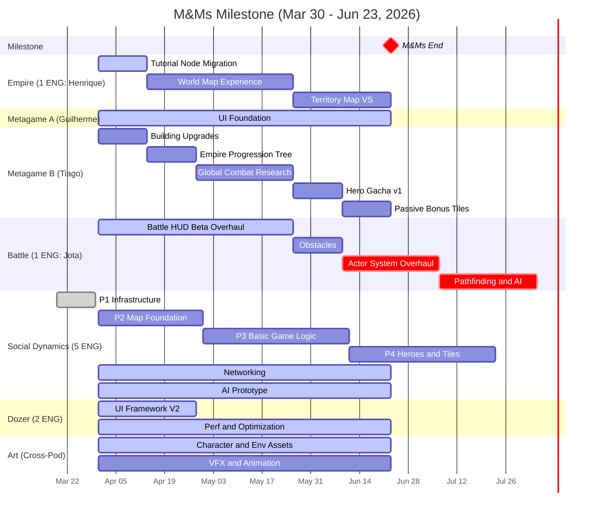

# Multiplayer & Meta (M&Ms) — Milestone Plan

> Generated: 2026-03-30 by `/generate_ms_plan`
> Sources: product_targets.md, pod plans, ValidationPlan.md, capacity.md

**Dates**: Mar 30 → Jun 23, 2026
**Sprints**: 6 (S26 Yodel Yaks → S31)
**Phase**: Iteration & Refinement
**Goal**: Introduce multiplayer foundations and metagame depth. Validate map exploration, combat quality bar, and progression systems.

---

## Milestone Timeline

> **Reading the chart**: Blue = in progress. Red = at risk / overflows past milestone. Gray = complete. Bars extending past the "M&Ms End" marker indicate capacity overflow.

---

## What Are We Building? — Must-Have Coverage

Features required for M&Ms to succeed (from `product_targets.md`):

| # | Must-Have Feature | Responsible Pod | Planned Feature | Sprint Window | Coverage |
|---|-------------------|----------------|-----------------|---------------|----------|
| 1 | Territory Map Vertical Slice | Empire | Territory Map VS | S30-S31 | ✅ Covered |
| 2 | Battle HUD Beta Overhaul | Battle | Battle HUD Beta Overhaul | S26-S29 | ✅ Covered |
| 3 | Optimisation in Preparation for Beta | Dozer | Performance/Optimization and Review | S26-S31 (ongoing) | ✅ Covered |
| 4 | Narrative and Tutorial Tooling | Empire | Tutorial Node Migration | S26 | ⚠️ Partial — enables tooling but doesn't deliver full pipeline |
| 5 | Audio Tooling Foundation | Art | — | — | ❌ Gap — no pod feature defined |
| 6 | UI Foundation | Metagame | UI Foundation (Pipeline A) | S26-S31 | ✅ Covered |
| 7 | 6 Starter Heroes — Designed and Arted | Battle / Art | Character Assets (Art, ongoing) | S26-S31 | ⚠️ Partial — ongoing art, no discrete deliverable defined |
| 8 | Art Outsourcing Pipelines | Art | — | — | ❌ Gap — no pod feature defined |
| 9 | Reduction of FTUE Friction | Cross-pod | — | — | ❌ Gap — no pod owner or feature defined |
| 10 | Overarching Tone/Emotion of Game | Art / Empire | — | — | ❌ Gap — no pod feature defined |
| 11 | Multiplayer Foundation Complete | Social Dynamics | P1-P6 Map Build-Up + Networking | S26-S31 | ✅ Covered |

**Summary**: 5 of 11 must-haves fully covered, 2 partial, 4 gaps.

---

## What Are We Validating? — SHQ Plan

15 SHQs targeted for M&Ms: 6 Battle, 5 Empire, 4 Monetisation.

### WH-1: Battle — Compelling army battling centered on dramatic hero moments

| SHQ | Question | Validating Feature(s) | Earliest Testable | Status |
|-----|----------|----------------------|-------------------|--------|
| SHQ3-24 | Does our art direction maintain clarity necessary for combat? | Battle HUD Overhaul, Character Assets | ~S28 (HUD mid-build) | IN PROGRESS |
| SHQ4-1 | Does the HUD allow strategic planning and tactical response? | Battle HUD Beta Overhaul | ~S29 (HUD complete) | NOT STARTED |
| SHQ3-27 | Can we establish scalable battle-building across all game modes? | Battle Content Pipeline | Ongoing | IN PROGRESS |
| SHQ3-28 | Does the unit production pipeline work and support long-term projections? | Unit Content Pipeline | Ongoing | IN PROGRESS |
| SHQ3-26 | Are players motivated to collect varied heroes/troops per game mode? | Hero Gacha v1, Character Assets | ~S30 (Gacha built) | PENDING VALIDATION |
| SHQ4-2 | Can players understand starter hero roles; do progression choices vary per hero? | 6 Starter Heroes, Hero Gacha v1 | ~S30 (Gacha built) | NOT STARTED |

### WH-2: Empire — Retention via intuitive, visual map exploration

| SHQ | Question | Validating Feature(s) | Earliest Testable | Status |
|-----|----------|----------------------|-------------------|--------|
| SHQ3-1 | Does the map pipeline deliver diverse, high-quality maps at scale? | Territory Map VS, Map Content | ~S31 (TMVS complete) | IN PROGRESS |
| SHQ4-3 | Does the world map let players quickly form session engagement goals? | World Map Experience | ~S29 (WME complete) | NOT STARTED |
| SHQ4-4 | Does the territory map remain functional and readable with real art? | Territory Map VS | ~S31 (TMVS complete) | NOT STARTED |
| SHQ4-5 | Do narrative beats drive players to explore and engage with progression? | Tutorial Node Migration, Map Content | ~S27 (Tutorial done) | NOT STARTED |
| SHQ4-6 | Do we have a clear UX vision for navigating between empire, events, and MP? | World Map Experience | ~S29 (WME complete) | NOT STARTED |

### WH-3: Monetisation — Sustained spend via hero collection with social context

| SHQ | Question | Validating Feature(s) | Earliest Testable | Status |
|-----|----------|----------------------|-------------------|--------|
| SHQ4-7 | Do players engage with vertical empire progression as meaningful investment? | Building Upgrades, Empire Progression Tree | ~S28 (both built) | NOT STARTED |
| SHQ4-8 | Are players motivated to return session-to-session over 3 days? | Multiple systems (cross-pod) | ~S30 (enough depth) | NOT STARTED |
| SHQ4-9 | Do players face meaningful resource tension forcing strategic prioritisation? | Global Combat Research, Building Upgrades | ~S29 (Research built) | NOT STARTED |
| SHQ4-10 | Do we have confidence the economy model supports future monetisation? | Paper design exercise | ~S28 (enough systems) | NOT STARTED |

---

## Pod Order of Operations

### Empire

**Engineering**: 1x — Henrique De Lima (sole client engineer)
**Design**: Diana Vasilescu (lead), Elise Cole, Jacob Siegel
**UX**: Yura Rusin
**QA**: Laura Santana

| Sprint | Engineering (Henrique) | Design / Art | SHQs Under Test |
|--------|----------------------|-------------|-----------------|
| S26 (3/31-4/14) | Tutorial Node Migration | WME design prep (Diana, Yura). Map Content (Elise; Jacob out 3/31-4/7) | SHQ4-5 |
| S27 (4/14-4/28) | WME: Multiple Nodes per Territory (1/3) | WME UX (Yura). Map Content (Elise, Jacob) | SHQ4-3, SHQ4-6 |
| S28 (4/28-5/12) | WME: Main Menu UX/UI (2/3) | TMVS design prep. Map Content | SHQ4-3, SHQ4-6 |
| S29 (5/12-5/26) | WME: Iterations (3/3) | TMVS design. Map Content | SHQ4-3, SHQ4-6 |
| S30 (5/26-6/9) | Territory Map VS (1/2) | Map Content | SHQ3-1, SHQ4-4 |
| S31 (6/9-6/23) | Territory Map VS (2/2) | Map Content | SHQ3-1, SHQ4-4 |

**Key risk**: Henrique is the sole client engineer — no parallelism, any delay cascades. WME design/UX must be ready before Henrique starts each sub-effort. Zero buffer — 6 sprints of work in 6 sprints.

---

### Metagame

**Engineering**: 2x parallel — Guilherme Quizzini (Pipeline A: UI Foundation), Tiago Costa (Pipeline B: sequential features)
**Eng Lead**: Dan Dupuis (planning capacity, oversight — also Empire eng lead)
**Design**: Leonard Perez (lead), Chris Fidalgo
**UX**: Kevin Ligon
**UI Art**: Miguel Duran
**QA**: Hugo Hideo

| Sprint | Pipeline A (Guilherme) | Pipeline B (Tiago) | Design / UX / Art | SHQs Under Test |
|--------|----------------------|-------------------|-------------------|-----------------|
| S26 (3/31-4/14) | UI Foundation (1/6) | Building Upgrades | Leonard: UI Foundation design. Kevin: UX wireframes. Miguel: UI art. | — |
| S27 (4/14-4/28) | UI Foundation (2/6) | Empire Progression Tree | Leonard: design. Kevin: UX. Miguel: UI art. | SHQ4-7 |
| S28 (4/28-5/12) | UI Foundation (3/6) | Global Combat Research (1/2) | Leonard: design. Kevin: UX. | SHQ4-7, SHQ4-9, SHQ4-10 |
| S29 (5/12-5/26) | UI Foundation (4/6) | Global Combat Research (2/2) | Leonard: design. Kevin: UX. | SHQ4-9 |
| S30 (5/26-6/9) | UI Foundation (5/6) | Hero Gacha v1 | Leonard: Gacha design. | SHQ3-26, SHQ4-2 |
| S31 (6/9-6/23) | UI Foundation (6/6) | Passive Bonus Tiles | Polish pass. | SHQ4-8 |

**Key risk**: Tiago Costa is a new hire — ramp-up time may affect Pipeline B velocity. Building Upgrades is his first feature. Dan Dupuis has 0 planned eng capacity (eng lead oversight only). Chris Fidalgo had 6 open S25 tasks — carry-over risk.

---

### Battle

**Engineering**: 1x — Jota Oliveira (sole engineer)
**Design**: Lincoln Li (lead), Nathan Hajek, Dylan Jeffery, Vishaal Gupta
**Art**: Ben Clair, Felipe Chaves, Tony Bonilla, Vini Muniz, Danny Oliveira, Alessandro Oliveira, Vinod Rams
**QA**: Julio Scarabelli

| Sprint | Engineering (Jota) | Design / Art | SHQs Under Test |
|--------|-------------------|-------------|-----------------|
| S26 (3/31-4/14) | HUD Beta Overhaul (1/4) | Obstacles design prep (Nathan). Content pipelines. VFX start (Alessandro, Danny) | SHQ3-24 |
| S27 (4/14-4/28) | HUD Beta Overhaul (2/4) | Actor System design prep. Content | SHQ3-24 |
| S28 (4/28-5/12) | HUD Beta Overhaul (3/4) | Pathfinding design prep. Content | SHQ3-24, SHQ4-1 |
| S29 (5/12-5/26) | HUD Beta Overhaul (4/4) | Content. HUD QA (Julio) | SHQ3-24, SHQ4-1 |
| S30 (5/26-6/9) | Obstacles | Content | SHQ3-27, SHQ3-28 |
| S31 (6/9-6/23) | Actor System Overhaul (1/2) | Content | — |
| ⚠️ Overflow → Beta Prep | Actor System (2/2) | | |
| ⚠️ Overflow → Beta Prep/M&C | Pathfinding and AI (2 sprints) | | |

**Key risk**: 9 eng-sprints of work for 6-sprint window with 1 engineer. Actor System and Pathfinding & AI **will overflow** past M&Ms. Only HUD + Obstacles fit cleanly. 4 designers to 1 engineer — design will be far ahead of engineering.

---

### Social Dynamics

**Engineering**: 5x — Gabriel Arruda (from Empire), Marcos Loures (from Empire), Randy Pasion, Garrett Eidsvig, Bruno Bacelar
**Design**: Paul Flores (lead)
**QA**: —

> Tiago Costa was previously listed here but has been reassigned to Metagame Pipeline B.

| Sprint | Engineering (4 client + 1 backend) | Parallel Tracks | SHQs Under Test |
|--------|----------------------------------|-----------------|-----------------|
| S26 (3/31-4/14) | P1 wrap-up → P2: Map Foundation start | Networking (Bruno B). AI Prototype (Paul) | — |
| S27 (4/14-4/28) | P2: Map Foundation | Networking. AI Prototype | — |
| S28 (4/28-5/12) | P2/P3: Map Foundation → Basic Game Logic | Networking. AI Prototype | SHQ3-18 through SHQ3-22 (paper) |
| S29 (5/12-5/26) | P3: Basic Game Logic | Networking. Switchover assessment | — |
| S30 (5/26-6/9) | P3/P4: Game Logic → Heroes on Map | Networking. Switchover target | — |
| S31 (6/9-6/23) | P4: Heroes on Map / Interesting Tiles | Networking | — |

**Key risk**: Randy and Garrett have Dozer split — feature work at risk of interruption (2 of 4 client engineers). Gabriel and Marcos transitioning from Empire — handoff/ramp risk. Phase completion pace depends on velocity with new team composition.

---

### Dozer

**Engineering**: 2x — Derek Gallant (eng lead, also Social Dynamics), Bruno Freitas

| Sprint | Derek Gallant | Bruno Freitas | Notes |
|--------|-------------|---------------|-------|
| S26 (3/31-4/14) | EKS deployment (Prod/Stage), UI Framework V2, MP support | Single Config Editor, Build Info/Logs | EKS critical for SD multiplayer |
| S27 (4/14-4/28) | UI Framework V2, infrastructure | Infrastructure support | |
| S28-S31 | Performance and Optimization | Performance and Optimization | Ongoing, reactive |

**Key risk**: Derek split across Dozer eng lead and Social Dynamics eng lead. EKS deployment is critical path for multiplayer readiness.

---

### Art

**Art Director**: Kevin Griffith | **Assoc. Art Director**: Brendan Cheatham | **Producer**: Brann Livesay

| Track | Key People | M&Ms Scope | Notes |
|-------|-----------|-----------|-------|
| Character Assets | Felipe Chaves, Vini Muniz, Tony Bonilla | Heroes and units for all pods | Ongoing. 6 Starter Heroes deliverable. |
| Environment Art | Guilherme Lascasas, Thiago Saraiva | Map tiles, buildings, world map | Ongoing |
| UI/UX Art | Miguel Duran | Interface elements for UI Foundation, WME | Shared with Metagame |
| VFX and Animation | Danny Oliveira, Alessandro Oliveira, Ben Clair | Combat effects, skill animations | Starts M&Ms |
| Tech Art | Pedro Sarraf, Marcos Teles | Pipeline tooling, shaders | Pedro out 4/3-4/21 |
| Sound | Lawrence Steele | Audio implementation | Audio Tooling Foundation is a must-have gap |

**Key risk**: Cross-pod priority conflicts — Battle HUD vs UI Foundation vs World Map Experience for art resources. Pedro Sarraf PTO (4/3-4/21) reduces tech art capacity for 3 weeks.

---

## Cross-Pod Dependencies

| Dependency | From | To | Sprint Window | Risk |
|-----------|------|-----|---------------|------|
| UI Framework V2 enables UI Foundation | Dozer | Metagame | S26-S27 | Medium — timing must align |
| WME needs UX flows ready before eng | Empire Design | Empire Eng | S26 (design) → S27 (eng) | Medium — design must be ahead |
| Character Assets for 6 Starter Heroes | Art | Battle | Throughout | Low — ongoing pipeline |
| Map Content art for Territory Map VS | Art | Empire | S30-S31 | Low — art pipeline in place |
| EKS deployment enables MP infrastructure | Dozer | Social Dynamics | S26 | High — critical path for MP |
| Miguel Duran shared between Metagame UI and Empire | Art | Metagame, Empire | Throughout | Medium — priority conflicts |
| Dan Dupuis eng lead for both Empire and Metagame | Shared | Empire, Metagame | Throughout | Medium — attention split |

---

## Gaps and Risks

### Must-Have Gaps (4 of 11 not covered)

These must-have features from `product_targets.md` have **no matching pod feature**:

1. **Audio Tooling Foundation** — No Art pod feature defined. Lawrence Steele (Sound) is staffed but no deliverable scoped.
2. **Art Outsourcing Pipelines** — No pod feature. External art production validation not planned.
3. **Reduction of FTUE Friction** — Cross-pod effort with no owner or feature definition.
4. **Overarching Tone/Emotion of Game** — Art/Empire cross-pod. No feature defined.

**Action needed**: These gaps need resolution — either add features to pod plans, assign ownership, or reclassify as not-must-have for M&Ms.

### Capacity Risks

- **Battle**: 9 eng-sprints in 6 sprints (1 engineer). Actor System Overhaul and Pathfinding & AI **will overflow** into Beta Prep/M&C. Only HUD + Obstacles complete within M&Ms.
- **Empire**: 6 eng-sprints in 6 sprints (1 engineer). Fits but zero buffer — any delay cascades to Territory Map VS, which validates SHQ3-1 and SHQ4-4.
- **Social Dynamics**: 4 client engineers but Randy and Garrett have Dozer split. Effective capacity ~2.5-3 dedicated client engineers. New team composition (Gabriel, Marcos from Empire) needs ramp time.
- **Metagame**: Pipeline B depends on Tiago Costa (new hire) executing independently from sprint 1. Building Upgrades spec source unclear — risk of slow start.

### Validation Risks

- **SHQ3-1, SHQ4-4** (map at scale, map readability): Testable only in S30-S31 — last two sprints. If Territory Map VS slips, these SHQs can't be tested within M&Ms.
- **SHQ4-8** (session-to-session return): Requires multiple systems working together — hard to validate until late in milestone.
- **SHQ3-26, SHQ4-2** (hero collection, starter hero roles): Depend on Hero Gacha v1 (S30) and character art. Late testability window.
- **SHQ3-18 through SHQ3-22** (multiplayer designs): Paper/prototype validation only — no in-client testing during M&Ms.

### Open Questions

- [ ] Who owns the 4 must-have gaps? Need pod assignments or decision to defer.
- [ ] Battle feature sequencing: Sprint plan shows Jota on Actor System / Pathfinding first, but priority table lists HUD as #1. Which is the actual order?
- [ ] Social Dynamics switchover target: When does in-client replace AI prototype for playtesting?
- [ ] Art priority order: When Battle HUD, UI Foundation, and WME all need art, which goes first?
- [ ] Building Upgrades spec: Does one exist? Tiago needs design direction for his first feature.
- [ ] UI Foundation SHQ: Should this be mapped to a validation question?
