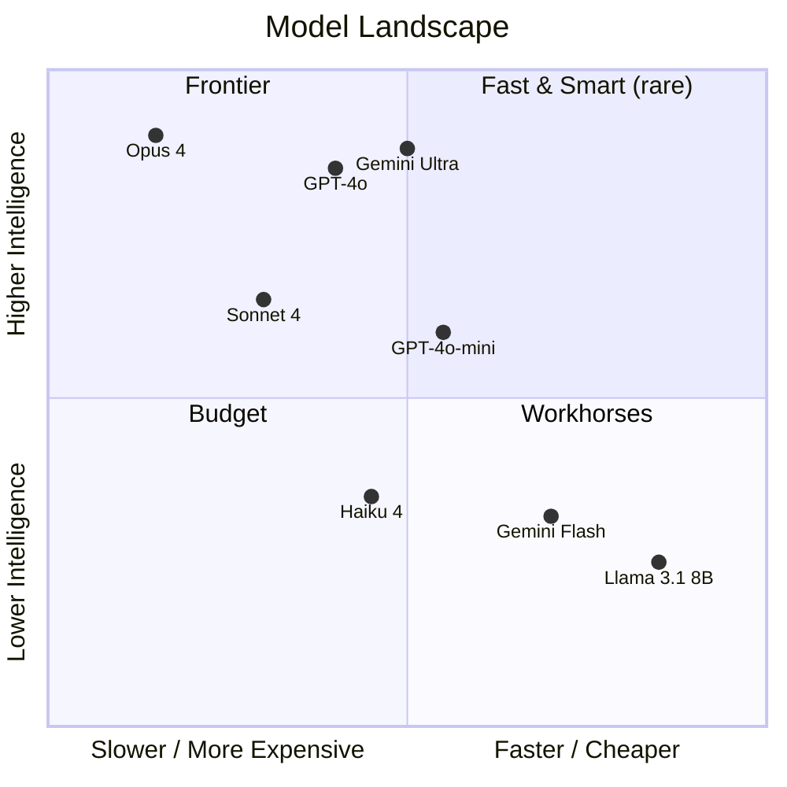
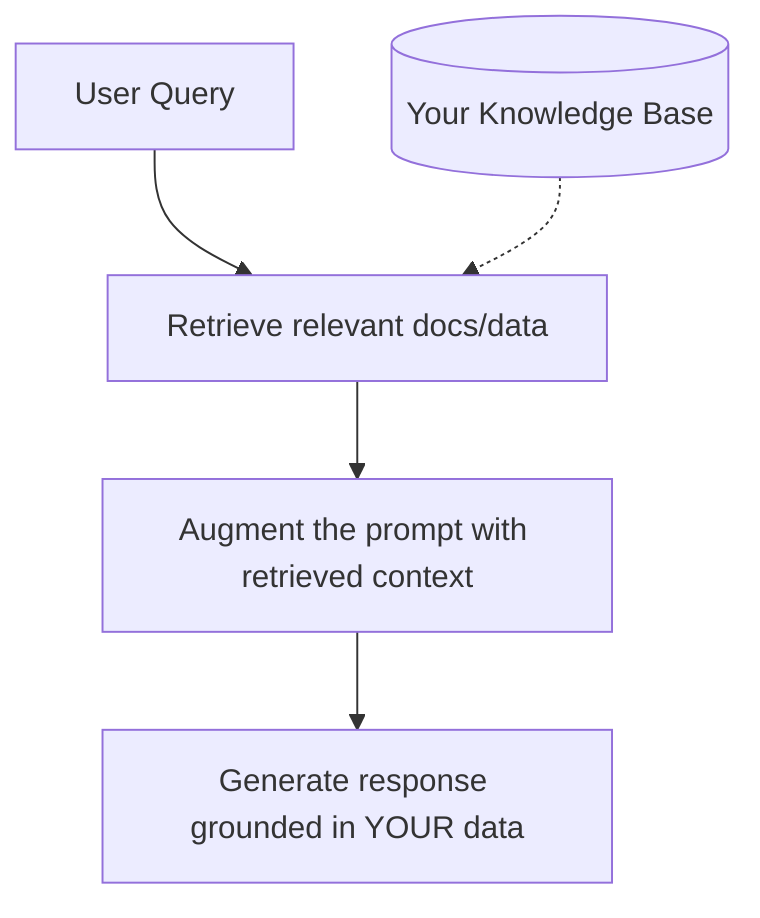
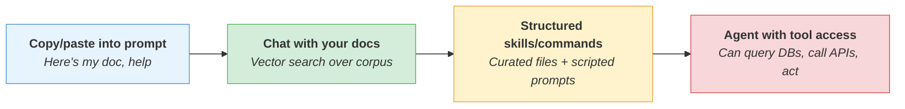
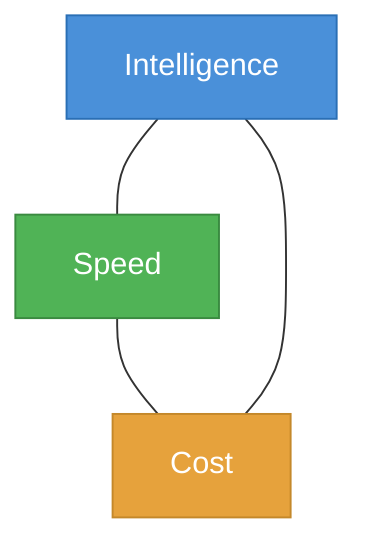
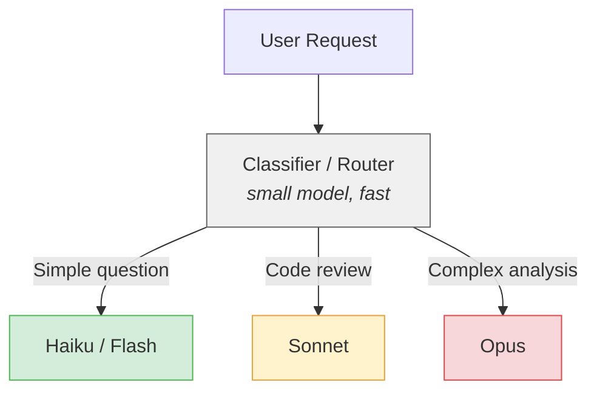
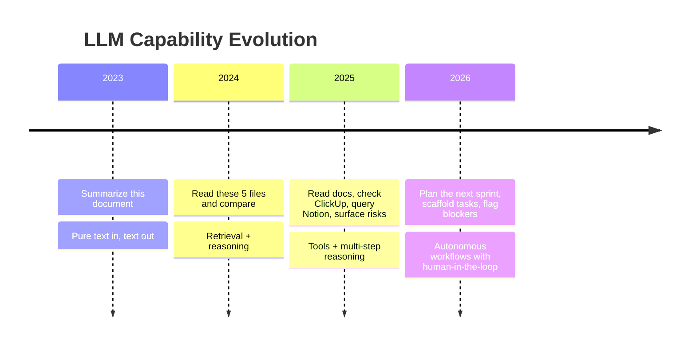
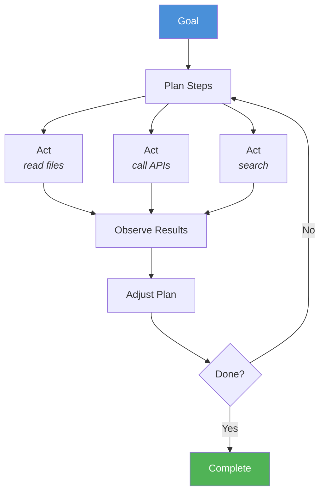

# Working With LLMs: Practical Lessons From the Trenches

> Presentation draft — adapt to slides as needed. Speaker notes in blockquotes.

---

## Opening

**You're already behind if you're not experimenting.**

LLMs aren't "smart search." They're reasoning engines — and like any engine, how you fuel them determines what you get out.

This talk covers five practical lessons from building real systems on top of LLMs.

> Speaker note: Frame this as practitioner-to-practitioner. Not theory, not hype — lessons learned by actually building with these tools on a production game project.

---

## 1. The Landscape: Not All Models Are Created Equal

### The Mental Model

Think of LLMs on two axes:



### Key Insight: "Model" Is Not Monolithic

- **Frontier models** (Opus, GPT-4o, Gemini Ultra) — Deep reasoning, complex multi-step tasks, nuanced judgment. Expensive. Slower.
- **Mid-tier models** (Sonnet, GPT-4o-mini) — 80% of the capability at 20% of the cost. The workhorses.
- **Fast/small models** (Haiku, Flash, small open-source) — Classification, extraction, summarization. Millisecond responses. Pennies per million tokens.

### The Mistake Everyone Makes

Picking one model for everything. That's like using a forklift to commute.

**Real example**: Summarizing a Slack channel? Haiku/Flash is perfect. Comparing a 15-feature roadmap against staffing capacity to surface risks? You want a frontier model that can hold the full picture and reason across it.

> Speaker note: The landscape changes fast — specific model names will date. The principle won't: match model capability to task complexity. Also worth mentioning: open-source vs. hosted matters for data sensitivity and cost at scale.

### Slide: Model Selection Cheat Sheet

| Task Type | Best Fit | Why |
|-----------|----------|-----|
| Classification, routing, tagging | Small/Fast | Speed, cost. Simple pattern matching. |
| Summarization, extraction | Mid-tier | Good enough quality, much cheaper. |
| Multi-document reasoning | Frontier | Needs to hold and compare large context. |
| Code generation (complex) | Frontier | Reasoning depth matters for correctness. |
| Code generation (boilerplate) | Mid-tier | Pattern-heavy, less reasoning needed. |
| Creative/nuanced writing | Frontier | Subtlety, tone, coherence over length. |

---

## 2. Context Is King

### The Core Truth

**The quality of an LLM's output is directly proportional to the quality of context you give it.**

This is THE most underappreciated lesson. People blame the model when the real problem is what they fed it.

### What Is "Context"?

Everything the model can see when it generates a response:

1. **System prompt** — Who it is, how it should behave, what rules to follow
2. **Conversation history** — What's been said so far
3. **Retrieved documents** — Files, data, search results you inject
4. **Tool results** — Output from function calls, API responses
5. **User instructions** — The actual ask

### Context Problems Are Output Problems

| You See...                 | The Real Problem Is...                                                |
| -------------------------- | --------------------------------------------------------------------- |
| Hallucinated details       | Missing context — it filled the gap with plausible fiction            |
| Generic/vague answers      | Too little specific context — it had nothing concrete to ground on    |
| Contradictory outputs      | Conflicting context — two documents disagree and the model picked one |
| Ignoring your instructions | Buried context — critical instructions lost in noise                  |
| Outdated information       | Stale context — the model is working from old data                    |

### Practical Techniques

**1. Be explicit about authority**

Bad: Dump 10 documents and say "use these."
Good: "product_targets.md is the authoritative source for milestone goals. If any other document conflicts, product_targets.md wins."

**2. Establish reading order**

Don't assume the model knows which file matters most. Tell it:
> "Read in this order: (1) charter — architecture/rules, (2) targets — what we're building, (3) capacity — who's available, (4) pod plans — what's actually planned."

**3. Reference, don't duplicate**

Every duplicate is a potential contradiction. Use IDs and pointers:
> "This feature contributes to SHQ3-7" is better than copying the full hypothesis text into every feature doc.

**4. Keep context fresh**

Stale context is worse than no context — it creates confident wrong answers. Build systems that regenerate views rather than manually maintaining copies.

**5. Control the noise**

More context isn't always better. Irrelevant context dilutes the signal. A model reading 50 pages of docs to answer a question about one feature will perform worse than one reading just the relevant 3 pages.

> Speaker note: This section is the heart of the talk. The Lotus brain example is powerful here — it's literally a system designed around controlling LLM context. The file hierarchy, the "one source of truth" rule, the reading order — all context engineering.

---

## 3. The RAG Pattern: Bringing Your Own Data

### What Is RAG?

**Retrieval-Augmented Generation**: Instead of relying on what the model was trained on, you retrieve relevant data at query time and inject it into the context.



### Why RAG Matters

Models have a training cutoff. They don't know:
- Your internal docs
- Your team's decisions
- Your project's current state
- Your company's conventions

RAG bridges that gap. It's how you make a general-purpose model into a domain expert.

### Beyond Basic RAG: Skills and Commands

RAG is just the data layer. The real power comes when you combine retrieved context with **structured instructions** — reusable prompts that tell the model exactly how to use the data.

**Example — a "Risk Evaluation" skill:**
```
1. Read product_targets.md    (what we need to achieve)
2. Read roadmap.md            (what we're planning to build)
3. Read capacity.md           (who's available)
4. Compare: Are the plans achievable with the resources?
5. Output: Gaps, risks, and recommendations
```

This isn't just retrieval — it's a **repeatable analytical workflow** powered by curated context.

### The Spectrum of RAG Sophistication



### Practical Tips

- **Curate, don't dump.** A well-organized set of 20 markdown files beats a vector database of 10,000 unstructured docs.
- **Structure your data for LLMs.** Markdown with clear headers, tables, and IDs. Not PDFs, not Confluence pages with embedded images.
- **Version your knowledge base.** Git gives you history, diffing, and collaboration — for free.
- **Separate sources of truth from generated views.** Human-authored docs are authoritative. AI-generated reports are disposable and regeneratable.

> Speaker note: The Lotus documentation brain IS a RAG system: curated markdown in git, structured for LLM consumption, with skills that define specific retrieval + reasoning patterns. No vector database needed — the structure IS the retrieval mechanism.

---

## 4. The Trade-offs: Speed, Cost, and Intelligence

### The Iron Triangle of LLMs



You can optimize for two. The third suffers. Always.

### Real Numbers (Approximate, mid-2026)

| Model Tier                 | Input Cost (per 1M tokens) | Output Cost (per 1M tokens) | Relative Speed | Relative Intelligence |
| -------------------------- | -------------------------- | --------------------------- | -------------- | --------------------- |
| Frontier (Opus, GPT-4o)    | $10-15                     | $30-75                      | Slow           | Highest               |
| Mid-tier (Sonnet, 4o-mini) | $3                         | $15                         | Medium         | High                  |
| Fast (Haiku, Flash)        | $0.25-0.80                 | $1-5                        | Fast           | Good                  |

> Speaker note: These numbers shift constantly. The principle is stable: there's always a 10-50x cost difference between tiers, and you should be intentional about when you're paying for the premium.

### How to Think About It

**Don't ask "which model is best?"**
Ask: **"What's the cheapest model that can do THIS task reliably?"**

Then reserve your expensive model budget for the tasks that actually need it.

### Practical Architecture: Model Routing

Smart systems don't use one model — they route:



### The Hidden Costs

Token price isn't the whole story:

- **Latency** — A 30-second response kills interactive workflows
- **Context window** — Cheap models often have smaller windows; you may need to chunk your data
- **Reliability** — Cheaper models fail more on edge cases; debugging and retries have costs too
- **Developer time** — Time spent engineering around model limitations is expensive

> Speaker note: For the Lotus project, I use frontier models for complex cross-referencing tasks (risk evaluation across 15+ files) and faster models for simpler tasks (summarizing a single Slack channel). The cost difference is 10-50x but the quality difference on complex tasks is night-and-day.

---

## 5. Future-Proofing: Agents, Tool Use, and Evaluation

### Where We're Headed

The trajectory is clear: models are becoming **agents** — not just answering questions, but taking actions.



### Tool Use: The Multiplier

An LLM with tools isn't just smarter — it's **capable in fundamentally different ways**.

| Without Tools | With Tools |
|--------------|-----------|
| Can discuss what's in a database | Can query the database |
| Can suggest API calls | Can make the API calls |
| Can recommend file changes | Can read, edit, and create files |
| Can describe a plan | Can execute the plan |

**The key shift**: The model goes from advisor to operator.

### The Agent Pattern



**Critical principle: Human-in-the-loop.**
Agents should *propose*, not *execute blindly*. Especially for:
- Writing to authoritative data sources
- Creating tasks in project management tools
- Communicating externally (Slack, email)

### Evaluation: The Unsexy Essential

As you build more sophisticated LLM systems, you NEED ways to measure quality:

- **Are the outputs actually correct?** (Not just plausible-sounding)
- **Are they consistent?** (Same input, same quality every time?)
- **Are they getting better over time?** (As you improve prompts, context, models?)

### How to Evaluate

1. **Golden datasets** — Known-good input/output pairs. Run your system against them regularly.
2. **LLM-as-judge** — Use a frontier model to grade outputs from your production model. Cheaper than human review, more scalable.
3. **Human spot-checks** — Regular sampling. Can't scale, but catches things automated eval misses.
4. **Regression testing** — When you change a prompt or model, re-run your test suite. Did quality go up or down?

### Practical Future-Proofing Checklist

- [ ] **Separate your data from your prompts.** Models change; your knowledge base shouldn't be coupled to a specific model's quirks.
- [ ] **Use structured formats.** Markdown, JSON, YAML — not free-form text. Structured data survives model transitions.
- [ ] **Build skills, not monoliths.** Small, composable prompts that each do one thing well. Easier to test, easier to swap models.
- [ ] **Version everything.** Your prompts, your data, your outputs. Git is your friend.
- [ ] **Design for model-agnosticism.** Don't depend on one provider. The model you use today won't be the model you use next year.
- [ ] **Add human checkpoints.** Automation is great until it's confidently wrong at scale.

> Speaker note: The Lotus brain embodies most of these principles — skills are modular, data is in git, human-authored content is separated from generated views, and destructive actions require approval. It's not theoretical — it's running in production on a real game project.

---

## Closing

### The Five Lessons

1. **The Landscape** — Match model capability to task complexity. Don't use a forklift to commute.
2. **Context Is King** — Garbage in, garbage out. Invest in context quality before blaming the model.
3. **The RAG Pattern** — Bring your own data + structured workflows. That's where the real leverage is.
4. **The Trade-offs** — Be intentional about the speed/cost/intelligence triangle. Route, don't default.
5. **Future-Proofing** — Build modular, versioned, model-agnostic systems. The tools will change; good architecture won't.

### The Meta-Lesson

The teams that win with AI aren't the ones with the most sophisticated models.

They're the ones with the **best-organized data** and the **clearest processes**.

The AI is the engine. Your data and workflows are the fuel and the road.

---

## Appendix: Glossary

| Term | Definition |
|------|-----------|
| **LLM** | Large Language Model — AI trained on text to generate/reason about text |
| **Token** | A chunk of text (~4 characters or ~0.75 words). Models charge per token. |
| **Context window** | The maximum amount of text a model can "see" at once (e.g., 128K-200K tokens for frontier models) |
| **RAG** | Retrieval-Augmented Generation — fetching relevant data to include in the prompt |
| **Fine-tuning** | Training a model further on your specific data (different from RAG) |
| **Agent** | An LLM that can plan, use tools, and take actions — not just answer questions |
| **MCP** | Model Context Protocol — standardized way for AI models to connect to external tools and data |
| **Tool use / Function calling** | Letting the model invoke defined functions (search, query, create) during its response |
| **Prompt engineering** | Crafting instructions and context to get better model outputs |
| **Hallucination** | When a model generates plausible but factually incorrect content |

## Appendix: Resources

- [Anthropic's Claude documentation](https://docs.anthropic.com)
- [OpenAI's platform documentation](https://platform.openai.com/docs)
- [Google's Gemini documentation](https://ai.google.dev)
- [Model Context Protocol (MCP)](https://modelcontextprotocol.io)
