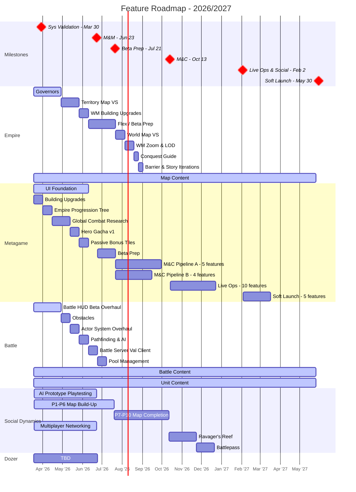

# Feature Roadmap

Last Updated: 2026-03-20

> **This is the operational view** - what we're actually building and when, consolidated from all pod plans.
> For milestone targets and success criteria, see `planning/product_targets.md`.
> For product validation (Winning Hypotheses, BHQs, SHQs), see `planning/ValidationRoadmap.md`.
> For feature details, see `planning/features/*.md`. For staffing, see `planning/capacity.md`.
>
> **This file is regenerated by `/roadmap-update`.** Do not manually edit the consolidated tables or Gantt — update pod plans first, then run the skill.

---

## High-Level Gantt

---

## Pods

### Empire

**Pod Lead**: Diana Vasilescu | **Producer**: Brann Livesay
**Plan**: [`planning/pods/Empire_Plan.md`](../planning/pods/Empire_Plan.md)

**M&Ms Validation Focus**: Validating **WH-2 (Empire Hypothesis)** - retention through intuitive, visual map exploration.

| Key BHQ | Key SHQs for M&Ms | Status |
|---------|-------------------|--------|
| BHQ-E1: Intuitive map exploration | SHQ1 (map at scale), SHQ2 (strategy <-> conquest) | SHQ2 IN PROGRESS |
| BHQ-E3: Long-term progression | SHQ7 (short/mid/long-term goals) | Planning |
| BHQ-E4: Instant gratification | No SHQs defined | Gap |

**M&Ms Features**:

| # | Feature | Estimate | Status |
|---|---------|----------|--------|
| 1 | Governors | 3 sprints | IN PROGRESS |
| 2 | Territory Map Vertical Slice | 2 sprints | NOT STARTED |
| 3 | WM Support for Building Upgrades | 1 sprint | NOT STARTED |
| - | Map Content (Design/Art) | Ongoing | IN PROGRESS |

---

### Metagame

**Pod Lead**: Leonard Perez | **Producer**: Tim Williams
**Plan**: [`planning/pods/Metagame_Plan.md`](../planning/pods/Metagame_Plan.md)

**M&Ms Validation Focus**: Building the systems and UI layers that support empire progression depth and hero investment.

| Key BHQ | Key SHQs for M&Ms | Status |
|---------|-------------------|--------|
| BHQ-E3: Long-term progression (cross-pod) | SHQ7 (short/mid/long-term goals) | Contributes alongside Empire |
| BHQ-M1: Hero collectability | SHQ10-13 (hero value, attachment, agency, assets) | NOT STARTED |

**M&Ms Features** (2x ENG, parallel pipelines):

| # | Feature | Sprints | Pipeline | Status |
|---|---------|---------|----------|--------|
| 1 | UI Foundation | 6 | A | IN PROGRESS |
| 2 | Building Upgrades | 1 | B | NOT STARTED |
| 3 | Empire Progression Tree | 1 | B | NOT STARTED |
| 4 | Global Combat Research Tree | 2 | B | NOT STARTED |
| 5 | Hero Gacha v1 | 1 | B | NOT STARTED |
| 6 | Passive Bonus Tiles | 1 | B | NOT STARTED |

**M&C Features** (2x ENG, parallel pipelines):

| # | Feature | Sprints | Status |
|---|---------|---------|--------|
| 1 | Main Menu UX/UI | 1 | NOT STARTED |
| 2 | Dungeons v2 | 1 | NOT STARTED |
| 3 | Timed Objectives | 1 | NOT STARTED |
| 4 | End Level Reward Screen | 1 | NOT STARTED |
| 5 | Academies | 1 | NOT STARTED |
| 6 | Hero Ranking Up | 1 | NOT STARTED |
| 7 | Shop | 1 | NOT STARTED |
| 8 | Hero Gacha v2 | 1 | NOT STARTED |
| 9 | Timed PvE Live Ops Maps | 1 | NOT STARTED |

---

### Battle

**Pod Lead**: Lincoln Li | **Producer**: Thorben Novais
**Plan**: [`planning/pods/Battle_Plan.md`](../planning/pods/Battle_Plan.md)

**M&Ms Validation Focus**: Validating **WH-1 (Battle Hypothesis)** - extending battle foundations with HUD overhaul, obstacles, and scalable systems to support content growth.

| Key BHQ | Key SHQs for M&Ms | Status |
|---------|-------------------|--------|
| BHQ-B1: Fun & sticky gameplay | SHQ23 (battle depth over 3 days) | ANSWERED |
| BHQ-B2: Intuitive & satisfying actions | SHQ24 (art clarity) | ANSWERED |
| BHQ-B3: Keys & locks motivation | 5/6 answered, 1 negative (troop excitement) | TESTING |
| BHQ-B4: Scalable battle content | SHQ27 (scalable battles), SHQ28 (hero/unit pipeline) | ANSWERED |

**M&Ms Features** (1x ENG: Jota, sequential):

| # | Feature | Estimate | Status |
|---|---------|----------|--------|
| 1 | Battle HUD Beta Overhaul | 3 sprints | NOT STARTED |
| 2 | Obstacles | 1 sprint | NOT STARTED |
| 3 | Actor System Overhaul | 1 sprint | NOT STARTED |
| 4 | Pathfinding & AI Improvements | 1 sprint | NOT STARTED |
| 5 | Battle Server Validation Client | 1 sprint | NOT STARTED |
| 6 | Pool Management | 1 sprint | NOT STARTED |
| - | Battle Content (Design/Art) | Ongoing | IN PROGRESS |
| - | Unit Content (Design/Art) | Ongoing | IN PROGRESS |

> **Capacity risk**: 8 sprints of eng work in 7 available sprints with 1 engineer. Pool Management overflows ~1 sprint into Beta Prep. No flex buffer. See `planning/capacity.md` for staffing risks.

---

### Social Dynamics

**Pod Lead**: Paul Flores | **Producer**: Tim Williams
**Plan**: [`planning/pods/SocialDynamics_Plan.md`](../planning/pods/SocialDynamics_Plan.md)

**M&Ms Validation Focus**: Building multiplayer map foundations via phased build-up (P1-P10), with AI prototype playtesting in parallel until in-client switchover.

| Key BHQ | Key SHQs for M&Ms | Status |
|---------|-------------------|--------|
| BHQ-M2: PvE to social pipeline | No SHQs until post-Systems Validation | Future milestone |
| BHQ-M4: Multiplayer motivations | SHQ18-22 (paper/prototype multiplayer designs) | NOT STARTED |

**Strategy**: 3 parallel tracks -- AI Prototype (playtesting), Multiplayer Maps (P1-P10 phased build), Networking. All phases target completion by end of M&C. Switchover from AI prototype to in-client during M&Ms.

**M&Ms Features** (2x ENG: Randy, Garrett):

| Phase | Feature | Status |
|-------|---------|--------|
| P1 | Infrastructure & Foundation (ETA 3/30) | IN PROGRESS |
| P2 | Map Foundation (~1 month) | NOT STARTED |
| P3 | Basic Game Logic (6 features) | NOT STARTED |
| P4+ | Heroes on Map, Interesting Tiles, Initial Rollout | NOT STARTED |
| - | Multiplayer Networking (parallel) | IN PROGRESS |
| - | AI Prototype Playtesting (parallel) | IN PROGRESS |

**Post-M&C Features**:

| Feature | Estimate | Status |
|---------|----------|--------|
| Ravager's Reef | 3 sprints | NOT STARTED |
| Battlepass | 2 sprints | NOT STARTED |

---

### Dozer

**Pod Lead**: Derek Gallant (eng lead) | **Producer**: -
**Plan**: [`planning/pods/Dozer_Plan.md`](../planning/pods/Dozer_Plan.md)

**M&Ms Validation Focus**: Infrastructure and tooling supporting WH-4 (Production Hypothesis).

| Key BHQ | Key SHQs for M&Ms | Status |
|---------|-------------------|--------|
| WH-4: Production | Content pipeline scalability, technical stability | NOT STARTED |

**M&Ms Features**: [TBD - awaiting feature definitions]

---

## Legend

| Visual | Meaning |
|--------|---------|
| Gray bar | `done` - Completed |
| Blue bar | `active` - In progress |
| Red bar | `crit` - Blocked or at risk |
| Red diamond | `crit, milestone` - Milestone end date |
| Default bar | Planned (not yet started) |

---

## Update History

| Date | Changed By | Summary |
|------|-----------|---------|
| 2026-03-20 | Tim / Claude | **Battle Pod Plan created**: 6 M&Ms features (HUD Overhaul, Obstacles, Actor System, Pathfinding & AI, Server Validation Client, Pool Management). Added Battle Content and Unit Content continuous pipelines. 8 sprints committed in 7 available — Pool Management overflows into Beta Prep. |
| 2026-03-19 | Tim / Claude | Added Social Dynamics features (3 tracks, 10 phases, P1-P10 + Ravager's Reef + Battlepass). Added System Validation milestone (Mar 30) across all roadmaps. |
| 2026-03-19 | Tim / Claude | Added full Metagame feature plan across all milestones (M&Ms through Soft Launch). Updated milestone markers with crit styling and dates. Added Empire Beta Prep gap to Gantt. |
| 2026-03-19 | Tim / Claude | Rearranged: Gantt first, pod sections with validation summaries, legend/history at bottom |
| 2026-03-19 | Tim / Claude | Restructured as consolidated operational view; milestone definitions moved to product_targets.md |
| 2026-03-18 | Tim / Claude | Initial milestone definitions, Empire M&Ms + M&C features |
