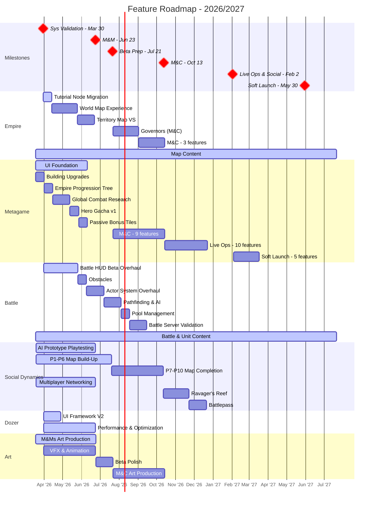

# Feature Roadmap

Last Updated: 2026-03-27

> **This is the operational view** - what we're actually building and when, consolidated from all pod plans.
> For milestone targets and success criteria, see `planning/product_targets.md`.
> For product validation (Winning Hypotheses, BHQs, SHQs), see `planning/ValidationRoadmap.md`.
> For feature details, see `planning/features/*.md`. For staffing, see `planning/capacity.md`.
>
> **This file is regenerated by `/roadmap-update`.** Do not manually edit the consolidated tables or Gantt — update pod plans first, then run the skill.

---

## High-Level Gantt

---

## Pods

### Empire

**Pod Lead**: Diana Vasilescu | **Producer**: Brann Livesay | **Eng Lead**: Dan Dupuis
**Plan**: [`planning/pods/Empire_Plan.md`](../planning/pods/Empire_Plan.md)

**M&Ms Validation Focus**: Validating **WH-2 (Empire Hypothesis)** — map exploration, map readability, and cross-mode UX vision. New M&Ms SHQs focus on world map goal-setting, territory map clarity, narrative direction, and navigation UX.

| Key BHQ | Key SHQs for M&Ms | Status |
|---------|-------------------|--------|
| BHQ-E1: Intuitive map exploration | SHQ1 (map at scale), SHQ31 (session goals via world map), SHQ32 (territory map readability), SHQ33 (narrative goals), SHQ34 (cross-mode UX vision) | SHQ1 IN PROGRESS, SHQ31-34 NOT STARTED |

**M&Ms Features** (1x ENG: Henrique De Lima):

| # | Feature | Estimate | Status |
|---|---------|----------|--------|
| 1 | Tutorial Node Migration | 1 sprint | NOT STARTED |
| 2 | World Map Experience (3 sub-efforts) | 3 sprints | NOT STARTED |
| 3 | Territory Map Vertical Slice | 2 sprints | NOT STARTED |
| - | Map Content (Design/Art) | Ongoing | IN PROGRESS |

**M&C Features**:

| # | Feature | Estimate | Status |
|---|---------|----------|--------|
| 1 | Governors | 3 sprints | IN PROGRESS |
| 2 | WM Building Upgrades | 1 sprint | NOT STARTED |
| 3 | WM Zoom Filtering & LOD | ~1 sprint | NOT STARTED |
| 4 | Conquest Guide + Barrier & Story Iterations | ~1 sprint | NOT STARTED |

---

### Metagame

**Pod Lead**: Leonard Perez | **Producer**: Tim Williams | **Eng Lead**: Dan Dupuis
**Plan**: [`planning/pods/Metagame_Plan.md`](../planning/pods/Metagame_Plan.md)

**M&Ms Validation Focus**: Building the systems and UI layers that support empire progression depth and hero investment. M&Ms SHQs under Monetisation hypothesis (BHQ-M3) test whether progression systems drive meaningful engagement and future spend potential.

| Key BHQ | Key SHQs for M&Ms | Status |
|---------|-------------------|--------|
| BHQ-M3: Spending drivers (cross-pod) | SHQ35 (empire progression depth), SHQ36 (session-to-session return), SHQ37 (resource tension), SHQ38 (economy model confidence) | NOT STARTED |
| BHQ-M1: Hero collectability | SHQ10-13 (hero value, attachment, agency, assets) | NOT STARTED |

**M&Ms Features** (2x ENG, parallel pipelines: Guilherme Quizzini + Tiago Costa):

| # | Feature | Sprints | Pipeline | Status |
|---|---------|---------|----------|--------|
| 1 | UI Foundation | 6 | A | IN PROGRESS |
| 2 | Building Upgrades | 1 | B | NOT STARTED |
| 3 | Empire Progression Tree | 1 | B | NOT STARTED |
| 4 | Global Combat Research Tree | 2 | B | NOT STARTED |
| 5 | Hero Gacha v1 | 1 | B | NOT STARTED |
| 6 | Passive Bonus Tiles | 1 | B | NOT STARTED |

**M&C Features** (2x ENG, parallel pipelines):

| # | Feature | Sprints | Status |
|---|---------|---------|--------|
| 1 | Main Menu UX/UI | 1 | NOT STARTED |
| 2 | Dungeons v2 | 1 | NOT STARTED |
| 3 | Timed Objectives | 1 | NOT STARTED |
| 4 | End Level Reward Screen | 1 | NOT STARTED |
| 5 | Academies | 1 | NOT STARTED |
| 6 | Hero Ranking Up | 1 | NOT STARTED |
| 7 | Shop | 1 | NOT STARTED |
| 8 | Hero Gacha v2 | 1 | NOT STARTED |
| 9 | Timed PvE Live Ops Maps | 1 | NOT STARTED |

---

### Battle

**Pod Lead**: Lincoln Li | **Producer**: Thorben Novais | **Eng Lead**: Jota Oliveira
**Plan**: [`planning/pods/Battle_Plan.md`](../planning/pods/Battle_Plan.md)

**M&Ms Validation Focus**: Validating combat engagement, tactical depth, hero role clarity, and battle systems quality bar for beta. New M&Ms SHQs focus on HUD supporting strategic+tactical play and hero role differentiation.

| Key BHQ | Key SHQs for M&Ms | Status |
|---------|-------------------|--------|
| BHQ-B2: Intuitive actions | SHQ24 (art clarity for combat), SHQ29 (HUD strategic + tactical) | SHQ24 IN PROGRESS, SHQ29 NOT STARTED |
| BHQ-B3: Hero/troop variety | SHQ26 (hero/troop collection motivation), SHQ30 (starter hero role clarity) | SHQ26 PENDING, SHQ30 NOT STARTED |
| BHQ-B4: Scalable battle content | SHQ27 (scalable battle building), SHQ28 (unit pipeline) | IN PROGRESS |

**M&Ms Features** (1x ENG: Jota):

⚠️ **CAPACITY WARNING**: 4 features totaling 9 eng-sprints for ~7-sprint milestone. Features shown sequentially — engineering is single-threaded. Pathfinding & AI may overflow into Beta Prep.

| # | Feature | Estimate | Status |
|---|---------|----------|--------|
| 1 | Battle HUD Beta Overhaul | 4 sprints | NOT STARTED |
| 2 | Obstacles | 1 sprint | NOT STARTED |
| 3 | Actor System Overhaul | 2 sprints | NOT STARTED |
| 4 | Pathfinding & AI Improvements | 2 sprints | NOT STARTED |
| - | Battle Content (Design/Art) | Ongoing | IN PROGRESS |
| - | Unit Content (Design/Art) | Ongoing | IN PROGRESS |

**Beta Prep Features**:

| # | Feature | Estimate | Status |
|---|---------|----------|--------|
| 1 | Pool Management | 1 sprint | NOT STARTED |

**M&C Features**:

| # | Feature | Estimate | Status |
|---|---------|----------|--------|
| 1 | Battle Server Validation Client | 2 sprints | NOT STARTED |

---

### Social Dynamics

**Pod Lead**: Paul Flores | **Producer**: Tim Williams | **Eng Lead**: Derek Gallant
**Plan**: [`planning/pods/SocialDynamics_Plan.md`](../planning/pods/SocialDynamics_Plan.md)

**M&Ms Validation Focus**: Building multiplayer map foundations via phased build-up (P1-P10), with AI prototype playtesting in parallel until in-client switchover.

| Key BHQ | Key SHQs for M&Ms | Status |
|---------|-------------------|--------|
| BHQ-M2: PvE to social pipeline | No SHQs until post-Systems Validation | Future milestone |
| BHQ-M4: Multiplayer motivations | SHQ18-22 (paper/prototype multiplayer designs) | NOT STARTED |

**Strategy**: 3 parallel tracks — AI Prototype (playtesting), Multiplayer Maps (P1-P10 phased build), Networking. All phases target completion by end of M&C. Switchover from AI prototype to in-client during M&Ms.

**M&Ms Staffing** (5x ENG: Gabriel Arruda, Marcos Loures, Randy Pasion, Garrett Eidsvig, Bruno Bacelar):
- Gabriel Arruda and Marcos Loures transitioning from Empire for M&Ms
- Randy and Garrett have Dozer split risk — feature work may be interrupted
- Bruno Bacelar dedicated to Multiplayer Networking

| Phase | Feature | Status |
|-------|---------|--------|
| P1 | Infrastructure & Foundation (ETA 3/30) | IN PROGRESS |
| P2 | Map Foundation (~1 month) | NOT STARTED |
| P3 | Basic Game Logic (6 features) | NOT STARTED |
| P4+ | Heroes on Map, Interesting Tiles, Initial Rollout | NOT STARTED |
| - | Multiplayer Networking (parallel) | IN PROGRESS |
| - | AI Prototype Playtesting (parallel) | IN PROGRESS |

**Post-M&C Features**:

| Feature | Estimate | Status |
|---------|----------|--------|
| Ravager's Reef | 3 sprints | NOT STARTED |
| Battlepass | 2 sprints | NOT STARTED |

---

### Dozer

**Eng Lead**: Derek Gallant | **Producer**: - | **Pod Lead**: -
**Plan**: [`planning/pods/Dozer_Plan.md`](../planning/pods/Dozer_Plan.md)

**M&Ms Focus**: Infrastructure, UI framework support, and performance optimization to meet beta quality bar.

| Key Focus | Description | Status |
|-----------|-------------|--------|
| UI Framework V2 | Cross-pod UI support for M&Ms features | NOT STARTED |
| Performance & Stability | Game performance meets beta quality bar | NOT STARTED |

**M&Ms Features** (2x ENG: Derek Gallant, Bruno Freitas):

| # | Feature | Estimate | Status |
|---|---------|----------|--------|
| 1 | UI Framework V2 - UI Support (Cross-Pod) | 2 sprints | NOT STARTED |
| 2 | Performance/Optimization and Review | Ongoing | NOT STARTED |

---

### Art

**Art Director**: Kevin Griffith | **Producer**: Brann Livesay | **Eng Lead**: -
**Plan**: [`planning/pods/Art_Plan.md`](../planning/pods/Art_Plan.md)

**M&Ms Validation Focus**: Visual quality bar and art pipeline scalability supporting all pods.

| Key Focus | Description | Status |
|-----------|-------------|--------|
| Art pipeline efficiency | Rapid iteration without sacrificing quality | NOT YET TESTED |
| Visual consistency | Cross-pod aesthetic alignment | TESTING |
| Production scalability | Long-term content production capacity | NOT YET TESTED |

**M&Ms Features** (Cross-pod support):

| # | Feature | Status |
|---|---------|--------|
| 1 | Character Assets (Heroes & Units) | IN PROGRESS |
| 2 | Environment Art (Map tiles, buildings) | IN PROGRESS |
| 3 | UI/UX Assets (Interface elements) | IN PROGRESS |
| 4 | VFX & Animation (Combat effects) | NOT STARTED |
| - | Art Style Guide (Continuous) | IN PROGRESS |
| - | Art Tool Development (Continuous) | IN PROGRESS |

**Beta Prep**: Polish & Beta Quality (2 sprints)

**M&C Features**: Hero Assets Expansion, Monetization Art Assets, Content Pipeline Scaling

---

## Legend

| Visual | Meaning |
|--------|---------|
| Gray bar | `done` - Completed |
| Blue bar | `active` - In progress |
| Red bar | `crit` - Blocked or at risk |
| Red diamond | `crit, milestone` - Milestone end date |
| Default bar | Planned (not yet started) |

---

## Update History

| Date | Changed By | Summary |
|------|-----------|---------|
| 2026-03-27 | Tim / Claude | **Major update**: Empire M&Ms reprioritized (Tutorial Node Migration → World Map Experience → Territory Map VS). Governors moved to M&C. Empire capacity: Henrique De Lima sole client eng (Gabriel Arruda → Social Dynamics, Marcos Loures → Social Dynamics). Tiago Costa (new) → Metagame. WH-4 (Production) removed — Dozer now shows actual features (UI Framework V2, Performance). 15 M&Ms SHQs added to ValidationRoadmap (SHQ29-38 new). Updated product_targets.md with 9 new M&Ms must-haves. |
| 2026-03-20 | Brann / Claude | **Added Art Pod**: Created Art_Plan.md with cross-pod art production priorities (Character Assets, Environment Art, UI/UX Assets, VFX & Animation). Added Art pod section to consolidated roadmap with M&Ms, Beta Prep, and M&C features. Art supports all pods with visual assets and pipeline development. |
| 2026-03-20 | Brann / Claude | Added Battle pod M&Ms features: 6 features (Battle HUD Beta Overhaul, Obstacles, Actor System Overhaul, Pathfinding & AI, Battle Server Validation, Pool Management). Added Battle Content and Unit Content ongoing tracks. **Capacity warning**: 9 eng-sprints for 7-sprint milestone - Pool Management deferred to M&C. |
| 2026-03-19 | Tim / Claude | Added Social Dynamics features (3 tracks, 10 phases, P1-P10 + Ravager's Reef + Battlepass). Added System Validation milestone (Mar 30) across all roadmaps. |
| 2026-03-19 | Tim / Claude | Added full Metagame feature plan across all milestones (M&Ms through Soft Launch). Updated milestone markers with crit styling and dates. Added Empire Beta Prep gap to Gantt. |
| 2026-03-19 | Tim / Claude | Rearranged: Gantt first, pod sections with validation summaries, legend/history at bottom |
| 2026-03-19 | Tim / Claude | Restructured as consolidated operational view; milestone definitions moved to product_targets.md |
| 2026-03-18 | Tim / Claude | Initial milestone definitions, Empire M&Ms + M&C features |
