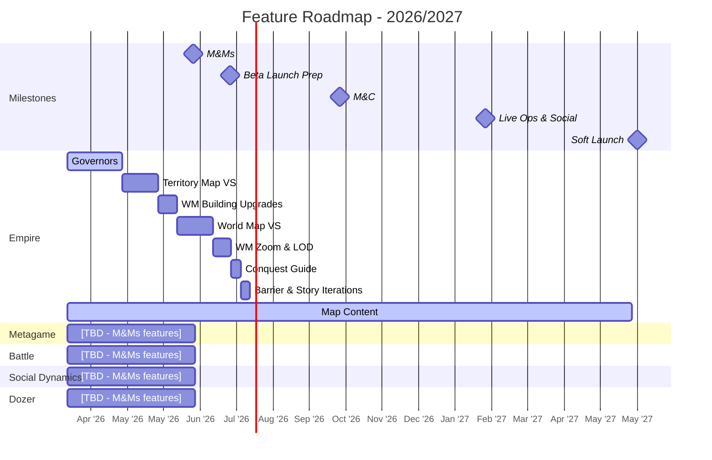

# Feature Roadmap

Last Updated: 2026-03-19

> **This is the operational view** - what we're actually building and when, consolidated from all pod plans.
> For milestone targets and success criteria, see `planning/product_targets.md`.
> For product validation (Winning Hypotheses, BHQs, SHQs), see `planning/ValidationRoadmap.md`.
> For feature details, see `planning/features/*.md`. For staffing, see `planning/capacity.md`.
>
> **This file is regenerated by `/roadmap-update`.** Do not manually edit the consolidated tables or Gantt — update pod plans first, then run the skill.

---

## High-Level Gantt

---

## Pods

### Empire

**Pod Lead**: Diana Vasilescu | **Producer**: Brann Livesay
**Plan**: [`planning/pods/Empire_Plan.md`](../planning/pods/Empire_Plan.md)

**M&Ms Validation Focus**: Validating **WH-2 (Empire Hypothesis)** - retention through intuitive, visual map exploration.

| Key BHQ | Key SHQs for M&Ms | Status |
|---------|-------------------|--------|
| BHQ-E1: Intuitive map exploration | SHQ1 (map at scale), SHQ2 (strategy <-> conquest) | SHQ2 IN PROGRESS |
| BHQ-E3: Long-term progression | SHQ7 (short/mid/long-term goals) | Planning |
| BHQ-E4: Instant gratification | No SHQs defined | Gap |

**M&Ms Features**:

| # | Feature | Estimate | Status |
|---|---------|----------|--------|
| 1 | Governors | 3 sprints | IN PROGRESS |
| 2 | Territory Map Vertical Slice | 2 sprints | NOT STARTED |
| 3 | WM Support for Building Upgrades | 1 sprint | NOT STARTED |
| - | Map Content (Design/Art) | Ongoing | IN PROGRESS |

---

### Metagame

**Pod Lead**: Leonard Perez | **Producer**: Tim Williams
**Plan**: [`planning/pods/Metagame_Plan.md`](../planning/pods/Metagame_Plan.md)

**M&Ms Validation Focus**: TBD - features and SHQ alignment not yet defined.

| Key BHQ | Key SHQs for M&Ms | Status |
|---------|-------------------|--------|
| BHQ-E3: Long-term progression (cross-pod) | SHQ7 (short/mid/long-term goals) | Contributes alongside Empire |
| BHQ-M1: Hero collectability | SHQ10-13 (hero value, attachment, agency, assets) | NOT STARTED |

**M&Ms Features**: [TBD - awaiting feature definitions]

---

### Battle

**Pod Lead**: Lincoln Li | **Producer**: Thorben Novais
**Plan**: [`planning/pods/Battle_Plan.md`](../planning/pods/Battle_Plan.md)

**M&Ms Validation Focus**: TBD - features and SHQ alignment not yet defined.

| Key BHQ | Key SHQs for M&Ms | Status |
|---------|-------------------|--------|
| BHQ-B1: Fun & sticky gameplay | SHQ23 (battle depth over 3 days) | ANSWERED |
| BHQ-B4: Scalable battle content | SHQ27 (scalable battle building), SHQ28 (hero/unit pipeline) | ANSWERED |
| BHQ-E4: Instant gratification (cross-pod) | No SHQs defined | Gap |

**M&Ms Features**: [TBD - awaiting feature definitions]

---

### Social Dynamics

**Pod Lead**: Paul Flores | **Producer**: Tim Williams
**Plan**: [`planning/pods/SocialDynamics_Plan.md`](../planning/pods/SocialDynamics_Plan.md)

**M&Ms Validation Focus**: TBD - features and SHQ alignment not yet defined.

| Key BHQ | Key SHQs for M&Ms | Status |
|---------|-------------------|--------|
| BHQ-M2: PvE to social pipeline | No SHQs until post-Systems Validation | Future milestone |
| BHQ-M4: Multiplayer motivations | SHQ18-22 (paper/prototype multiplayer designs) | NOT STARTED |

**M&Ms Features**: [TBD - awaiting feature definitions]

---

### Dozer

**Pod Lead**: Derek Gallant (eng lead) | **Producer**: -
**Plan**: [`planning/pods/Dozer_Plan.md`](../planning/pods/Dozer_Plan.md)

**M&Ms Validation Focus**: Infrastructure and tooling supporting WH-4 (Production Hypothesis).

| Key BHQ | Key SHQs for M&Ms | Status |
|---------|-------------------|--------|
| WH-4: Production | Content pipeline scalability, technical stability | NOT STARTED |

**M&Ms Features**: [TBD - awaiting feature definitions]

---

## Legend

| Visual | Meaning |
|--------|---------|
| Gray bar | `done` - Completed |
| Blue bar | `active` - In progress |
| Red bar | `crit` - Blocked or at risk |
| Default bar | Planned (not yet started) |
| Diamond | `milestone` - Milestone end date |

---

## Update History

| Date | Changed By | Summary |
|------|-----------|---------|
| 2026-03-19 | Tim / Claude | Rearranged: Gantt first, pod sections with validation summaries, legend/history at bottom |
| 2026-03-19 | Tim / Claude | Restructured as consolidated operational view; milestone definitions moved to product_targets.md |
| 2026-03-18 | Tim / Claude | Initial milestone definitions, Empire M&Ms + M&C features |
