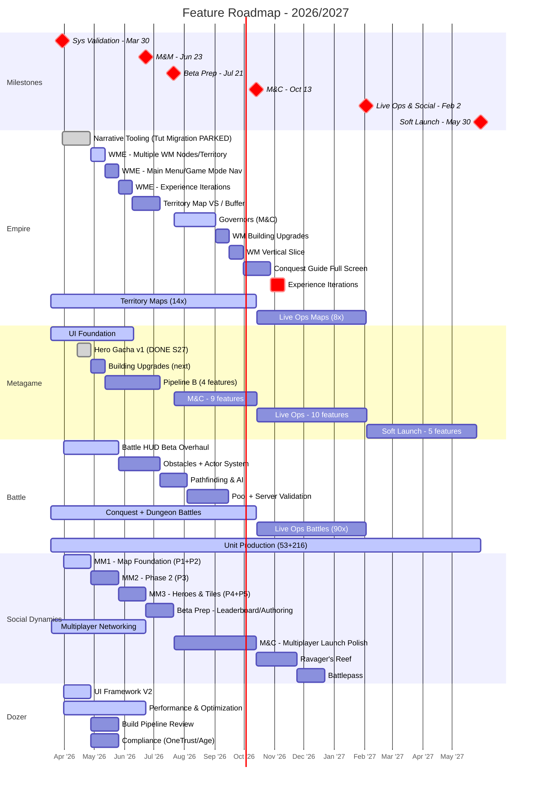

# Feature Roadmap

Last Updated: 2026-04-21

> **This is the operational view** - what we're actually building and when, consolidated from all pod plans.
> For milestone targets and success criteria, see `planning/product_targets.md`.
> For product validation (Winning Hypotheses, BHQs, SHQs), see `planning/ValidationPlan.md`.
> For feature details, see `planning/features/*.md`. For staffing, see `planning/capacity.md`.
>
> **This file is regenerated by `/roadmap-update`.** Do not manually edit the consolidated tables or Gantt — update pod plans first, then run the skill.

---

## High-Level Gantt

```mermaid
gantt
    title Feature Roadmap - 2026/2027
    dateFormat YYYY-MM-DD
    axisFormat %b '%y
    tickInterval 1month

    section Milestones
    Sys Validation - Mar 30   :crit, milestone, 2026-03-30, 0d
    M&M - Jun 23              :crit, milestone, 2026-06-23, 0d
    Beta Prep - Jul 21        :crit, milestone, 2026-07-21, 0d
    M&C - Oct 13              :crit, milestone, 2026-10-13, 0d
    Live Ops & Social - Feb 2 :crit, milestone, 2027-02-02, 0d
    Soft Launch - May 30      :crit, milestone, 2027-05-30, 0d

    section Empire
    Narrative Tooling (Tut Migration PARKED) :done, emp1, 2026-03-30, 28d
    WME - Multiple WM Nodes/Territory :active, emp2a, 2026-04-28, 14d
    WME - Main Menu/Game Mode Nav     :        emp2b, after emp2a, 14d
    WME - Experience Iterations       :        emp2c, after emp2b, 14d
    Territory Map VS / Buffer  :         emp3, after emp2c, 28d
    Governors (M&C)            :active,  emp4, 2026-07-22, 42d
    WM Building Upgrades       :         emp5, after emp4, 14d
    WM Vertical Slice          :         emp6, after emp5, 14d
    Conquest Guide Full Screen :         emp7, after emp6, 28d
    Experience Iterations      :crit,    emp8, after emp7, 14d
    Territory Maps (14x)       :active,  emp_tm, 2026-03-18, 2026-10-13
    Live Ops Maps (8x)         :         emp_lm, 2026-10-14, 2027-02-02

    section Metagame
    UI Foundation              :active, meta_a, 2026-03-18, 84d
    Hero Gacha v1 (DONE S27)   :done,   meta_b1, 2026-04-14, 14d
    Building Upgrades (next)   :        meta_b2, 2026-04-28, 14d
    Pipeline B (4 features)    :        meta_b, after meta_b2, 56d
    M&C - 9 features           :        meta_mc, 2026-07-22, 84d
    Live Ops - 10 features     :        meta_lo, 2026-10-14, 112d
    Soft Launch - 5 features   :        meta_sl, 2027-02-03, 112d

    section Battle
    Battle HUD Beta Overhaul   :active,  bat1, 2026-03-31, 56d
    Obstacles + Actor System   :         bat2, after bat1, 42d
    Pathfinding & AI           :         bat4, after bat2, 28d
    Pool + Server Validation   :         bat5, after bat4, 42d
    Conquest + Dungeon Battles :active,  bat_cb, 2026-03-18, 2026-10-13
    Live Ops Battles (90x)     :         bat_lb, 2026-10-14, 2027-02-02
    Unit Production (53+216)   :active,  bat_units, 2026-03-18, 2027-05-30

    section Social Dynamics
    MM1 - Map Foundation (P1+P2)    :active,  soc_mm1, 2026-03-31, 2026-04-28
    MM2 - Phase 2 (P3)              :         soc_mm2, 2026-04-28, 2026-05-26
    MM3 - Heroes & Tiles (P4+P5)    :         soc_mm3, 2026-05-26, 2026-06-23
    Beta Prep - Leaderboard/Authoring :       soc_beta, 2026-06-23, 2026-07-21
    Multiplayer Networking          :active,  soc_net, 2026-03-19, 2026-06-23
    M&C - Multiplayer Launch Polish :         soc_mc, 2026-07-22, 2026-10-13
    Ravager's Reef                  :         soc_rr, 2026-10-13, 42d
    Battlepass                      :         soc_bp, after soc_rr, 28d

    section Dozer
    UI Framework V2            :active,  doz1, 2026-03-31, 28d
    Performance & Optimization :active,  doz2, 2026-03-31, 84d
    Build Pipeline Review      :         doz3, 2026-04-28, 28d
    Compliance (OneTrust/Age)  :         doz4, 2026-04-28, 28d
```

---

## Pods

### Empire

**Pod Lead**: Diana Vasilescu | **Producer**: Brann Livesay | **Eng Lead**: Dan Dupuis
**Pod Folder**: [`planning/pods/empire/`](../planning/pods/empire/)

**M&Ms Validation Focus**: Validating **WH-2 (Empire Hypothesis)** — map exploration, map readability, and cross-mode UX vision. New M&Ms SHQs focus on world map goal-setting, territory map clarity, narrative direction, and navigation UX.

| Key BHQ | Key SHQs for M&Ms | Status |
|---------|-------------------|--------|
| BHQ-E1: Intuitive map exploration | SHQ3-1 (map at scale), SHQ4-3 (session goals via world map), SHQ4-4 (territory map readability), SHQ4-5 (narrative goals), SHQ4-6 (cross-mode UX vision), SHQ4-11 (map objectives clarity) | SHQ3-1 IN PROGRESS, rest NOT STARTED |

**M&Ms Features** (1x ENG: Henrique De Lima):

| # | Feature | Estimate | Status |
|---|---------|----------|--------|
| 1 | Narrative & Tutorial Tooling (Tutorial Migration PARKED) | 2 sprints (S26-S27) | NARRATIVE DONE / TUTORIAL PARKED |
| 2a | WME - Multiple WM Nodes per Territory | 1 sprint (S28) | IN PROGRESS |
| 2b | WME - Main Menu/Game Mode Navigation | 1 sprint (S29) | NOT STARTED |
| 2c | WME - Experience Iterations | 1 sprint (S30) | NOT STARTED |
| 3 | Territory Map VS / Risk buffer | 2 sprints (S31-S32) | NOT STARTED |

> **UX Continuity Risk**: Yura Rusin on maternity leave 5/11 → ~6/20. UX handoff package for WME #2a + #2b due before 5/11. **Diana Vasilescu absorbs UX duties** for WME #2b and #2c on top of design lead. No embedded Empire UX coverage post-5/11.

> **Tutorial Migration PARKED**: All Tutorial Node Migration work paused as of S28; 3 open tickets stale (CHI-36213, CHI-36212, CHI-36381). Revisit at next milestone planning. **Note**: This affects the "Narrative and Tutorial Tooling" must-have in `product_targets.md` — tutorial portion is no longer being delivered in M&Ms.

**M&C Features** (1x ENG: Henrique De Lima):

> **CAPACITY WARNING**: 5 features totaling **8 eng-sprints** for a 6-sprint milestone with 1 engineer. Conquest Guide Full Screen and Experience Iterations overflow M&C by ~2 sprints into Live Ops & Social. Consider: (a) starting Governors earlier if M&Ms eng finishes ahead of schedule, (b) pulling in additional eng capacity for M&C, or (c) deferring Experience Iterations.

| # | Feature | Estimate | Status |
|---|---------|----------|--------|
| 1 | Governors | 3 sprints | IN PROGRESS (design) |
| 2 | WM Building Upgrades | 1 sprint | NOT STARTED |
| 3 | World Map Vertical Slice | ~1 sprint | NOT STARTED |
| 4 | Conquest Guide Full Screen | 2 sprints | NOT STARTED |
| 5 | Experience Iterations | 1 sprint | NOT STARTED |

**Content Targets** (see [`planning/contentTargets.md`](../planning/contentTargets.md)):

| Content | Target | Deadline | Status |
|---------|--------|----------|--------|
| World Map | 1x (ongoing updates every milestone) | M&Ms initial, then continuous | IN PROGRESS |
| Territory Maps | 14x | By end of M&C (Oct 13, 2026) | IN PROGRESS |
| Live Ops Maps | 8x | Starting Live Ops & Social (Oct 2026 → Feb 2027) | NOT STARTED |
| Map Visuals & Biomes | As many as possible | No firm target | IN PROGRESS |

---

### Metagame

**Pod Lead**: Leonard Perez | **Producer**: Tim Williams | **Eng Lead**: Dan Dupuis
**Pod Folder**: [`planning/pods/metagame/`](../planning/pods/metagame/)

**M&Ms Validation Focus**: Building the systems and UI layers that support empire progression depth and hero investment. M&Ms SHQs under Monetisation hypothesis (BHQ-M3) test whether progression systems drive meaningful engagement and future spend potential.

| Key BHQ | Key SHQs for M&Ms | Status |
|---------|-------------------|--------|
| BHQ-M3: Spending drivers (cross-pod) | SHQ4-7 (empire progression depth), SHQ4-8 (session-to-session return), SHQ4-9 (resource tension), SHQ4-10 (economy model confidence) | NOT STARTED |
| BHQ-M1: Hero collectability | SHQ3-10 through SHQ3-13 (hero value, attachment, agency, assets) | NOT STARTED |

**M&Ms Features** (2x ENG, parallel pipelines: Guilherme Quizzini + Tiago Costa):

| # | Feature | Sprints | Pipeline | Status |
|---|---------|---------|----------|--------|
| 1 | UI Foundation | 6 | A | IN PROGRESS |
| 2 | Hero Gacha v1 | 1 | B | **COMPLETE (S27)** |
| 3 | Building Upgrades | 1 | B | NOT STARTED (TiagoC next, S28) |
| 4 | Empire Progression Tree | 1 | B | NOT STARTED |
| 5 | Global Combat Research Tree | 2 | B | NOT STARTED |
| 6 | Passive Bonus Tiles | 1 | B | NOT STARTED |
| 7 | Reduction of FTUE Friction | 2 | (cross) | NOT STARTED |

**M&C Features** (2x ENG, parallel pipelines):

| # | Feature | Sprints | Status |
|---|---------|---------|--------|
| 1 | Main Menu UX/UI | 1 | NOT STARTED |
| 2 | Dungeons v2 | 1 | NOT STARTED |
| 3 | Timed Objectives | 1 | NOT STARTED |
| 4 | End Level Reward Screen | 1 | NOT STARTED |
| 5 | Academies | 1 | NOT STARTED |
| 6 | Hero Ranking Up | 1 | NOT STARTED |
| 7 | Shop | 1 | NOT STARTED |
| 8 | Hero Gacha v2 | 1 | NOT STARTED |
| 9 | Timed PvE Live Ops Maps | 1 | NOT STARTED |

---

### Battle

**Pod Lead**: Lincoln Li | **Producer**: Thorben Novais | **Eng Lead**: Jota Oliveira
**Pod Folder**: [`planning/pods/battle/`](../planning/pods/battle/)

**M&Ms Validation Focus**: Validating combat engagement, tactical depth, hero role clarity, and battle systems quality bar for beta. New M&Ms SHQs focus on HUD supporting strategic+tactical play and hero role differentiation.

| Key BHQ | Key SHQs for M&Ms | Status |
|---------|-------------------|--------|
| BHQ-B2: Intuitive actions | SHQ3-24 (art clarity for combat), SHQ4-1 (HUD strategic + tactical) | SHQ3-24 IN PROGRESS, SHQ4-1 IN PROGRESS |
| BHQ-B3: Hero/troop variety | SHQ3-26 (hero/troop collection motivation), SHQ4-2 (starter hero role clarity) | SHQ3-26 PENDING, SHQ4-2 NOT STARTED |
| BHQ-B4: Scalable battle content | SHQ3-27 (scalable battle building), SHQ3-28 (unit pipeline) | IN PROGRESS |

**M&Ms Features** (1x ENG: Jota):

> **CAPACITY WARNING**: 4 features totaling 9 eng-sprints for ~7-sprint milestone. Features shown sequentially — engineering is single-threaded. Pathfinding & AI may overflow into Beta Prep.

| # | Feature | Estimate | Status |
|---|---------|----------|--------|
| 1 | Battle HUD Beta Overhaul | 4 sprints | IN PROGRESS |
| 2 | Obstacles | 1 sprint | NOT STARTED |
| 3 | Actor System Overhaul | 2 sprints | NOT STARTED |
| 4 | Pathfinding & AI Improvements | 2 sprints | NOT STARTED |

**Content Targets** (see [`planning/contentTargets.md`](../planning/contentTargets.md)):

| Content | Target | Deadline | Status |
|---------|--------|----------|--------|
| Conquest Battles — Narrative | 10x unique | With territory maps (by M&C) | IN PROGRESS |
| Conquest Battles — Systemic | 9x templates × ~21 configs = ~189 | With territory maps (by M&C) | IN PROGRESS |
| Dungeon Boss Battles | 3x bosses × 25 floors = 75 encounters | M&C (with Dungeons feature) | NOT STARTED |
| Dungeon Encounter Battles | 5x encounters × 20 floors = 100 encounters | M&C (with Dungeons feature) | NOT STARTED |
| Live Ops Battles | 90x initial pool → ongoing cadence | Starting Live Ops & Social | NOT STARTED |
| Heroes | 53 unique | Ongoing (6 starters by M&Ms) | IN PROGRESS |
| Troops | 9 unique × 4 tiers × 6 skins = 216 variants | Ongoing (SHQ3-28) | IN PROGRESS |
| Bosses | 6 total (3 dungeon + 3 roaming monster) | M&C | NOT STARTED |
| Battlefields (3D envs) | As many as possible | No firm target | IN PROGRESS |

**Beta Prep Features**:

| # | Feature | Estimate | Status |
|---|---------|----------|--------|
| 1 | Pool Management | 1 sprint | NOT STARTED |

**M&C Features**:

| # | Feature | Estimate | Status |
|---|---------|----------|--------|
| 1 | Battle Server Validation Client | 2 sprints | NOT STARTED |

---

### Social Dynamics

**Pod Lead**: Paul Flores | **Producer**: Tim Williams | **Eng Lead**: Derek Gallant
**Pod Folder**: [`planning/pods/social_dynamics/`](../planning/pods/social_dynamics/)

**M&Ms Validation Focus**: Building multiplayer map foundations via the MM1 → MM3 checkpoint plan (P1–P10 phases as functionality vocabulary). AI prototype carries playtesting until in-client switchover by end of M&Ms (6/22).

| Key BHQ | Key SHQs for M&Ms | Status |
|---------|-------------------|--------|
| BHQ-M2: PvE to social pipeline | No SHQs until post-Systems Validation | Future milestone |
| BHQ-M4: Multiplayer motivations | SHQ3-18 through SHQ3-22 (paper/prototype multiplayer designs) | NOT STARTED |

**Strategy**: 3 parallel tracks — AI Prototype (playtesting), Multiplayer Maps (MM1/MM2/MM3 sprint-mapped build-up), Networking. **Goal 1**: in-client multiplayer ready to replace AI prototype by end of M&Ms. **Goal 2** (M&C): 6 polish areas — Dynamic Experience, Clarity, Design Depth, Infrastructure, Final UI Polish, Onboarding. **Goal 3** (post-launch): Flags, Chat, Coop. Source: Multiplayer Implementation Strategy (Notion).

**M&Ms Staffing** (5x ENG: Gabriel Arruda, Marcos Loures, Randy Pasion, Garrett Eidsvig, Bruno Bacelar):
- Gabriel Arruda and Marcos Loures transitioning from Empire for M&Ms
- Randy and Garrett have Dozer split risk — feature work may be interrupted
- Bruno Bacelar dedicated to Multiplayer Networking

**M&Ms Features** (sprint codes from Notion: A=S28, B=S29, C=S30, D=S31):

| Checkpoint | Sprint | Feature(s) | Phase | Status |
|------------|--------|------------|-------|--------|
| MM1 | S26–S27 (YY→ZZ) | Multiplayer Map Foundation — Data (Loures), Models (Gabriel), Visualization (Randy) | P1 + P2 | IN PROGRESS |
| MM2 | S28 (A) | Tile Ownership/States/Visualization, Embark Flow, MP Map Instance Creation/List/Join dev UI v1 | P3 (partial) | NOT STARTED |
| MM2 | S29 (B) | Battles, Troop Training | P3 (partial) | NOT STARTED |
| MM3 | S30 (C) | Persistent Hero Health & Recovery, Hero Party Map Representation, Hero Energy & Pathing | P4 | NOT STARTED |
| MM3 | S31 (D) | Tile Info & Actions, Tile Types & Cycle Generation | P5 | NOT STARTED |

> **Risky Prototype Areas** (may impact foundation): Embark Flow, Map RNG (Battles/Tile Types/Modifiers/Seasons), Map Visuals (multiplayer maps differ from Territory/World).

**Beta Launch Prep Features** (S32–S33 / Sprints E+F — milestone plan TBD closer to date):

| Sprint | Feature(s) | Phase |
|--------|------------|-------|
| S32 (E) | Map Leaderboard v1, Multiplayer Map Authoring | P6 |
| S33 (F) | Iteration / Flex | — |

**M&C Features — Multiplayer Launch Polish** (6 themes; sequencing TBD):

| # | Theme | Phase Coverage |
|---|-------|----------------|
| 1 | Make Experience More Dynamic (Story Shards, map choice, modifiers, departure) | P7 |
| 2 | Make Experience More Clear (Activity Log, modifiers display, Income Summary, End Reward, Metagame Leaderboard) | P8 |
| 3 | Design Depth (Seasons, Leaderboard Payouts, higher building start) | P9 |
| 4 | Infrastructure (Battle Server Authoritative, Matchmaking & Leaderboards) | P10 |
| 5 | Final UI Polish (MP Map Instance/List/Join screens) | — |
| 6 | Game Mode Onboarding (design effort) | — |

**Post-M&C Features**:

| Feature | Estimate | Status |
|---------|----------|--------|
| Ravager's Reef | 3 sprints | NOT STARTED |
| Battlepass | 2 sprints | NOT STARTED |

**Post-Launch Backlog**: Flags, Chat Messages, Coop mode.

---

### Dozer

**Eng Lead**: Derek Gallant | **Producer**: - | **Pod Lead**: -
**Pod Folder**: [`planning/pods/dozer/`](../planning/pods/dozer/)

**M&Ms Focus**: Infrastructure, UI framework support, performance, build pipeline, and beta compliance.

| Key Focus | Description | Status |
|-----------|-------------|--------|
| UI Framework V2 | Cross-pod UI support for M&Ms features (Support → Full migration) | IN PROGRESS |
| Performance & Stability | Game performance meets beta quality bar | IN PROGRESS |
| Build Pipeline Review | CP2 audit and improvements | NOT STARTED (CP2 kickoff S28) |
| Compliance | OneTrust + Age Gate for beta readiness | NOT STARTED (CP2 kickoff S28) |

**M&Ms Features** (2x ENG: Derek Gallant, Bruno Freitas):

| # | Feature | Estimate | Status |
|---|---------|----------|--------|
| 1 | UI Framework V2 - UI Support (Cross-Pod) | 2 sprints | IN PROGRESS |
| 2 | UI Framework V2 - Full Migration (CP2) | 2 sprints | NOT STARTED |
| 3 | Build Pipeline Review (CP2) | 2 sprints | NOT STARTED |
| 4 | Compliance — OneTrust + Age Gate (CP2) | 2 sprints | NOT STARTED |
| 5 | Performance/Optimization | Ongoing | IN PROGRESS |

> **CP2 CAPACITY**: 3 features kicking off S28 against 2 engineers (Derek + Bruno F). Likely needs prioritization. Derek also splits with SD eng lead duties.

---

> **Art Pod (closed 2026-04-13)**: No standalone Art section. Artists are now embedded in Empire, Battle, and Cross-pod (Kevin Griffith / Brendan Cheatham). Per-pod art deliverables roll up under each pod's content track. See `planning/capacity.md` for current artist assignments and `planning/pods/art/milestone_mms.md` for the closure marker.

---

## Legend

| Visual | Meaning |
|--------|---------|
| Gray bar | `done` - Completed |
| Blue bar | `active` - In progress |
| Red bar | `crit` - Blocked or at risk |
| Red diamond | `crit, milestone` - Milestone end date |
| Default bar | Planned (not yet started) |

---

## Update History

| Date | Changed By | Summary |
|------|-----------|---------|
| 2026-04-21 | Tim / Claude | **Social Dynamics restructure** from Multiplayer Implementation Strategy (Notion). Adopted dual vocabulary: **MM1/MM2/MM3** = M&Ms checkpoint plan (rigid: 2 sprints each) and **P1–P10** = phases of multiplayer functionality (engineering shorthand). Sprint-by-sprint commitments now mapped: MM1 (Map Foundation: Data/Models/Visualization) through MM3 (Sprint D: Tile Info, Tile Types, Cycle Generation). Beta Launch Prep S32/S33 features added (Map Leaderboard v1, MP Map Authoring, Flex). M&C broken into Goal 2 themes (6 polish areas: Dynamic, Clarity, Depth, Infrastructure, UI Polish, Onboarding). Goal 3 post-launch backlog (Flags, Chat, Coop). 3 risky prototype areas called out (Embark Flow, Map RNG, Map Visuals). Pod Lead set to Paul Flores. |
| 2026-04-21 | Tim / Claude | **Empire WME terminology**: Renamed "WME Sub-Effort 1/2/3" to feature names — **WME - Multiple WM Nodes per Territory** (S28), **WME - Main Menu/Game Mode Navigation** (S29), **WME - Experience Iterations** (S30). **Tutorial Migration PARKED entirely** — narrative tooling work continued S26-S27 but tutorial migration paused; affects "Narrative and Tutorial Tooling" must-have in product_targets.md. **Yura maternity 5/11**: Diana absorbs UX for WME #2b + #2c. **Metagame**: Hero Gacha v1 marked COMPLETE (shipped in S27 by Tiago Costa); Building Upgrades is next Pipeline B feature for TiagoC. **Art Pod removed from roadmap** — closed 2026-04-13; artists redistributed; per-pod art deliverables now roll under each pod's content track. **Dozer**: Added Build Pipeline Review and Compliance (OneTrust/Age Gate) as M&Ms CP2 features. |
| 2026-04-09 | Tim / Claude | **Empire M&Ms resequence**: Tutorial Node Migration expanded to 2 sprints (S26-S27) — more UX exploration time needed for World Map Experience. WME pushed to S28-S30. Territory Map VS deferred to S31-S32 (design not ready for eng yet, shares time with risk buffer). Total M&Ms scope unchanged. |
| 2026-04-09 | Tim / Claude | **Empire M&C update**: "WM Zoom Filtering & LOD" renamed to "World Map Vertical Slice" (~1 sprint). "Conquest Guide Full Screen" expanded to 2 sprints (supporting conquest territory/world maps & live ops maps). "Barrier & Story Shard Iterations" renamed to "Experience Iterations" (1 sprint, experience iterations only). Map Content split to `planning/contentTargets.md` with explicit targets: 1x World Map (ongoing), 14x Territory Maps (by M&C), 8x Live Ops Maps (starting Live Ops & Social). **Empire M&C now 8 eng-sprints in 6-sprint milestone — overflow risk flagged.** Feature registry updated. Social Dynamics P1 marked COMPLETE, P2 IN PROGRESS. Pod folder links updated. |
| 2026-03-27 | Tim / Claude | **Major update**: Empire M&Ms reprioritized (Tutorial Node Migration -> World Map Experience -> Territory Map VS). Governors moved to M&C. Empire capacity: Henrique De Lima sole client eng (Gabriel Arruda -> Social Dynamics, Marcos Loures -> Social Dynamics). Tiago Costa (new) -> Metagame. WH-4 (Production) removed — Dozer now shows actual features (UI Framework V2, Performance). 15 M&Ms SHQs added to ValidationPlan (SHQ4-1 through SHQ4-10 new). Updated product_targets.md with 9 new M&Ms must-haves. |
| 2026-03-20 | Brann / Claude | **Added Art Pod**: Created Art_Plan.md with cross-pod art production priorities (Character Assets, Environment Art, UI/UX Assets, VFX & Animation). Added Art pod section to consolidated roadmap with M&Ms, Beta Prep, and M&C features. Art supports all pods with visual assets and pipeline development. |
| 2026-03-20 | Brann / Claude | Added Battle pod M&Ms features: 6 features (Battle HUD Beta Overhaul, Obstacles, Actor System Overhaul, Pathfinding & AI, Battle Server Validation, Pool Management). Added Battle Content and Unit Content ongoing tracks. **Capacity warning**: 9 eng-sprints for 7-sprint milestone - Pool Management deferred to M&C. |
| 2026-03-19 | Tim / Claude | Added Social Dynamics features (3 tracks, 10 phases, P1-P10 + Ravager's Reef + Battlepass). Added System Validation milestone (Mar 30) across all roadmaps. |
| 2026-03-19 | Tim / Claude | Added full Metagame feature plan across all milestones (M&Ms through Soft Launch). Updated milestone markers with crit styling and dates. Added Empire Beta Prep gap to Gantt. |
| 2026-03-19 | Tim / Claude | Rearranged: Gantt first, pod sections with validation summaries, legend/history at bottom |
| 2026-03-19 | Tim / Claude | Restructured as consolidated operational view; milestone definitions moved to product_targets.md |
| 2026-03-18 | Tim / Claude | Initial milestone definitions, Empire M&Ms + M&C features |
