# Lotus Documentation Brain - System Architecture

> Generated from `project-charter.md`. Regenerate by re-reading the charter and running this view.

---

## System Architecture Diagram

```mermaid
graph TB
    subgraph External["External Systems"]
        NOTION["Notion<br/>Game Documentation DB"]
        CLICKUP["ClickUp<br/>Sprint Tasks & Tracking"]
        SLACK["Slack<br/>Pod Channels"]
        GCAL["Google Calendar<br/>PTO / OOO"]
        GSHEETS["Google Sheets<br/>Roadmap Spreadsheet"]
    end

    subgraph Brain["Documentation Brain"]
        subgraph Planning["planning/ (Human-Authored, Authoritative)"]
            PT["product_targets.md<br/>WHAT we need"]
            CAP["capacity.md<br/>WHAT we have"]
            VR["ValidationRoadmap.md<br/>WHAT we must prove"]
            FR["feature_registry.md<br/>Feature-to-Source Map"]
            PP["pods/*_Plan.md<br/>Per-Pod Priorities"]
            FS["features/*.md<br/>Feature Specs"]
            SR["sprint_rules.md<br/>Task Scaffolding"]
            TD["TechnicalDebt.md<br/>Debt Ledger"]
            DM["dependency_map.md"]
            GR["GlobalRules.md"]
            DQ["designer_queue/<br/>Q&A Pipeline"]
        end

        subgraph Generated["generated/ (Disposable, Regenerated)"]
            RD["roadmap.md<br/>Consolidated Roadmap"]
            RO["roadmap_options.md<br/>Scenario Comparison"]
            SP["sprint_plans/<br/>Sprint Plans"]
            RPT["reports/<br/>Risk & Sprint Reports"]
            DB["design_briefs/"]
            RAS["roadmap_apps_script.js"]
        end

        subgraph Skills["Skills (.claude/commands/)"]
            S_RU["/roadmap-update"]
            S_RE["/risk-evaluation"]
            S_SS["/spec-sync"]
            S_DA["/doc-author"]
            S_DZ["/designer-quiz"]
            S_QR["/queue-review"]
            S_SP["/sprint-plan"]
            S_SR["/sprint-risks"]
            S_VR["/validation-review"]
            S_TD["/tech-debt"]
            S_FRP["/feature-review-prep"]
            S_RS["/roadmap-sheet"]
        end
    end

    %% Core Triangle
    PT ===|"compared against"| RD
    RD ===|"checked against"| CAP

    %% Planning interconnections
    VR -->|"SHQ IDs"| FS
    VR -->|"validation focus"| PP
    CAP -->|"staffing"| PP
    CAP -->|"estimates"| FS
    PT -->|"must-haves"| FR
    FR -->|"drives"| FS
    PP -->|"priorities"| RD
    TD -->|"constrains"| FS
    DM --> PP
    DM --> FS

    %% Skill to File flows
    S_RU -->|"regenerates"| RD
    S_RU -->|"updates"| PP
    S_RE -->|"writes"| RPT
    S_SS -->|"creates/updates"| FS
    S_SS -->|"populates"| DQ
    S_DA -->|"creates"| FS
    S_DZ -->|"collects"| DQ
    S_QR -->|"applies to"| FS
    S_SP -->|"generates"| SP
    S_TD -->|"manages"| TD
    S_FRP -->|"generates"| DB
    S_RS -->|"generates"| RAS

    %% External connections
    NOTION -.->|"/spec-sync"| FS
    FR -.->|"page IDs"| NOTION
    CLICKUP -.->|"/sprint-plan<br/>/sprint-risks"| SP
    S_SP -.->|"scaffolds tasks"| CLICKUP
    SLACK -.->|"/channel-digest"| RPT
    GCAL -.->|"PTO data"| S_SP
    RAS -.->|"paste into"| GSHEETS
```



---

## Key Takeaways

### 1. The Core Triangle

The entire system revolves around three tensions:

- **Targets** (`product_targets.md`) -- what leadership says we must achieve
- **Plans** (`roadmap.md`, consolidated from pod plans) -- what we're actually building
- **Resources** (`capacity.md`) -- who we have to do it

Most skills exist to compare these three and surface gaps.

```
product_targets.md     "What must each milestone achieve?"
       |
       | compared against
       v
roadmap.md             "What are we actually building?"
(from pod plans)
       |
       | checked against
       v
capacity.md            "Do we have the people?"
```

### 2. Three-Tier File Authority

| Tier | Location | Editable By | Lifespan |
|------|----------|-------------|----------|
| **Authoritative** | `planning/` | Humans (skills ask first) | Persistent |
| **Generated** | `generated/` | Skills only | Disposable -- blow away and regenerate |
| **Reference** | `reference/` | Ingestion scripts | Source material, not plans |

### 3. Validation Flows Top-Down

```
Winning Hypotheses (4 bets about the product)
  -> BHQs (broad questions, cross-pod)
    -> SHQs (specific, testable per milestone)
      -> Features (each traces back to SHQs)
```

Every feature should answer "why are we building this?" via SHQ references. Validation is not siloed to pods -- it cuts across them.

### 4. The Brain Sits Between Notion and ClickUp

```
Notion (Design Docs)              Documentation Brain              ClickUp
Game Documentation DB    -sync->  planning/ files        -inform-> Sprint-level tasks
                                  generated/ views                  Execution tracking
                                  reference/ raw data
```

- **Notion** = design detail (source docs), synced into feature specs via `/spec-sync`
- **Brain** = strategic planning layer (milestones, capacity, validation, risk)
- **ClickUp** = sprint execution, tasks scaffolded via `/sprint-plan`

The brain does not replace either -- it is the connective tissue.

### 5. Skills Follow Pipeline Patterns

Most workflows are multi-skill chains:

**Spec pipeline:**
```
/spec-sync -> /designer-quiz -> /queue-review -> updated feature specs
```

**Planning pipeline:**
```
/roadmap-update -> /risk-evaluation -> /roadmap-options -> decision
```

**Sprint pipeline:**
```
/sprint-plan (Preview) -> /sprint-plan (Kickoff) -> /sprint-risks -> triage
```

### 6. Single Source of Truth, Reference by ID

Nothing is duplicated. Features reference SHQs by ID (`SHQ7`), tech debt by ID (`TD-001`), pod leadership from `capacity.md`. If the same fact appears in two places, one is wrong -- the authoritative file wins.

### 7. Skill Design Principles

1. **Read-Assess-Act-Summarize**: Read project state, assess against criteria, take action (with approval), summarize what changed.
2. **Graceful Degradation**: If an external source or file is not available, do useful work with what is available. Flag what is missing, do not halt.
3. **Flag, Don't Fix**: When a skill spots a problem outside its scope, flag it and suggest which skill to run -- do not try to fix everything.
4. **Questions Grouped by Owner**: When generating action items, group by the responsible person (from `capacity.md`).
5. **Idempotent / Additive**: Running a skill twice should never break anything or overwrite human-authored content without approval.

### 8. Core Skill I/O Summary

| Skill | Reads | Writes |
|-------|-------|--------|
| `/roadmap-update` | product_targets, pod plans, capacity, feature_registry, features/, ValidationRoadmap, TechnicalDebt | pods/, feature_registry, generated/roadmap.md |
| `/risk-evaluation` | product_targets, roadmap, capacity, pod plans, ValidationRoadmap, feature_registry, TechnicalDebt | generated/reports/ |
| `/spec-sync` | feature_registry, features/, Notion (MCP) | features/, designer_queue |
| `/sprint-plan` | product_targets, pod plans, capacity, sprint_rules, roadmap, Google Calendar, ClickUp | generated/sprint_plans/, pods/, ClickUp tasks |
| `/sprint-risks` | ClickUp sprint tasks, product_targets, pod plans, Slack | Report (copy/paste) |
| `/doc-author` | features/, all planning files | features/ |
| `/designer-quiz` | designer_queue, capacity | raw_input/ |
| `/queue-review` | raw_input/, features/ | clean_input/, output/, features/, designer_queue |
| `/tech-debt` | TechnicalDebt, features/, capacity | TechnicalDebt |
| `/feature-review-prep` | features/, pod plans, product_targets, ValidationRoadmap | generated/design_briefs/ |
| `/roadmap-sheet` | product_targets, pod plans, capacity, roadmap | generated/roadmap_apps_script.js |
| `/validation-review` | ValidationRoadmap, features/, pod plans, product_targets | Report (no file changes) |
