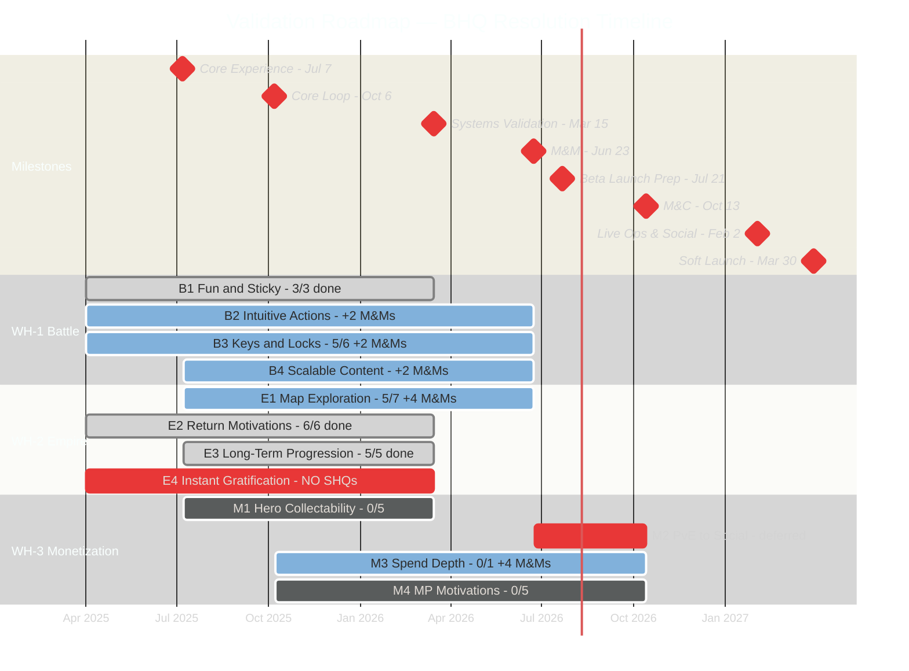
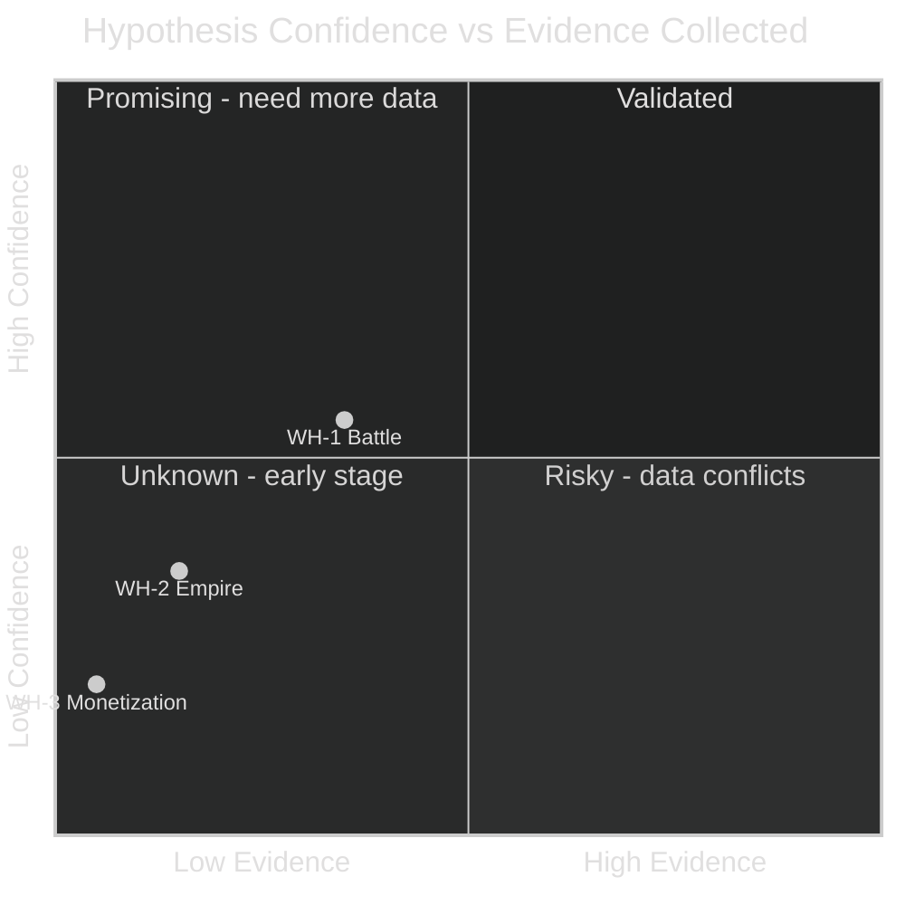

# Validation Roadmap

Last Updated: 2026-03-27
Last Evaluated: Sprint XX

---

## Purpose

This roadmap tracks our **product validation** - the structured process of proving (or disproving) that we're building the right thing. It works top-down:

1. **Winning Hypotheses** (4x) - If these are true, we succeed
2. **Big Hairy Questions** (BHQs) - How we test each hypothesis in smaller pieces
3. **Small Hairy Questions** (SHQs) - Concrete validations assigned per milestone

Each sprint we evaluate progress against these targets. Over time, milestone by milestone, we validate (or pivot) our product direction.

**Important**: BHQs and SHQs are **not necessarily pod-specific**. Some belong clearly to one pod, but many are cross-pod "cohesive product" questions that require contributions from multiple teams. This file is the single source of truth for all validation content — pod plans and feature docs reference SHQs by ID, they don't duplicate them.

---

## Milestones In Scope

| Milestone | Player Journey | Target Date | Test Type | Distribution |
|-----------|---------------|-------------|-----------|-------------|
| **Core Experience** | Build a core battle in which players can clearly observe heroes being awesome, and generate goals from what they see. | July 7, 2025 | Closed Beta Test | Android |
| **Core Loop** | An engaging first session that leaves players wanting more, supported by a lightweight FTUE that onboards players onto core loop mechanics. | October 6, 2025 | External Validation (Paid Playtesters) | Android |
| **Systems Validation** | Day 0-1: Expand FTUE with map exploration that facilitates strong emotional attachment to characters & "completing" a hero to a soft-cap (e.g. epic max rank). | March 2026 | External Validation (Paid Playtesters) | Android |
| **Multiplayer & Meta (M&Ms)** | Day 2-3: Home Empire territories (1-9) conquered; player pushes on vertical depth of upgrading buildings in the empire and farming dungeons for gear. | June 23, 2026 | [TBD] | [TBD] |
| **Beta Launch Prep** | Stabilize, polish, and bugfix the game with a final push before releasing. No planned feature work during this milestone. | July 21, 2026 | [TBD] | [TBD] |
| **Monetization & Conversion** | 7 days of PvE Home Territory content and PvP limited timed events. | October 13, 2026 | [TBD] | [TBD] |
| **Live Ops & Social** | Broader battle mechanics and game modes give players more ways to play and keeps them coming back. As they near the end of the solo content, players are introduced to dynamic PvP options that provide dynamic objectives and opponents. | February 2, 2027 | [TBD] | [TBD] |
| **Soft Launch (UA Scale)** | Players start thinking about tier 4 goals and setting goals to optimize their army setup. | March 30, 2027 | [TBD] | [TBD] |

### Validation Methods by Milestone

**Core Experience**: Qualitative playtest feedback on battles & heroes. Internal stakeholder review.

**Core Loop**: PTC targeting of actual audience (Eddard, Jimmy, Jackson) to measure response to first session of play. Qualitative surveys on art style and theme with regard to characters.

**Systems Validation**: Qualitative playtest feedback. Technical performance metrics to ensure stability (unhandled exceptions, crash rates, ANR).

**Multiplayer & Meta (M&Ms)**: [TBD]

**Beta Launch Prep**: Bug triage, crash/ANR rates, performance benchmarks. No new validation — focus on stability.

**Monetization & Conversion**: [TBD]

**Live Ops & Social**: [TBD]

**Soft Launch (UA Scale)**: [TBD]

---

## Validation Hierarchy — Timeline

Each bar = one BHQ. The span shows which milestones contain its SHQs. When the bar ends, that BHQ should be answerable. Fractions show SHQs answered vs total.



**Legend**: Green (done) = all SHQs answered positively | Blue (active) = in progress or mixed results | Red (crit) = gap or deferred | Gray = not started

---

## Winning Hypotheses

---

### WH-1: Battle Hypothesis

**Statement**: We think we can win at every point in the funnel by delivering on a compelling army battling experience centered on dramatic hero moments. The battle experience will grab attention on D1 with delightful and memorable moments then continue to drive depth and attachment resulting in investment by D30 and keeping them engaged on D700.

**Status**: PARTIALLY VALIDATED
**Current Confidence**: Medium
**Confidence Trend**: +

<details>
<summary>Market Conditions & Belief (expand)</summary>

**Market Conditions:**
1. Early experience benefits from instant gratification high dopamine moments (market emphasis on minigames or alternate gameplay to maintain initial interest at top of funnel)
2. Players are interested in dramatic battles & clashing of armies; evident from ad creative trends and audience motivation research
3. Broad audience means low appetite for complexity while providing enough agency to maintain interest

**Belief:** Current market trends achieve short term stickiness at the cost of dissonance on what the player truly wants and unclear hooks into mid and long term strategy.

**We can beat the market by:**
1. Focusing on intuitive and easy to execute battle controls that center around dramatic and memorable big hero moments (in the context of army battlers, this helps heroes stand out as larger-than-life and sets up multilayer gameplay on a strategic map)
2. Reinforce those big hero moments with a highly visual (and intuitive) feedback layer (baubles)
3. Easy-to-execute battle mechanics to minimize complexity (autoplacement, pausing for abilities)
4. Players will learn battle mechanics and how heroes can provide solutions to strategic gameplay problems
5. Capitalize on player's understanding of battle by providing short, mid, and long term progression hooks in Empire that improve battle outcomes
6. Sustain long term interest -- keep battle fresh -- via increasing difficulty and varied strategic challenges that require many permutations of teams to solve

</details>

#### Big Hairy Questions

##### BHQ-B1: Does the battle experience result in fun-to-execute gameplay that creates stickiness for a broad audience?

**Status**: TESTING

| Milestone          | SHQ                                                                                                                                                                    | Status     |
| ------------------ | ---------------------------------------------------------------------------------------------------------------------------------------------------------------------- | ---------- |
| Core Experience    | Do players understand how to improve battle outcomes?                                                                                                                  | ANSWERED ✅ |
| Core Loop          | Do playtesters enjoy the first 20 minutes of gameplay? Is there a sense of momentum and rewards that lead to short term goals that make them want to continue playing? | ANSWERED ✅ |
| Systems Validation | SHQ23: Beyond initial stickiness, does depth of play in our battle mechanics remain interesting and engaging for the first three days?                                 | ANSWERED ✅ |

---

##### BHQ-B2: Are in-game actions taken by the player intuitive, quick to visually understand, and satisfying to execute?

**Status**: TESTING

| Milestone          | SHQ                                                                                                | Status     |
| ------------------ | -------------------------------------------------------------------------------------------------- | ---------- |
| Core Experience    | Can hero skills be articulated, and troop roles & counter systems understood?                      | ANSWERED ✅ |
| Core Loop          | Does the player understand how WomboCombo builds up (baubles) and are they excited with its usage? | ANSWERED ✅ |
| Systems Validation | SHQ24: Does our new art direction maintain the level of clarity necessary for this to be clear?    | ANSWERED ✅ |
| M&Ms               | SHQ24: Does our new art direction maintain the level of clarity necessary for this to be clear? | IN PROGRESS |
| M&Ms               | SHQ29: Does the HUD allow strategic planning (understanding the challenge) as well as tactical response (understanding who's turn it is and the result of their targeting choices)? | NOT STARTED |

---

##### BHQ-B3: Is the player motivated to collect 'keys' (heroes) to solve various 'locks' (gameplay mechanics/challenges)?

**Status**: TESTING

| Milestone          | SHQ                                                                                                                                                              | Status     |
| ------------------ | ---------------------------------------------------------------------------------------------------------------------------------------------------------------- | ---------- |
| Core Experience    | Do players get excited to build troops to solve battle problems?                                                                                                 | ANSWERED ❌ |
| Core Experience    | Does our hero presentation allow them to stand out and allow for personality & collectibility?                                                                   | ANSWERED ✅ |
| Core Loop          | Does the player understand the need for specific mechanics in battle, and is able to anticipate using the right skills at the right time?                        | ANSWERED ✅ |
| Core Loop          | Do players utilize broad troop roles to support hero choices? Melee to protect ranged, etc. Do they appreciate their troops?                                     | ANSWERED ✅ |
| Systems Validation | SHQ25: (paper) Does our GTM hero roster cover both the rarity spread necessary for monetization and the roles & mechanics spread necessary for broad collection? | ANSWERED ✅ |
| Systems Validation | SHQ26: Is the player motivated to collect specific and varied heroes and troops against each planned game mode (Dungeons, XP farm, Conquest, etc)?               | ANSWERED ✅ |
| M&Ms               | SHQ26: Is the player motivated to collect specific and varied heroes and troops against each planned game mode (Dungeons, XP farm, Conquest, etc)? | PENDING VALIDATION |
| M&Ms               | SHQ30: Can players understand the role and abilities of all six starter heroes, and do player metagame progression choices vary per hero in support of that role? | NOT STARTED |

> **Note**: The ❌ on troop excitement is a signal to watch. Hero presentation tested well (✅) but troops did not excite. This may require design iteration.

---

##### BHQ-B4: Can our battle solution scale? Can we define what makes good levels in a repeatable way and produce them at an acceptable rate?

**Status**: NOT YET TESTED

| Milestone          | SHQ                                                                                                                                                                                                      | Status     |
| ------------------ | -------------------------------------------------------------------------------------------------------------------------------------------------------------------------------------------------------- | ---------- |
| Core Loop          | Can we support a variety of level types with varied pacing, that keeps each battle in the first session feeling fresh and not repetitive?                                                                | ANSWERED ✅ |
| Systems Validation | SHQ27: Can we effectively and scalably build battles across all game modes?                                                                                                                              | ANSWERED ✅ |
| Systems Validation | SHQ28: Are we confident in our pipeline hero/unit production? Can we prove it with animation requirements and get a full understanding on how long it takes to build a hero/unit for long term planning? | ANSWERED ✅ |
| M&Ms               | SHQ27: Can we establish an effective, scalable process for building battles across all game modes, with confidence on early, mid, and late game? | IN PROGRESS |
| M&Ms               | SHQ28: Validate the unit production pipeline to ensure it works in practice and supports confident long-term projections. | IN PROGRESS |

---
---

### WH-2: Empire Hypothesis

**Statement**: We believe we can retain better than traditional mobile 4X by anchoring early progression in intuitive, visual exploration on the map layer that allows strong goal formation and seamless transition to long term retention systems (live ops).

**Status**: PARTIALLY VALIDATED
**Current Confidence**: Low-Medium
**Confidence Trend**: +

<details>
<summary>Market Conditions & Belief (expand)</summary>

**Market Conditions:**
1. Early retention is a challenge for games with 4x or CCRPG metas; players are either subject to a bait and switch or introduced to complex progression systems expressed through menus and UI
2. Players are interested in the fantasy of conquering and ruling a vast empire; however, the market underserves this motivation as players' individual territory never expands beyond their base in 4x mobile games
3. Broad audience means low appetite for complexity while providing enough agency to maintain interest

**Belief:** We believe that visually exploring a map surfaces goals and hooks more effectively than menu-driven UI, driving stronger retention than traditional login calendars and buried events.

**We can beat the market by:**
1. Using a visual, tile-based conquest map to make progression intuitive and exploration rewarding
2. Differentiating with a unique presentation that counters "just another 4X" fatigue and appeals to PC 4X players on mobile
3. Creating strong early momentum through satisfying battles and rewarding exploration
4. Leveraging the map to foreshadow rewards, set short-term goals, and drive session-to-session retention
5. Surfacing live ops and daily quests naturally through the map, enhancing day-to-day engagement
6. Capitalizing on "horizontal expansion" and exploration to create long term strategic goals by adding deep vertical progression to captured elements, increasing perceived value on capturing new territory

</details>

#### Big Hairy Questions

##### BHQ-E1: Civ-like grid has failed on mobile before. Can we make it intuitive, scalable, and will the player be motivated to explore?

**Status**: NOT YET TESTED

| Milestone          | SHQ                                                                                                                                                                            | Status      |
| ------------------ | ------------------------------------------------------------------------------------------------------------------------------------------------------------------------------ | ----------- |
| Core Loop          | Do players feel surprise and delight in discovering a variety of tile types and rewards ranging from minor to major?                                                           | ANSWERED ✅  |
| Core Loop          | Do players understand and are motivated to explore and expand their Empire?                                                                                                    | ANSWERED ✅  |
| Core Loop          | Do players understand how to make their armies stronger, and are motivated to invest in empire to do so?                                                                       | ANSWERED ✅  |
| Core Loop          | Are players making assumptions on our map presentation that draws parallels to traditional mobile 4x? (hopefully not)                                                          | ANSWERED ✅  |
| Systems Validation | SHQ1: Have we identified the constraints for producing the map at scale: high visual bar, high performance, and high variety?                                                  | ANSWERED ✅  |
| Systems Validation | SHQ2: Can we enable players to seamlessly move between high-level empire strategy and low level tile-to-tile conquest, without either layer feeling disconnected or secondary? | IN PROGRESS |
| Systems Validation | SHQ3: Do players understand how map exploration fuels hero progression as well as army development?                                                                            | ANSWERED ❌  |
| M&Ms               | SHQ1: Does the production pipeline successfully deliver diverse, high-quality territory maps at scale that feel unique and handcrafted to the player, while maintaining a modular workflow that meets internal time and resource constraints? | IN PROGRESS |
| M&Ms               | SHQ31: Does the world map presentation allow the player to quickly form engagement goals for their session, across conquest, dungeons, roaming monsters, and empire management tasks? | NOT STARTED |
| M&Ms               | SHQ32: Does the territory map remain highly functional and readable with real art, allowing players to clearly identify tile types, plan expansions, and make confident decisions without confusion or visual clutter? | NOT STARTED |
| M&Ms               | SHQ33: Do narrative beats provide clear, motivating goals that drive players to explore the map and engage with key progression content? | NOT STARTED |
| M&Ms               | SHQ34: Do we have a clear UX vision for how the player will engage and navigate between home empire, limited time maps (whirlpool), and multiplayer — with an understanding of how each supports their goals? | NOT STARTED |

---

##### BHQ-E2: Can we create sharp motivations to return the next session / day that feel time sensitive and organic, without having a miss create churn due to a feeling of punishment?

**Status**: TESTING

| Milestone          | SHQ                                                                                                                                                               | Status     |
| ------------------ | ----------------------------------------------------------------------------------------------------------------------------------------------------------------- | ---------- |
| Core Experience    | What is our holistic vision of all major game systems with associated loops?                                                                                      | ANSWERED ✅ |
| Core Loop          | Does the player response to our first session raise our confidence that the long term systems planning is compatible with the core loop early session experience? | ANSWERED ✅ |
| Core Loop          | Does the player end sessions with in-progress projects that make them want to return to complete? (one more turn feel)                                            | ANSWERED ✅ |
| Core Loop          | Can we create a simple narrative hook that a broad audience understands and is compelled to progress against?                                                     | ANSWERED ✅ |
| Systems Validation | SHQ8: Can we create progression opportunities to come back and finish the next session that are high-impact and time sensitive?                                   | ANSWERED ✅ |
| Systems Validation | SHQ9: Does the map feel dynamic, leading players to adjust their priorities in ways that feel exciting and worthwhile?                                            | ANSWERED ✅ |

---

##### BHQ-E3: Can our Empire progression systems remain compelling in the long term, keeping the player engaged through a variety of 'projects' that capture the "one more turn" feel in a mobile context?

**Status**: NOT YET TESTED

| Milestone          | SHQ                                                                                                                                                                         | Status     |
| ------------------ | --------------------------------------------------------------------------------------------------------------------------------------------------------------------------- | ---------- |
| Core Loop          | Can we create a sense of compounding investment in the empire to make players feel productive?                                                                              | ANSWERED ✅ |
| Systems Validation | SHQ4: Can players easily visualize their empire's progression in a way that feels meaningful and intuitive?                                                                 | ANSWERED ✅ |
| Systems Validation | SHQ5: Can players seamlessly continue previous goals from session to session, staying engaged with their objectives?                                                        | ANSWERED ✅ |
| Systems Validation | SHQ6: Do players feel compelled to explore different activity types early on and perceive meaningful connections between them, without feeling overwhelmed?                 | ANSWERED ✅ |
| Systems Validation | SHQ7: Is there a clear sense of short-, mid-, and long-term goals that interconnect across verticals, with projects that feel meaningful for the different player profiles? | ANSWERED ✅ |

---

##### BHQ-E4: Can we increase instant gratification by making sure when the player takes an action (e.g. attacking with army) they can instantly see a result?

**Status**: NOT YET TESTED

| Milestone | SHQ | Status |
|-----------|-----|--------|
| *(No SHQs defined for Core Experience through Systems Validation)* | | |

> **Gap**: This BHQ has no SHQs assigned in the first three milestones. Consider adding an SHQ to Systems Validation or deferring this BHQ to a later milestone.

---
---

### WH-3: Monetization Hypothesis

**Statement**: We can sustain monetization depth by anchoring long-term spend in hero progression and collection with a heavy social context. That social context will convert a broader audience by leaning into FOMO of positive progression, rather than negative reinforcement of loss of investment (zero-sum PvP).

**Status**: NOT YET VALIDATED
**Current Confidence**: Low
**Confidence Trend**: =

<details>
<summary>Market Conditions & Belief (expand)</summary>

**Market Conditions:**
1. Social competition is the biggest driver of spending in 4x and CCRPGs
2. 4x games have low conversion & high spend - Loss of social status, as a result of losing power in combat, is the main source of spend depth in 4x games
3. CCRPGs have high conversion & low/mid spend - FOMO on new content is the main source of spend depth in CCRPGs (content treadmill)

**Belief:** We can create a new monetization model (mid conversion & mid spend) by providing strong social context and sharp FOMO ("win this map now or lose out on this bonus forever") to drive collection and energy spending.

**We can beat the market by:**
1. Increasing the size of potential spender base by avoiding high friction zero sum PvP; utilize optional PvP and co-op on limited time maps instead (shared maps with visible social context, losing = lost opportunity not lost investment)
2. Utilizing social context to drive deep spend; lean heavily on social recognition and rivalry motivations as well as important progression elements in shared maps (not just leaderboards, but a shared world with winners and losers; permanent meta progression benefits from seasonal events; FOMO!)
3. Accepting that optional PvP/co-op isn't as sharp, but making up for it by utilizing a monetization product with sharper emotional attachment (heroes), resulting in deep spend for a broad audience (lower ARPPU than 4x, but comparable ARPU)

</details>

#### Big Hairy Questions

##### BHQ-M1: Can we create heroes that resonate with our target audience and inspire collectability?

**Status**: NOT YET TESTED

| Milestone | SHQ | Status |
|-----------|-----|--------|
| Core Loop | Does the art style resonate with the target audience? Does it invoke a strong curiosity & desire to collect & connect with heroes? (not ingame) | NOT STARTED |
| Systems Validation | SHQ10: Do players understand the value of new heroes they acquire and do they see use cases for trying them? | NOT STARTED |
| Systems Validation | SHQ11: Do players get attached to favorite heroes and feel excited to focus on its progression? | NOT STARTED |
| Systems Validation | SHQ12: Do players feel they have enough agency in upgrading their favorite characters? | NOT STARTED |
| Systems Validation | SHQ13: (in software) Real heroes, final assets: do they invoke curiosity, collectibility, and emotional attachment when compared to top CCRPGs? | NOT STARTED |

---

##### BHQ-M2: Can we bring broad audience PvE players into social context and make them care? (PvE lord -> Async PvP invasions -> shared maps)

**Status**: NOT YET TESTED

| Milestone | SHQ | Status |
|-----------|-----|--------|
| *(No SHQs defined for Core Experience through Systems Validation)* | | |

> **Note**: This BHQ has SHQs in later milestones (Multiplayer, Early Experience) but none in the first three. Validation starts post-Systems Validation.

---

##### BHQ-M3: Once we have players in the social context: does the monetization strategy create deep enough spend? (Hero collection & progression vectors vs traditional 4x vectors like troops and time barriers)

**Status**: NOT YET TESTED

| Milestone | SHQ | Status |
|-----------|-----|--------|
| Systems Validation | SHQ16: Can we paper design shared multiplayer maps that feel exciting and offer long term replayability? | NOT STARTED |
| M&Ms               | SHQ35: Do players understand and engage with vertical empire progression (buildings, research, governors, bonuses) as meaningful investments that increase power and unlock strategic options? | NOT STARTED |
| M&Ms               | SHQ36: Are players motivated to return session to session across three days to pursue progression goals (heroes, empire, research) while engaging in varied game mechanics and game modes? | NOT STARTED |
| M&Ms               | SHQ37: Do players face meaningful resource tension across systems that forces them to prioritise and delay investments, driving strategic decision making? | NOT STARTED |
| M&Ms               | SHQ38: (Paper) Do we have confidence that the economy model provides sufficient depth and viable levers for future monetisation? | NOT STARTED |

---

##### BHQ-M4: Does our multiplayer heighten motivations of strategic planning, building, and showing off progression and collection in a repeatable, sustainable way?

**Status**: NOT YET TESTED

| Milestone | SHQ | Status |
|-----------|-----|--------|
| Systems Validation | SHQ18: [paper / prototype] Do specific heroes and units shine and allow player to form deeper collection and progression goals? | NOT STARTED |
| Systems Validation | SHQ19: [paper / prototype] Do our multiplayer game modes create a sense of building, investment & strategic planning? | NOT STARTED |
| Systems Validation | SHQ20: [paper / prototype] Do our multiplayer modes provide enough dynamic strategic decisions that the player wants to play again and again? | NOT STARTED |
| Systems Validation | SHQ21: [paper / prototype] Do we have confidence in viable monetization avenues from multiplayer game mechanics? | NOT STARTED |
| Systems Validation | SHQ22: [paper] How can unlimited spend result in unlimited benefit without being bottlenecked by engagement? | NOT STARTED |

---
---

## SHQs by Milestone

### Milestone: Core Experience (July 7, 2025 - Closed Beta Test)

**Dev Phase**: Exploration
**Goal**: Build a core battle in which players can clearly observe heroes being awesome, and generate goals from what they see.
**Validation**: Qualitative playtest feedback on battles & heroes. Internal stakeholder review.

| SHQ | Parent BHQ | Status | Result |
|-----|-----------|--------|--------|
| Do players understand how to improve battle outcomes? | BHQ-B1 | ANSWERED ✅ | Validated |
| Can hero skills be articulated, and troop roles & counter systems understood? | BHQ-B2 | ANSWERED ✅ | Validated |
| Do players get excited to build troops to solve battle problems? | BHQ-B3 | ANSWERED ❌ | Not validated - troops didn't excite |
| Does our hero presentation allow them to stand out and allow for personality & collectibility? | BHQ-B3 | ANSWERED ✅ | Validated |
| What is our holistic vision of all major game systems with associated loops? | BHQ-E2 | ANSWERED ✅ | Validated |

**Core Experience Summary**: 4/5 SHQs answered positively. Battle fundamentals and hero presentation validated. Troop excitement (❌) is a known gap requiring design iteration.

---

### Milestone: Core Loop (October 6, 2025 - External Validation)

**Dev Phase**: Exploration
**Goal**: An engaging first session that leaves players wanting more, supported by a lightweight FTUE that onboards players onto core loop mechanics.
**Validation**: PTC targeting of actual audience (Eddard, Jimmy, Jackson). Qualitative surveys on art style and theme.

| SHQ | Parent BHQ | Status | Result |
|-----|-----------|--------|--------|
| Do playtesters enjoy the first 20 minutes of gameplay? Is there a sense of momentum and rewards that lead to short term goals? | BHQ-B1 | NOT STARTED | |
| Does the player understand how WomboCombo builds up (baubles) and are they excited with its usage? | BHQ-B2 | NOT STARTED | |
| Does the player understand the need for specific mechanics in battle, and is able to anticipate using the right skills at the right time? | BHQ-B3 | NOT STARTED | |
| Do players utilize broad troop roles to support hero choices? Melee to protect ranged, etc. Do they appreciate their troops? | BHQ-B3 | NOT STARTED | |
| Can we support a variety of level types with varied pacing, that keeps each battle in the first session feeling fresh and not repetitive? | BHQ-B4 | NOT STARTED | |
| Do players feel surprise and delight in discovering a variety of tile types and rewards? | BHQ-E1 | NOT STARTED | |
| Do players understand and are motivated to explore and expand their Empire? | BHQ-E1 | NOT STARTED | |
| Do players understand how to make their armies stronger, and are motivated to invest in empire to do so? | BHQ-E1 | NOT STARTED | |
| Are players making assumptions on our map presentation that draws parallels to traditional mobile 4x? (hopefully not) | BHQ-E1 | NOT STARTED | |
| Does the player response to our first session raise our confidence that long term systems planning is compatible with the core loop early session experience? | BHQ-E2 | NOT STARTED | |
| Does the player end sessions with in-progress projects that make them want to return to complete? (one more turn feel) | BHQ-E2 | NOT STARTED | |
| Can we create a simple narrative hook that a broad audience understands and is compelled to progress against? | BHQ-E2 | NOT STARTED | |
| Can we create a sense of compounding investment in the empire to make players feel productive? | BHQ-E3 | NOT STARTED | |
| Does the art style resonate with the target audience? Does it invoke a strong curiosity & desire to collect & connect with heroes? (not ingame) | BHQ-M1 | NOT STARTED | |

**Core Loop Summary**: 0/14 SHQs answered. Heavy focus on first-session experience across Battle and Empire hypotheses, plus initial art style read for Monetization.

---

### Milestone: Systems Validation (March 2026 - External Validation)

**Dev Phase**: Iteration and Refinement
**Goal**: Day 0-1: Expand FTUE with map exploration that facilitates strong emotional attachment to characters & "completing" a hero to a soft-cap (e.g. epic max rank).
**Validation**: Qualitative playtest feedback. Technical performance metrics (unhandled exceptions, crash rates, ANR).

| ID | SHQ | Parent BHQ | Status | Result |
|----|-----|-----------|--------|--------|
| SHQ1 | Have we identified the constraints for producing the map at scale: high visual bar, high performance, and high variety? | BHQ-E1 | NOT STARTED | |
| SHQ2 | Can we enable players to seamlessly move between high-level empire strategy and low level tile-to-tile conquest, without either layer feeling disconnected or secondary? | BHQ-E1 | NOT STARTED | |
| SHQ3 | Do players understand how map exploration fuels hero progression as well as army development? | BHQ-E1 | NOT STARTED | |
| SHQ4 | Can players easily visualize their empire's progression in a way that feels meaningful and intuitive? | BHQ-E3 | NOT STARTED | |
| SHQ5 | Can players seamlessly continue previous goals from session to session, staying engaged with their objectives? | BHQ-E3 | NOT STARTED | |
| SHQ6 | Do players feel compelled to explore different activity types early on and perceive meaningful connections between them, without feeling overwhelmed? | BHQ-E3 | NOT STARTED | |
| SHQ7 | Is there a clear sense of short-, mid-, and long-term goals that interconnect across verticals, with projects that feel meaningful for the different player profiles? | BHQ-E3 | NOT STARTED | |
| SHQ8 | Can we create progression opportunities to come back and finish the next session that are high-impact and time sensitive? | BHQ-E2 | NOT STARTED | |
| SHQ9 | Does the map feel dynamic, leading players to adjust their priorities in ways that feel exciting and worthwhile? | BHQ-E2 | NOT STARTED | |
| SHQ10 | Do players understand the value of new heroes they acquire and do they see use cases for trying them? | BHQ-M1 | NOT STARTED | |
| SHQ11 | Do players get attached to favorite heroes and feel excited to focus on its progression? | BHQ-M1 | NOT STARTED | |
| SHQ12 | Do players feel they have enough agency in upgrading their favorite characters? | BHQ-M1 | NOT STARTED | |
| SHQ13 | (in software) Real heroes, final assets: do they invoke curiosity, collectibility, and emotional attachment when compared to top CCRPGs? | BHQ-M1 | NOT STARTED | |
| SHQ16 | Can we paper design shared multiplayer maps that feel exciting and offer long term replayability? | BHQ-M3 | NOT STARTED | |
| SHQ18 | [paper / prototype] Do specific heroes and units shine and allow player to form deeper collection and progression goals? | BHQ-M4 | NOT STARTED | |
| SHQ19 | [paper / prototype] Do our multiplayer game modes create a sense of building, investment & strategic planning? | BHQ-M4 | NOT STARTED | |
| SHQ20 | [paper / prototype] Do our multiplayer modes provide enough dynamic strategic decisions that the player wants to play again and again? | BHQ-M4 | NOT STARTED | |
| SHQ21 | [paper / prototype] Do we have confidence in viable monetization avenues from multiplayer game mechanics? | BHQ-M4 | NOT STARTED | |
| SHQ22 | [paper] How can unlimited spend result in unlimited benefit without being bottlenecked by engagement? | BHQ-M4 | NOT STARTED | |
| SHQ23 | Beyond initial stickiness, does depth of play in our battle mechanics remain interesting and engaging for the first three days? | BHQ-B1 | NOT STARTED | |
| SHQ24 | Does our new art direction maintain the level of clarity necessary for this to be clear? | BHQ-B2 | NOT STARTED | |
| SHQ25 | (paper) Does our GTM hero roster cover both the rarity spread necessary for monetization and the roles & mechanics spread necessary for broad collection? | BHQ-B3 | NOT STARTED | |
| SHQ26 | Is the player motivated to collect specific and varied heroes and troops against each planned game mode (Dungeons, XP farm, Conquest, etc)? | BHQ-B3 | NOT STARTED | |
| SHQ27 | Can we effectively and scalably build battles across all game modes? | BHQ-B4 | NOT STARTED | |
| SHQ28 | Are we confident in our pipeline hero/unit production? Can we prove it with animation requirements and get a full understanding on how long it takes to build a hero/unit for long term planning? | BHQ-B4 | NOT STARTED | |

**Systems Validation Summary**: 0/25 SHQs answered. Heavy milestone with Empire (SHQ1-9), Monetization hero/multiplayer paper designs (SHQ10-22), Battle depth (SHQ23-28). Production items moved to `planning/product_targets.md`.

---

### Milestone: Multiplayer & Meta (M&Ms) (June 23, 2026)

**Dev Phase**: Iteration and Refinement
**Goal**: Day 2-3: Home Empire territories (1-9) conquered; player pushes on vertical depth of upgrading buildings in the empire and farming dungeons for gear.
**Validation**: [TBD]

#### Battle Hypothesis SHQs (WH-1)

| ID | SHQ | Parent BHQ | Status | Notes |
|----|-----|-----------|--------|-------|
| SHQ24 | Does our new art direction maintain the level of clarity necessary for this to be clear? | BHQ-B2 | IN PROGRESS | Continuing from SV |
| SHQ26 | Is the player motivated to collect specific and varied heroes and troops against each planned game mode (Dungeons, XP farm, Conquest, etc)? | BHQ-B3 | PENDING VALIDATION | Continuing from SV |
| SHQ27 | Can we establish an effective, scalable process for building battles across all game modes, with confidence on early, mid, and late game? | BHQ-B4 | IN PROGRESS | Reworded from SV |
| SHQ28 | Validate the unit production pipeline to ensure it works in practice and supports confident long-term projections. | BHQ-B4 | IN PROGRESS | Reworded from SV |
| SHQ29 | Does the HUD allow strategic planning (understanding the challenge) as well as tactical response (understanding who's turn it is and the result of their targeting choices)? | BHQ-B2 | NOT STARTED | New |
| SHQ30 | Can players understand the role and abilities of all six starter heroes, and do player metagame progression choices vary per hero in support of that role? | BHQ-B3 | NOT STARTED | New |

#### Empire Hypothesis SHQs (WH-2)

| ID | SHQ | Parent BHQ | Status | Notes |
|----|-----|-----------|--------|-------|
| SHQ1 | Does the production pipeline successfully deliver diverse, high-quality territory maps at scale that feel unique and handcrafted to the player, while maintaining a modular workflow that meets internal time and resource constraints? | BHQ-E1 | IN PROGRESS | Reworded from SV |
| SHQ31 | Does the world map presentation allow the player to quickly form engagement goals for their session, across conquest, dungeons, roaming monsters, and empire management tasks? | BHQ-E1 | NOT STARTED | New |
| SHQ32 | Does the territory map remain highly functional and readable with real art, allowing players to clearly identify tile types, plan expansions, and make confident decisions without confusion or visual clutter? | BHQ-E1 | NOT STARTED | New |
| SHQ33 | Do narrative beats provide clear, motivating goals that drive players to explore the map and engage with key progression content? | BHQ-E1 | NOT STARTED | New |
| SHQ34 | Do we have a clear UX vision for how the player will engage and navigate between home empire, limited time maps (whirlpool), and multiplayer — with an understanding of how each supports their goals? | BHQ-E1 | NOT STARTED | New |

#### Monetisation Hypothesis SHQs (WH-3)

| ID | SHQ | Parent BHQ | Status | Notes |
|----|-----|-----------|--------|-------|
| SHQ35 | Do players understand and engage with vertical empire progression (buildings, research, governors, bonuses) as meaningful investments that increase power and unlock strategic options? | BHQ-M3 | NOT STARTED | New |
| SHQ36 | Are players motivated to return session to session across three days to pursue progression goals (heroes, empire, research) while engaging in varied game mechanics and game modes? | BHQ-M3 | NOT STARTED | New |
| SHQ37 | Do players face meaningful resource tension across systems that forces them to prioritise and delay investments, driving strategic decision making? | BHQ-M3 | NOT STARTED | New |
| SHQ38 | (Paper) Do we have confidence that the economy model provides sufficient depth and viable levers for future monetisation? | BHQ-M3 | NOT STARTED | New |

**M&Ms Summary**: 15 SHQs — 6 Battle, 5 Empire, 4 Monetisation. 5 continuing from SV (SHQ1, SHQ24, SHQ26, SHQ27, SHQ28), 10 new (SHQ29-38). Next SHQ number: **39**.

---

## Sprint Evaluation Log

Track confidence changes sprint-over-sprint.

### Sprint XX (Date Range)

**Evaluator**: [Who ran this evaluation]

#### Confidence Snapshot

| Hypothesis | Previous | Current | Trend | Key Evidence |
|-----------|----------|---------|-------|--------------|
| WH-1: Battle | - | Medium | + | Core Experience: 3/4 player-facing SHQs positive. Troop excitement ❌ is a gap. |
| WH-2: Empire | - | Low-Medium | + | Holistic systems vision validated ✅. Map exploration untested. |
| WH-3: Monetization | - | Low | = | No player-facing data yet. Paper designs pending in Systems Validation. |
| ~~WH-4: Production~~ | - | - | - | Removed — items moved to product_targets.md as must-have features |

#### Key Findings
- Battle fundamentals are solid: players understand battle outcomes and hero skills
- Hero presentation resonates: personality & collectibility validated
- **Red flag**: Troops did not excite players (BHQ-B3). Design iteration needed before Core Loop milestone.
- Empire map exploration is the biggest untested area heading into Core Loop

#### Open Concerns
- Troop excitement failure needs a plan before Core Loop playtest
- Many Core Loop SHQs (14) may be too many to validate in one milestone
- Systems Validation has 29 SHQs - consider if all are achievable

---

## Validation Status Summary



---

## Rules & Guidelines

### When to Evaluate
- **Every Sprint**: Review SHQ progress, update confidence levels
- **Every Milestone**: Full BHQ assessment, update hypothesis status
- **On Major Finding**: If an SHQ result is surprising (positive or negative), trigger immediate review

### Status Definitions

#### Winning Hypotheses
| Status | Meaning |
|--------|---------|
| NOT YET VALIDATED | No significant evidence collected |
| PARTIALLY VALIDATED | Some BHQs answered positively, others pending |
| VALIDATED | Sufficient evidence across BHQs to confirm |
| INVALIDATED | Evidence contradicts the hypothesis - pivot needed |

#### Big Hairy Questions
| Status | Meaning |
|--------|---------|
| NOT YET TESTED | No SHQs started |
| TESTING | SHQs in progress |
| PARTIALLY ANSWERED | Some SHQs answered, directionally positive |
| ANSWERED | Sufficient SHQs answered to draw conclusion |
| INVALIDATED | SHQ results contradict the question's premise |

#### Small Hairy Questions
| Status | Meaning |
|--------|---------|
| NOT STARTED | Defined but no work begun |
| IN PROGRESS | Actively being tested |
| ANSWERED ✅ | Result obtained - positive |
| ANSWERED ❌ | Result obtained - negative / not validated |
| FAILED | Could not obtain meaningful result (methodology issue) |

### Confidence Scoring
- **Low**: Little to no evidence, gut feel only
- **Medium**: Some evidence supports, but gaps remain
- **High**: Strong evidence across multiple SHQs/BHQs

### Trend Indicators
- `++` Significantly increasing confidence
- `+` Slightly increasing
- `=` No change
- `-` Slightly decreasing
- `--` Significantly decreasing (red flag)

### SHQ Numbering
- Numbered SHQs (SHQ1-SHQ28+) are formally tracked in Systems Validation and later milestones
- Core Experience and Core Loop SHQs are tracked by question text (predates formal numbering)
- Next available SHQ number: **39**

### How SHQs Connect to Feature Work
Each SHQ should trace to specific work in the Feature Roadmap:

```
SHQ1: "Have we identified the constraints for producing the map at scale?"
  -> Feature: Map generation system (Empire pod)
  -> Test: Performance profiling, art review
  -> Feature Roadmap: Empire Systems Validation sprint
```

### Archiving
- Keep current milestone + 1 future milestone in the SHQ tables
- Move completed milestone evaluations to an `archive/` folder after 2 milestones
- Always keep the Sprint Evaluation Log for the last 4 sprints
