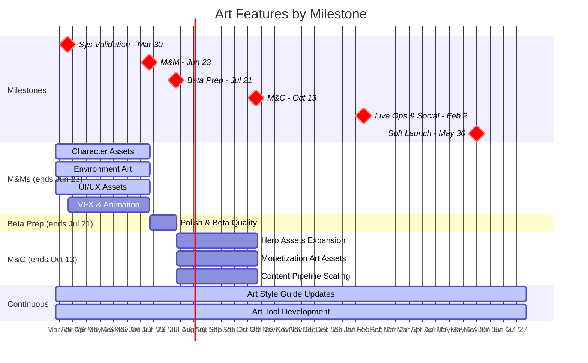

# Art Pod Plan

Last Updated: 2026-03-25
Pod Lead: [TBD]

> **What this file tracks**: Art production priorities per milestone and pipeline capacity.
> **What lives elsewhere**: Feature details in `planning/features/*.md`. Staffing in `planning/capacity.md`. Sprint execution in ClickUp.
> For the full validation hierarchy, see `planning/ValidationPlan.md`.

---

## Roadmap View



---

## Validation Focus

The Art pod supports all other pods by delivering high-quality visual assets that validate the aesthetic bar, scalability of art pipelines, and cross-pod content production capacity.

### BHQs This Pod Contributes To

Art production contributes to these BHQs across all pods (full details in `planning/ValidationPlan.md`).

| BHQ | Question | Status | Cross-Pod? |
|-----|----------|--------|------------|
| [TBD] | Does our art pipeline support rapid iteration without sacrificing quality? | NOT YET TESTED | Yes (all pods) |
| [TBD] | Can we maintain visual consistency across Empire, Battle, and Metagame systems? | TESTING | Yes (all pods) |
| [TBD] | Is our art scalable for long-term content production? | NOT YET TESTED | Yes (all pods) |

---

## Feature Priorities

All Art features across milestones, ordered by priority within each milestone.

| #   | Feature                        | Milestone | Estimate  | Status      | Related SHQs | What It Proves                                     |
| --- | ------------------------------ | --------- | --------- | ----------- | ------------ | -------------------------------------------------- |
| 1   | Character Assets               | M&Ms      | Ongoing   | IN PROGRESS | [TBD]        | Hero and unit art meets quality bar                |
| 2   | Environment Art                | M&Ms      | Ongoing   | IN PROGRESS | [TBD]        | Map tiles and world assets support exploration     |
| 3   | UI/UX Assets                   | M&Ms      | Ongoing   | IN PROGRESS | [TBD]        | Interface art supports beta quality bar            |
| 4   | VFX & Animation                | M&Ms      | Ongoing   | NOT STARTED | [TBD]        | Effects and motion enhance combat engagement       |
| 5   | Polish & Beta Quality          | Beta Prep | 2 sprints | NOT STARTED | [TBD]        | Art quality meets beta launch standards            |
| 6   | Hero Assets Expansion          | M&C       | Ongoing   | NOT STARTED | [TBD]        | Expanded hero roster supports monetization         |
| 7   | Monetization Art Assets        | M&C       | Ongoing   | NOT STARTED | [TBD]        | Shop and gacha visuals drive conversion            |
| 8   | Content Pipeline Scaling       | M&C       | Ongoing   | NOT STARTED | [TBD]        | Pipeline supports increased production velocity    |
| 9   | Art Style Guide Updates        | Ongoing   | Ongoing   | IN PROGRESS | [TBD]        | Consistent visual language across all systems      |
| 10  | Art Tool Development           | Ongoing   | Ongoing   | IN PROGRESS | [TBD]        | Tooling efficiency validates production hypothesis |

> Feature docs may not exist yet — create as needed.

---

## Sprint Plans

> Skill-maintained by `/sprint-plan`. Updated with user approval.
> Shows current + next sprint. Full details in `generated/sprint_plans/`.

### Sprint 26: Yodel Yaks (3/31 - 4/14) — CURRENT

**Goals**:
- Continue **Character Assets**, **Environment Art**, **UI/UX Assets** pipelines
- Start **VFX & Animation** track (new for M&Ms)
- Cross-pod asset delivery for Governors (Empire), Battle HUD (Battle), UI Foundation (Metagame)

**Key Assignments**:

| Person | Focus | Notes |
|--------|-------|-------|
| Kevin Griffith | Cross-pod art direction + pipeline oversight | Art Director |
| Brendan Cheatham | Cross-pod art direction | Assoc. Art Director |
| Pedro Sarraf | Current assignments (3/31-4/2 only) | Out 4/3-4/21 — only available first 3 days. Extends into S27. |
| Vinod Rams | Art assignments | Out 3/31 (1 day) |
| Danny | Art assignments | |
| Alessandro | Art assignments | |
| Guilherme (Art) | Art assignments | |
| Thiago | Art assignments | |
| Lawrence Steele | Sound design | Audio |

**Risks & Awareness**:
- Pedro Sarraf out 6 of 9 days — who covers his assignments?
- VFX & Animation: assignee TBD — who starts this track?
- Art priority conflicts: Governors UI vs Battle HUD vs UI Foundation — which gets art resources first?
- Good Friday (Apr 3) studio closure

### Sprint 27: Zany Zebras (4/14 - 4/28) — NEXT

**Goals**:
- Continue all active art pipelines
- VFX & Animation ramp-up
- Cross-pod delivery continues (Governors UI, Battle HUD, UI Foundation)

**Risks & Awareness**:
- Pedro Sarraf PTO extends through 4/21 — reduced capacity continues through first week
- Art priority conflicts likely to intensify as Governors UI implementation starts

---

## Milestone Breakdown

### M&Ms (Multiplayer & Meta)

**Ends**: Jun 23, 2026 | **Sprints**: ~7 | **Capacity**: [TBD - see capacity.md]

**Art Production Tracks**:

```
Character Assets:    Hero models, unit variations, character portraits
Environment Art:     Map tiles, buildings, terrain features, world map assets
UI/UX Assets:        Interface elements, icons, buttons, menus
VFX & Animation:     Combat effects, skill animations, transition effects
```

Art assets support all pod features running in parallel (see `planning/capacity.md` for discipline breakdown).

**Critical Path Risk**: Art dependencies block feature completion. Early asset delivery critical for iterative testing.

---

### Beta Launch Prep

**Ends**: Jul 21, 2026 | **Sprints**: 2 | **Flex**: -

Art team focuses on polish, visual consistency, and addressing beta feedback. Final quality pass on all assets planned for beta launch.

---

### M&C (Monetization & Conversion)

**Ends**: Oct 13, 2026 | **Sprints**: 6 | **Flex**: [TBD]

```
Hero Assets Expansion:       New hero models, skins, variations
Monetization Art Assets:     Shop UI, gacha animations, premium visuals
Content Pipeline Scaling:    Process optimization, template expansion
```

Art production scales to support monetization features. Pipeline efficiency gains critical for M&C velocity.

---

## Milestone: Live Ops & Social

**Ends**: Feb 2, 2027 (8 sprints available)

### Features

[TBD - awaiting feature definitions]

Art production continues with focus on live ops content cadence and social feature visual systems.

---

## Milestone: Soft Launch (UA Scale)

**Ends**: May 30, 2027 (~8 sprints available)

### Features

[TBD - awaiting feature definitions]

Art pipeline: final optimization for soft launch content velocity. Long-term content roadmap targets must be defined before this milestone.
