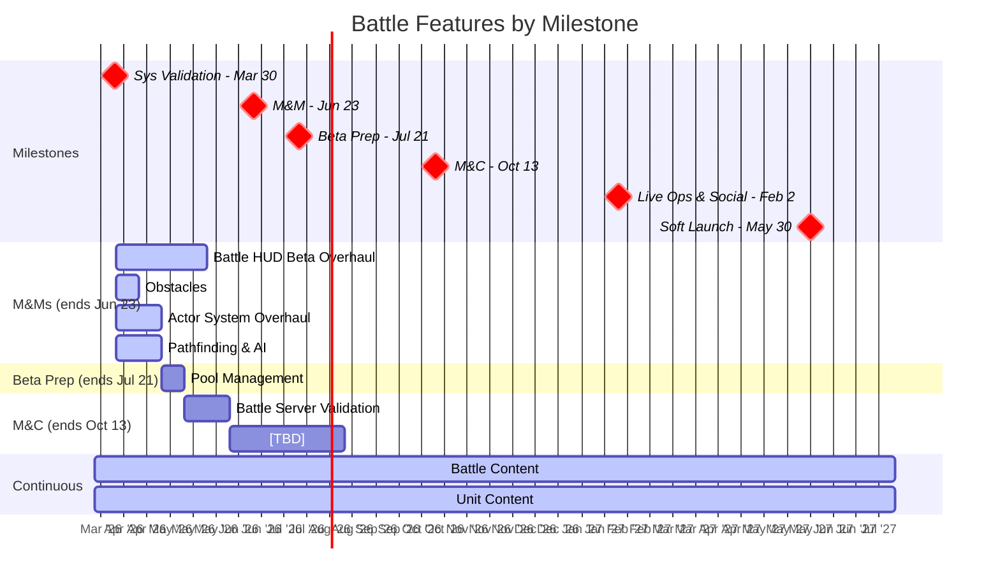

# Battle Pod Plan

Last Updated: 2026-03-25
Pod Lead: Lincoln Li

> **What this file tracks**: Feature priorities per milestone and validation alignment.
> **What lives elsewhere**: Feature details in `planning/features/*.md`. Staffing in `planning/capacity.md`. Sprint execution in ClickUp.
> For the full validation hierarchy, see `planning/ValidationRoadmap.md`.

---

## Roadmap View



---

## Validation Focus

The Battle pod is primarily validating combat engagement, unit variety, and tactical depth.

### BHQs This Pod Contributes To

Battle features contribute to these BHQs (full details in `planning/ValidationRoadmap.md`).

| BHQ | Question | Status | Cross-Pod? |
|-----|----------|--------|------------|
| [TBD] | Does combat feel engaging and skill-expressive? | TESTING | No |
| [TBD] | Does unit variety create meaningful tactical choices? | NOT YET TESTED | Yes (connects to Metagame) |
| [TBD] | Can we balance accessibility with depth? | NOT YET TESTED | No |

---

## Feature Priorities

All Battle features across milestones, ordered by priority within each milestone.

| #   | Feature                         | Milestone | Estimate  | Status      | Related SHQs | What It Proves                                   |
| --- | ------------------------------- | --------- | --------- | ----------- | ------------ | ------------------------------------------------ |
| 1   | Battle HUD Beta Overhaul        | M&Ms      | 4 sprints | NOT STARTED | [TBD]        | Combat interface meets beta quality bar          |
| 2   | Obstacles                       | M&Ms      | 1 sprint  | NOT STARTED | [TBD]        | Environmental tactics add depth                  |
| 3   | Actor System Overhaul           | M&Ms      | 2 sprints | NOT STARTED | [TBD]        | Performance and maintainability for scale        |
| 4   | Pathfinding & AI Improvements   | M&Ms      | 2 sprints | NOT STARTED | [TBD]        | AI behavior feels intelligent and responsive     |
| 5   | Battle Server Validation Client | M&C            | 2 sprints | NOT STARTED | [TBD]        | Server-authoritative combat foundation           |
| 6   | Pool Management                 | Beta Prep      | 1 sprint  | NOT STARTED | [TBD]        | Memory optimization for long sessions            |
| 7   | Battle Content                  | Ongoing   | Ongoing   | IN PROGRESS | [TBD]        | Content pipeline validates production capacity   |
| 8   | Unit Content                    | Ongoing   | Ongoing   | IN PROGRESS | [TBD]        | Unit variety pipeline validates art/balance pace |

> Feature docs may not exist yet — create as needed.

---

## Sprint Plans

> Skill-maintained by `/sprint-plan`. Updated with user approval.
> Shows current + next sprint. Full details in `generated/sprint_plans/`.

### Sprint 26: Yodel Yaks (3/31 - 4/14) — CURRENT

**Goals**:
- Start **Battle HUD Beta Overhaul** (Sprint 1 of ~4) — must-have for M&Ms beta quality
- Front-load design work on **Obstacles**, **Actor System Overhaul**, **Pathfinding & AI** while Jota focuses on HUD
- Continue **Battle Content** and **Unit Content** pipelines

**Key Assignments**:

| Person | Focus | Notes |
|--------|-------|-------|
| Jota Oliveira | Battle HUD Beta Overhaul | Solo client engineer, out 3/31 (starts 4/1). 8 avail days. Critical path. |
| Alessandro Oliveira | New VFXs | Starting this sprint |
| Danny Oliveira | VFXs implementation and polish | Starting this sprint |
| Vinod Rams | New unit concepts (Boss, Shared Assets for Heroes) | Starting this sprint |
| Lincoln Li | Battle HUD design direction | Also coordinating design prep for future features |
| Nathan Hajek | Unit Design & Prototype (M&M) | |
| Dylan Jeffery | Battle Content pipeline | Ongoing |
| Vishaal Gupta | Battle Content + unit balance | Out 4/2 (1 day) |
| Julio Scarabelli | S25 bug verification + HUD QA prep | |
| Ben Clair, Felipe Chaves, Tony Bonilla, Vinicius | Unit Content art | Ongoing |

**Risks & Awareness**:
- **Solo engineer**: Jota is the only client engineer. All features are sequential — any delay cascades.
- Jota misses kickoff day (3/31) — setup/planning needed without him?
- 6 features totaling ~12 eng-sprints in a 7-sprint milestone. Pool Management already deferred to M&C.
- Battle HUD estimate unclear: plan says 3 sprints, Gantt shows 4. Needs clarification.
- Battle HUD needs an SHQ Epic — should one be created or mapped to existing?

### Sprint 27: Zany Zebras (4/14 - 4/28) — NEXT

**Goals**:
- Continue **Battle HUD Beta Overhaul** (Sprint 2 of ~4)
- Continue design prep for upcoming features (Obstacles, Actor System)
- Continue content pipelines

**Risks & Awareness**:
- Still solo engineer (Jota) — no capacity flexibility
- If HUD runs long, downstream features compress further

---

## Milestone Breakdown

### M&Ms (Multiplayer & Meta)

**Ends**: Jun 23, 2026 | **Sprints**: ~7 | **Capacity**: 1x ENG (Jota)

**CAPACITY NOTE**: 4 features totaling 8 sprints scheduled for 7-sprint milestone. Feasible with tight execution.

```
Sprint 1:    Battle HUD Beta Overhaul, Obstacles, Actor System Overhaul, Pathfinding & AI (all start)
Sprint 2:    Battle HUD Beta Overhaul, Actor System Overhaul, Pathfinding & AI
Sprint 3-4:  Battle HUD Beta Overhaul continues
Sprint 5:    Obstacles completes
Sprint 6-7:  [Buffer for overruns or early M&C work]
```

Battle Content and Unit Content run in parallel on design/art track (see `planning/capacity.md`).

**Critical Path Risk**: Single engineer (Jota) means all features are sequential. Any delay cascades.

---

### Beta Launch Prep

**Ends**: Jul 21, 2026 | **Sprints**: 2 | **Flex**: -

```
Sprint 1:  Pool Management
Sprint 2:  Build stability and bugfixing
```

Battle Engineer will work on Pool Management and build stability. Engineering capacity may flex to other pods (see `planning/capacity.md`).
Battle Content and Unit Content continue on design/art track.

---

### M&C (Monetization & Conversion)

**Ends**: Oct 13, 2026 | **Sprints**: 6 | **Flex**: [TBD]

```
Sprint 1-2:  Battle Server Validation Client
Sprint 3-6:  [TBD - awaiting feature definitions]
```

Battle Content and Unit Content continue. M&C validation alignment TBD.

---

## Milestone: Live Ops & Social

**Ends**: Feb 2, 2027 (8 sprints available)

### Features

[TBD - awaiting feature definitions]

Battle Content and Unit Content continue.

---

## Milestone: Soft Launch (UA Scale)

**Ends**: May 30, 2027 (~8 sprints available)

### Features

[TBD - awaiting feature definitions]

Battle Content and Unit Content: final push. Content targets must be defined before this milestone.
