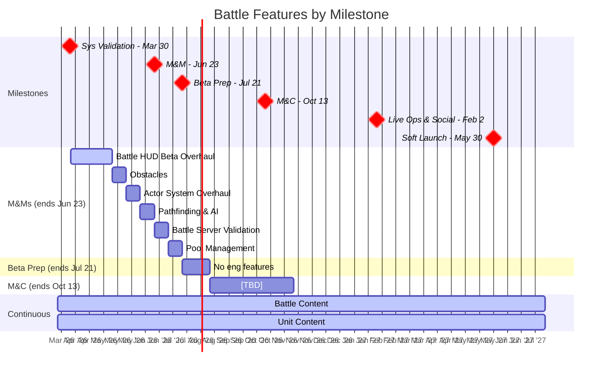

# Battle Pod Plan

Last Updated: 2026-03-20
Pod Lead: Lincoln Li

> **What this file tracks**: Feature priorities per milestone and validation alignment.
> **What lives elsewhere**: Feature details in `planning/features/*.md`. Staffing in `planning/capacity.md`. Sprint execution in ClickUp.
> For the full validation hierarchy, see `planning/ValidationRoadmap.md`.

---

## Validation Focus

The Battle pod is primarily validating combat engagement, unit variety, and tactical depth.

### BHQs This Pod Contributes To

Battle features contribute to these BHQs (full details in `planning/ValidationRoadmap.md`).

| BHQ | Question | Status | Cross-Pod? |
|-----|----------|--------|------------|
| [TBD] | Does combat feel engaging and skill-expressive? | TESTING | No |
| [TBD] | Does unit variety create meaningful tactical choices? | NOT YET TESTED | Yes (connects to Metagame) |
| [TBD] | Can we balance accessibility with depth? | NOT YET TESTED | No |

---

## Roadmap View



---

## Feature Priorities

All Battle features across milestones, ordered by priority within each milestone.

| #   | Feature                        | Milestone | Estimate  | Status      | Related SHQs | What It Proves                                     |
| --- | ------------------------------ | --------- | --------- | ----------- | ------------ | -------------------------------------------------- |
| 1   | Battle HUD Beta Overhaul       | M&Ms      | 3 sprints | NOT STARTED | [TBD]        | Combat interface meets beta quality bar            |
| 2   | Obstacles                      | M&Ms      | 1 sprint  | NOT STARTED | [TBD]        | Environmental tactics add depth                    |
| 3   | Actor System Overhaul          | M&Ms      | 1 sprint  | NOT STARTED | [TBD]        | Performance and maintainability for scale          |
| 4   | Pathfinding & AI Improvements  | M&Ms      | 1 sprint  | NOT STARTED | [TBD]        | AI behavior feels intelligent and responsive       |
| 5   | Battle Server Validation Client| M&Ms      | 1 sprint  | NOT STARTED | [TBD]        | Server-authoritative combat foundation             |
| 6   | Pool Management                | M&Ms      | 1 sprint  | NOT STARTED | [TBD]        | Memory optimization for long sessions              |
| 7   | Battle Content                 | Ongoing   | Ongoing   | IN PROGRESS | [TBD]        | Content pipeline validates production capacity     |
| 8   | Unit Content                   | Ongoing   | Ongoing   | IN PROGRESS | [TBD]        | Unit variety pipeline validates art/balance pace   |

> Feature docs may not exist yet — create as needed.

---

## Milestone Breakdown

### M&Ms (Multiplayer & Meta)

**Ends**: Jun 23, 2026 | **Sprints**: ~7 | **Capacity**: 1x ENG (Jota)

**⚠️ CAPACITY WARNING**: 6 features totaling 9 sprints scheduled for 7-sprint milestone. Requires compression or deferral.

```
Sprint 1-3:  Battle HUD Beta Overhaul
Sprint 4:    Obstacles
Sprint 5:    Actor System Overhaul
Sprint 6:    Pathfinding & AI Improvements
Sprint 7:    Battle Server Validation Client (defer Pool Management to M&C)
```

Battle Content and Unit Content run in parallel on design/art track (see `planning/capacity.md`).

**Critical Path Risk**: Single engineer (Jota) means all features are sequential. Any delay cascades.

---

### Beta Launch Prep

**Ends**: Jul 21, 2026 | **Sprints**: 2 | **Flex**: -

Battle Engineer will focus on build stability and bugfixing. Engineering capacity may flex to other pods (see `planning/capacity.md`).
Battle Content and Unit Content continue on design/art track.

---

### M&C (Monetization & Conversion)

**Ends**: Oct 13, 2026 | **Sprints**: 6 | **Flex**: [TBD]

```
Sprint 1:    Pool Management (deferred from M&Ms)
Sprint 2-6:  [TBD - awaiting feature definitions]
```

Battle Content and Unit Content continue. M&C validation alignment TBD.

---

## Milestone: Live Ops & Social

**Ends**: Feb 2, 2027 (8 sprints available)

### Features

[TBD - awaiting feature definitions]

Battle Content and Unit Content continue.

---

## Milestone: Soft Launch (UA Scale)

**Ends**: May 30, 2027 (~8 sprints available)

### Features

[TBD - awaiting feature definitions]

Battle Content and Unit Content: final push. Content targets must be defined before this milestone.
