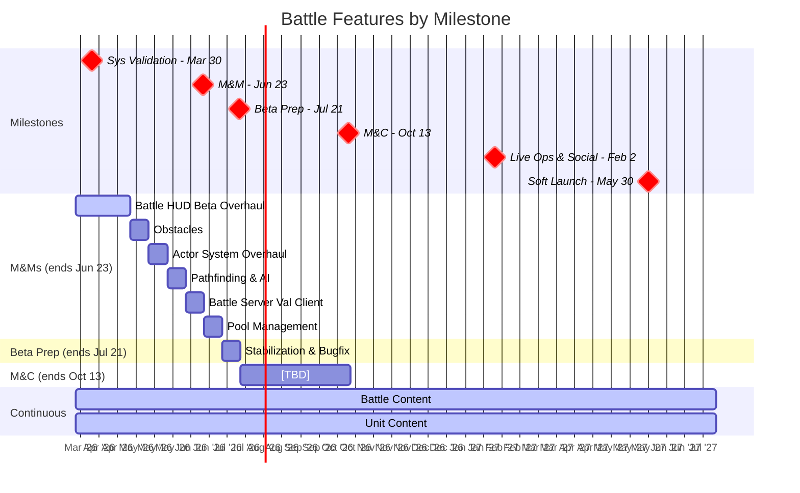

# Battle Pod Plan

Last Updated: 2026-03-20
Pod Lead: [TBD]

> **What this file tracks**: Feature priorities per milestone and validation alignment.
> **What lives elsewhere**: Feature details in `planning/features/*.md`. Staffing in `planning/capacity.md`. Sprint execution in ClickUp.
> For the full validation hierarchy, see `planning/ValidationRoadmap.md`.

---

## Validation Focus

The Battle pod is primarily validating **WH-1: Battle Hypothesis** - that we can win at every point in the funnel by delivering on a compelling army battling experience centered on dramatic hero moments.

### BHQs This Pod Contributes To

Battle features contribute to these BHQs (full details in `planning/ValidationRoadmap.md`).
Note: some BHQs are cross-pod — Battle contributes but doesn't solely own them.

| BHQ | Question | Status | Cross-Pod? |
|-----|----------|--------|------------|
| BHQ-B1 | Does the battle experience result in fun-to-execute gameplay that creates stickiness for a broad audience? | ANSWERED (3/3) | No |
| BHQ-B2 | Are in-game actions intuitive, quick to visually understand, and satisfying to execute? | ANSWERED (3/3) | No |
| BHQ-B3 | Is the player motivated to collect 'keys' (heroes) to solve various 'locks' (gameplay mechanics/challenges)? | TESTING (5/6, 1 neg) | Yes (connects to Metagame) |
| BHQ-B4 | Can our battle solution scale? Can we define what makes good levels in a repeatable way and produce them at an acceptable rate? | ANSWERED (3/3) | Yes (connects to Production) |

### Active SHQ Gaps

- **BHQ-B3** troop excitement answered negative. Design iteration needed — may require cross-pod input (Empire/Metagame).
- No new Battle SHQs defined for M&Ms yet. Current features are engineering foundations that extend validated systems.

---

## Roadmap View



> **Note**: M&Ms has 7 sprints available but 8 sprints of work scheduled. Pool Management overflows into the Beta Prep window by ~1 sprint. See Milestone Breakdown for details.

---

## Feature Priorities

All Battle features across milestones, ordered by priority within each milestone.

| #   | Feature                                                                               | Milestone | Estimate  | Status      | Related SHQs                          | What It Proves                                                        |
| --- | ------------------------------------------------------------------------------------- | --------- | --------- | ----------- | ------------------------------------- | --------------------------------------------------------------------- |
| 1   | [Battle HUD Beta Overhaul](../features/battle_hud_overhaul.md)                        | M&Ms      | 3 sprints | NOT STARTED | SHQ23 (battle depth), SHQ24 (clarity) | HUD supports readable, satisfying combat at scale                     |
| 2   | [Obstacles](../features/obstacles.md)                                                 | M&Ms      | 1 sprint  | NOT STARTED | SHQ23 (battle depth)                  | Terrain adds strategic variety to battle encounters                   |
| 3   | [Actor System Overhaul](../features/actor_system_overhaul.md)                         | M&Ms      | 1 sprint  | NOT STARTED | SHQ27 (scalable battles)              | Actor architecture supports content scale and new unit types          |
| 4   | [Pathfinding & AI Improvements](../features/pathfinding_ai.md)                        | M&Ms      | 1 sprint  | NOT STARTED | SHQ23 (battle depth), SHQ24 (clarity) | Units behave predictably and satisfyingly around obstacles/terrain    |
| 5   | [Battle Server Validation Client](../features/battle_server_validation.md)            | M&Ms      | 1 sprint  | NOT STARTED | WH-4 (servers)                        | Server-side validation prevents cheating; stability for multiplayer   |
| 6   | [Pool Management](../features/pool_management.md)                                     | M&Ms      | 1 sprint  | NOT STARTED | SHQ27 (scalable battles)              | Memory/performance stays stable as battle content scales              |
| 7   | [Battle Content](../features/battle_content.md)                                       | Ongoing   | Ongoing   | IN PROGRESS | SHQ27 (scalable battles)              | Content pipeline validates production capacity for battles at scale   |
| 8   | [Unit Content](../features/unit_content.md)                                           | Ongoing   | Ongoing   | IN PROGRESS | SHQ28 (hero/unit production pipeline) | Unit pipeline validates art/animation production throughput           |

> Feature docs marked as links may not exist yet — create with `planning/features/governors.md` as template.

---

## Milestone Breakdown

### M&Ms (Multiplayer & Meta)

**Ends**: Jun 23, 2026 | **Sprints**: ~7 | **Flex**: None — overcommitted by 1 sprint

```
Sprint 1-3:  Battle HUD Beta Overhaul
Sprint 4:   Obstacles
Sprint 5:   Actor System Overhaul
Sprint 6:   Pathfinding & AI Improvements
Sprint 7:   Battle Server Validation Client
Sprint 8*:  Pool Management (*overflows into Beta Prep window)
```

Battle Content and Unit Content run in parallel on design/art track (see `planning/capacity.md`).

> **Risk**: No flex buffer. Pool Management pushes ~1 sprint into Beta Prep. If earlier features slip, downstream features compress further. Consider whether Pool Management can be deferred or parallelized.

---

### Beta Launch Prep

**Ends**: Jul 21, 2026 | **Sprints**: 2 | **Flex**: -

Battle Engineers will focus on build stability and bugfixing (plus completing Pool Management if it overflows from M&Ms). Engineering capacity may flex to other pods (see `planning/capacity.md`).
Battle Content and Unit Content continue on design/art track.

---

### M&C (Monetization & Conversion)

**Ends**: Oct 13, 2026 | **Sprints**: 6 | **Flex**: [TBD]

```
Sprint 1-6:  [TBD - awaiting feature definitions]
```

Battle Content and Unit Content continue.

---

### Live Ops & Social

**Ends**: Feb 2, 2027 | **Sprints**: 8 | **Flex**: [TBD]

[TBD - awaiting feature definitions]

Battle Content and Unit Content continue.

---

### Soft Launch (UA Scale)

**Ends**: May 30, 2027 | **Sprints**: ~8 | **Flex**: [TBD]

[TBD - awaiting feature definitions]

Battle Content and Unit Content: final push. Content targets must be defined before this milestone.
