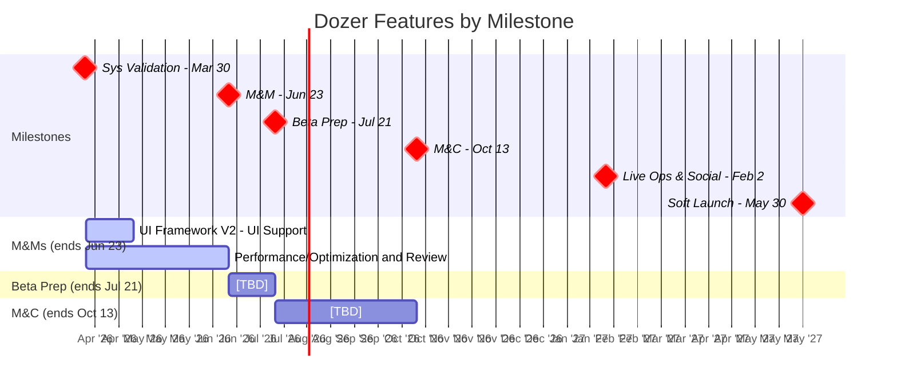

# Dozer Pod Plan

Last Updated: 2026-03-27
Pod Lead: [TBD]

> Feature-level planning per milestone. Sprint execution lives in ClickUp.
> For the overall milestone timeline, see `generated/roadmap.md`.
> For the full validation hierarchy, see `planning/ValidationPlan.md`.

---

## Roadmap View



---

## Feature Priorities

All Dozer features across milestones, ordered by priority within each milestone.

| #   | Feature                                | Milestone | Estimate  | Status      | What It Proves                                   |
| --- | -------------------------------------- | --------- | --------- | ----------- | ------------------------------------------------ |
| 1   | UI Framework V2 - UI Support (Cross-Pod) | M&Ms    | 2 sprints | NOT STARTED | UI framework supports cross-pod needs for beta   |
| 2   | Performance/Optimization and Review    | M&Ms      | Ongoing   | NOT STARTED | Game performance meets quality bar for beta      |

---

## Sprint Plans

> Skill-maintained by `/sprint-plan`. Updated with user approval.
> Shows current + next sprint. Full details in `generated/sprint_plans/`.

### Sprint 26: Yodel Yaks (3/31 - 4/14) — CURRENT

**Goals**:
- EKS infrastructure deployment (Prod week 1, Stage week 2)
- Multiplayer support infrastructure
- Build pipeline maintenance

**Key Assignments**:

| Person | Focus | Notes |
|--------|-------|-------|
| Derek Gallant | EKS Prod (week 1), EKS Stage (week 2), Multiplayer Support, UI Framework V2 - UI Support (Cross-Pod) | Also Social Dynamics eng lead |
| Bruno Freitas | Single Config Editor, Build Info/Logs | |

**Risks & Awareness**:
- EKS deployments are critical path for multiplayer readiness
- Randy Pasion and Garrett Eidsvig (Social Dynamics) have Dozer split risk — may pull them for infrastructure work

### Sprint 27: Zany Zebras (4/14 - 4/28) — NEXT

**Goals**:
- Continue infrastructure support
- [TBD — awaiting feature definitions]

**Risks & Awareness**:
- Same open question: should Dozer have defined M&Ms deliverables?

---

## Milestone: Multiplayer & Meta (M&Ms)

**Ends**: Jun 23, 2026 | **Sprints**: ~7 | **Capacity**: 2x ENG (Derek Gallant, Bruno Freitas)

### Features

```
Sprint 1-2:  UI Framework V2 - UI Support (Cross-Pod)
Sprint 1-7:  Performance/Optimization and Review (ongoing)
```

**UI Framework V2 - UI Support (Cross-Pod)** - UI framework enhancements to support cross-pod UI needs for M&Ms features. Ensures shared UI components and systems are ready for beta.

**Performance/Optimization and Review** - Continuous performance monitoring, optimization work, and technical review to ensure game performance meets beta quality bar. Includes build pipeline optimization, memory profiling, and infrastructure improvements.

---

## Milestone: Beta Launch Prep

**Ends**: Jul 21, 2026 (2 sprints available)

### Features

[TBD]

---

## Milestone: Monetization & Conversion (M&C)

**Ends**: Oct 13, 2026 (6 sprints available)

### Features

[TBD]

---

## Milestone: Live Ops & Social

**Ends**: Feb 2, 2027 (8 sprints available)

### Features

[TBD]

---

## Milestone: Soft Launch (UA Scale)

**Ends**: May 30, 2027 (~8 sprints available)

### Features

[TBD]
