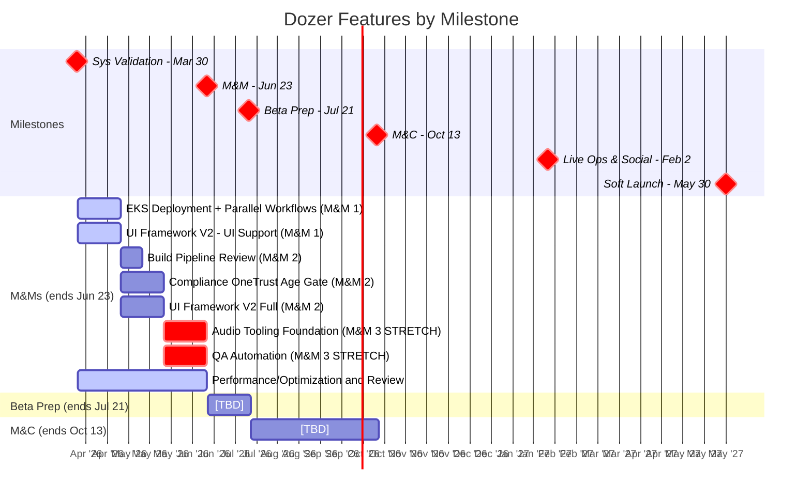

# Dozer Pod Plan

Last Updated: 2026-03-27
Pod Lead: [TBD]

> Feature-level planning per milestone. Sprint execution lives in ClickUp.
> For the overall milestone timeline, see `generated/roadmap.md`.
> For the full validation hierarchy, see `planning/ValidationPlan.md`.

---

## Roadmap View


```mermaid
gantt
    title Dozer Features by Milestone
    dateFormat YYYY-MM-DD
    axisFormat %b '%y
    tickInterval 2week

    section Milestones
    Sys Validation - Mar 30   :crit, milestone, 2026-03-30, 0d
    M&M - Jun 23              :crit, milestone, 2026-06-23, 0d
    Beta Prep - Jul 21        :crit, milestone, 2026-07-21, 0d
    M&C - Oct 13              :crit, milestone, 2026-10-13, 0d
    Live Ops & Social - Feb 2 :crit, milestone, 2027-02-02, 0d
    Soft Launch - May 30      :crit, milestone, 2027-05-30, 0d

    section M&Ms (ends Jun 23)
    EKS Deployment + Parallel Workflows (M&M 1)  :active,  doz1, 2026-03-31, 28d
    UI Framework V2 - UI Support (M&M 1)  :active,  doz2, 2026-03-31, 28d
    Build Pipeline Review (M&M 2)  :         doz3, 2026-04-28, 14d
    Compliance OneTrust Age Gate (M&M 2)  :         doz4, 2026-04-28, 28d
    UI Framework V2 Full (M&M 2)  :         doz5, 2026-04-28, 28d
    Audio Tooling Foundation (M&M 3 STRETCH)  :crit,  doz6, 2026-05-26, 28d
    QA Automation (M&M 3 STRETCH)  :crit,  doz7, 2026-05-26, 28d
    Performance/Optimization and Review  :active,  doz8, 2026-03-31, 84d

    section Beta Prep (ends Jul 21)
    [TBD]                     :         doz_bp, 2026-06-24, 28d

    section M&C (ends Oct 13)
    [TBD]                     :         doz_mc, after doz_bp, 84d
```

---

## Feature Priorities

All Dozer features across milestones, ordered by priority within each milestone.

| #   | Feature                                | Milestone | Checkpoint | Estimate  | Status      | What It Proves                                   |
| --- | -------------------------------------- | --------- | ---------- | --------- | ----------- | ------------------------------------------------ |
| 1   | EKS Infrastructure Deployment + Parallel Workflows | M&Ms  | M&M 1 (ends 4/27) | 2 sprints | IN PROGRESS | Infrastructure ready for multiplayer and parallel development |
| 2   | UI Framework V2 - UI Support (Cross-Pod) | M&Ms    | M&M 1 (ends 4/27) | 2 sprints | IN PROGRESS | UI framework supports cross-pod needs for beta   |
| 3   | Build Pipeline Review                  | M&Ms      | M&M 2 (4/28-5/25) | 2 sprints | NOT STARTED | Build pipeline is optimized and maintainable |
| 4   | Compliance (OneTrust, Age Gate)        | M&Ms      | M&M 2 (4/28-5/25) | 2 sprints | NOT STARTED | Game meets compliance requirements for beta |
| 5   | UI Framework V2 (Full)                 | M&Ms      | M&M 2 (4/28-5/25) | 2 sprints | NOT STARTED | Complete UI framework implementation and migration |
| 6   | Performance/Optimization and Review    | M&Ms      | All (ongoing) | Ongoing   | IN PROGRESS | Game performance meets quality bar for beta      |
| 7   | Audio Tooling Foundation               | M&Ms      | M&M 3 (5/26-6/22) **STRETCH** | TBD | NOT STARTED | Audio pipeline established for content production |
| 8   | QA Automation                          | M&Ms      | M&M 3 (5/26-6/22) **STRETCH** | TBD | NOT STARTED | Automated testing pipeline validates quality      |

---

## Sprint Plans

> Skill-maintained by `/sprint-plan`. Updated with user approval.
> Shows current + next sprint. Full details in `generated/sprint_plans/`.

### Sprint 26: Yodel Yaks (3/31 - 4/14) — COMPLETED

**Goals**:
- EKS infrastructure deployment (Prod week 1, Stage week 2)
- Multiplayer support infrastructure
- Build pipeline maintenance

**Actual Work Completed**:
- EKS infrastructure deployment started (Prod/Stage) — completing in S27
- Multiplayer support infrastructure
- Build pipeline maintenance

**Key Assignments**:

| Person | Focus | Notes |
|--------|-------|-------|
| Derek Gallant | EKS Prod (week 1), EKS Stage (week 2), Multiplayer Support, UI Framework V2 - UI Support (Cross-Pod) | Also Social Dynamics eng lead |
| Bruno Freitas | Single Config Editor, Build Info/Logs | |

**Outcomes**:
- EKS deployment work initiated, continues into S27

### Sprint 27: Zany Zebras (4/14 - 4/28) — CURRENT

**Goals**:
- **Complete EKS infrastructure deployment (Prod/Stage)** (Derek) — **enables parallel workflows setup in S28**
- **M&M Roadmap update** (Derek, Thorben) — milestone planning and roadmap refinement
- **Complete Single Config Editor** (Bruno, from S26)
- **Performance Improvements** (Bruno) — ongoing optimization work
- Continue UI Framework V2 support (cross-pod)
- Multiplayer infrastructure support for Social Dynamics

**Key Assignments**:

| Person | Focus | Notes |
|--------|-------|-------|
| Derek Gallant | EKS deployment completion (Prod/Stage), M&M Roadmap update, Multiplayer infrastructure support, UI Framework V2 support | Also Social Dynamics eng lead. EKS must complete to enable S28 parallel workflows. |
| Thorben Novais | M&M Roadmap update, Sprint planning/coordination | Brazil holiday 4/21 (9 avail days). Also Battle pod producer. |
| Bruno Freitas | Single Config Editor (finish from S26), Performance Improvements | Brazil holiday 4/21 (9 avail days) |

**Risks & Awareness**:
- Derek split between Dozer (EKS deployment) and Social Dynamics eng lead — EKS is critical path for S28
- **EKS deployment must complete by end of S27** — blocks parallel workflows setup in S28
- Bruno loses 1 day to Brazil holiday (4/21)

---

## Milestone: Multiplayer & Meta (M&Ms)

**Ends**: Jun 23, 2026 | **Sprints**: ~7 | **Capacity**: 2x ENG (Derek Gallant, Bruno Freitas)

### Features

```
M&M Checkpoint 1 (ends 4/27):     EKS Infrastructure Deployment + Parallel Workflows — IN PROGRESS
                                  UI Framework V2 - UI Support (Cross-Pod) — IN PROGRESS
M&M Checkpoint 2 (4/28 - 5/25):   Build Pipeline Review
                                  Compliance (OneTrust, Age Gate)
                                  UI Framework V2 (Full)
M&M Checkpoint 3 (5/26 - 6/22):   Audio Tooling Foundation (STRETCH)
                                  QA Automation (STRETCH)
M&M Checkpoint 1-3 (ongoing):     Performance/Optimization and Review — IN PROGRESS
```

**EKS Infrastructure Deployment + Parallel Workflows** — M&M Checkpoint 1 (ends 4/27) **IN PROGRESS**. Deploy EKS infrastructure to production and staging environments AND configure parallel development workflows. Critical path for multiplayer readiness. Enables concurrent development streams. Started in S26, completing in S27.

**UI Framework V2 - UI Support (Cross-Pod)** — M&M Checkpoint 1 (ends 4/27) **IN PROGRESS**. UI framework enhancements to support cross-pod UI needs for M&Ms features. Ensures shared UI components and systems are ready for beta. Focused on unblocking other pods.

**Build Pipeline Review** — M&M Checkpoint 2 (4/28 - 5/25) — 2 sprints. Audit and optimize build pipeline for efficiency, maintainability, and scalability. Clean up redundant workflows, improve error reporting, and ensure pipelines are well-documented.

**Compliance (OneTrust, Age Gate)** — M&M Checkpoint 2 (4/28 - 5/25) — 2 sprints. Implement compliance requirements for beta launch: OneTrust integration for privacy/consent management, proper age gating, and compliance with legal requirements.

**UI Framework V2 (Full)** — M&M Checkpoint 2 (4/28 - 5/25). Complete UI framework implementation and legacy UI migration. Completes the full framework architecture and migration of remaining legacy UI systems.

**Audio Tooling Foundation** — M&M Checkpoint 3 (5/26 - 6/22) **STRETCH GOAL**. Audio pipeline must be established for content production. Enables audio team to scale content creation for beta.

**QA Automation** — M&M Checkpoint 3 (5/26 - 6/22) **STRETCH GOAL**. Automated testing pipeline to validate game quality without manual QA intervention. Includes automated end-to-end testing and performance validation.

**Performance/Optimization and Review** — Ongoing **IN PROGRESS**. Continuous performance monitoring, optimization work, and technical review to ensure game performance meets beta quality bar. Includes build pipeline optimization, memory profiling, and infrastructure improvements.

---

## Milestone: Beta Launch Prep

**Ends**: Jul 21, 2026 (2 sprints available)

### Features

[TBD - polish, stability, performance validation]

---

## Milestone: Monetization & Conversion (M&C)

**Ends**: Oct 13, 2026 (6 sprints available)

### Features

[TBD]

---

## Milestone: Live Ops & Social

**Ends**: Feb 2, 2027 (8 sprints available)

### Features

[TBD]

---

## Milestone: Soft Launch (UA Scale)

**Ends**: May 30, 2027 (~8 sprints available)

### Features

[TBD]
