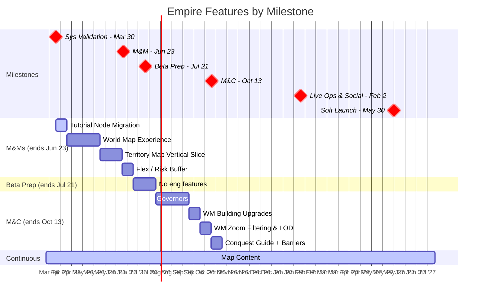

# Empire Pod Plan

Last Updated: 2026-03-27
Pod Lead: Diana Vasilescu

> **What this file tracks**: Feature priorities per milestone and validation alignment.
> **What lives elsewhere**: Feature details in `planning/features/*.md`. Staffing in `planning/capacity.md`. Sprint execution in ClickUp.
> For the full validation hierarchy, see `planning/ValidationRoadmap.md`.

---

## Roadmap View



---

## Validation Focus

The Empire pod is primarily validating **WH-2: Empire Hypothesis** - that we can retain better than traditional mobile 4X by anchoring early progression in intuitive, visual exploration on the map layer.

### BHQs This Pod Contributes To

Empire features contribute to these BHQs (full details in `planning/ValidationRoadmap.md`).
Note: some BHQs are cross-pod — Empire contributes but doesn't solely own them.

| BHQ | Question | Status | Cross-Pod? |
|-----|----------|--------|------------|
| BHQ-E1 | Can we make the civ-like grid intuitive, scalable, and will players be motivated to explore? | NOT YET TESTED | No |
| BHQ-E2 | Can we create sharp return motivations that feel organic and not punishing? | TESTING | Potentially (metagame hooks) |
| BHQ-E3 | Can Empire progression remain compelling long-term ("one more turn" on mobile)? | NOT YET TESTED | Yes (connects to Metagame) |

### Active SHQ Gaps

- **SHQ2** (empire strategy <-> tile conquest seamlessness) - IN PROGRESS
- **SHQ3** (map -> hero progression) - ANSWERED negative. May need cross-pod input (Battle/Metagame).
- **BHQ-E4** has no SHQs defined yet. Needs attention — likely requires Battle pod input too.

---

## Feature Priorities

All Empire features across milestones, ordered by priority within each milestone.

| #   | Feature                                                                     | Milestone | Estimate    | Status      | SHQ or Effort                                     | Why this?                                                          |
| --- | --------------------------------------------------------------------------- | --------- | ----------- | ----------- | ------------------------------------------------- | ------------------------------------------------------------------ |
| 1   | Narrative and Tutorial Tooling                                                     | M&Ms      | 1 sprint    | NOT STARTED | Effort                                            | Needed for designer tooling & other priorities aren't ready for engineering yet |
| 2   | [World Map Experience](../features/world_map_vs.md)                         | M&Ms      | 3 sprints   | NOT STARTED | [TBD]                                             | [TBD]                                                              |
| 2a  | — Multiple Nodes per Territory                                              | M&Ms      | (sprint 1)  | NOT STARTED | [TBD]                                             | [TBD]                                                              |
| 2b  | — Main Menu UX/UI Implementation                                            | M&Ms      | (sprint 2)  | NOT STARTED | [TBD]                                             | [TBD]                                                              |
| 2c  | — World Map Experience Iterations                                           | M&Ms      | (sprint 3)  | NOT STARTED | [TBD]                                             | [TBD]                                                              |
| 3   | [Territory Map Vertical Slice](../features/territory_map_vs.md)             | M&Ms      | 2 sprints   | NOT STARTED | SHQ1 (map at scale), SHQ2 (strategy <-> conquest) | Two map layers feel connected; seamless strategic flow             |
| 4   | [Map Content](../features/map_content.md)                                   | Ongoing   | Ongoing     | IN PROGRESS | SHQ1 (high visual bar, variety)                   | Content pipeline validates production capacity at scale            |
| 5   | [Governors](../features/governors.md)                                       | M&C       | 3 sprints   | IN PROGRESS | SHQ7 (short/mid/long-term goals)                  | Long-term goal vector within Empire; meaningful project investment |
| 6   | [WM Building Upgrades](../features/wm_building_upgrades.md)                 | M&C       | 1 sprint    | NOT STARTED | —                                                 | World map supports empire investment visibility                    |
| 7   | [WM Zoom Filtering & LOD](../features/wm_zoom_lod.md)                      | M&C       | ~1 sprint   | NOT STARTED | [TBD]                                             | [TBD]                                                              |
| 8   | [Conquest Guide Full Screen](../features/conquest_guide.md)                 | M&C       | ~0.5 sprint | NOT STARTED | [TBD]                                             | [TBD]                                                              |
| 9   | [Barrier & Story Shard Iterations](../features/barrier_story_iterations.md) | M&C       | ~0.5 sprint | NOT STARTED | [TBD]                                             | [TBD]                                                              |

> Feature docs marked as links may not exist yet — create with `planning/features/governors.md` as template.

---

## Sprint Plans

> Skill-maintained by `/sprint-plan`. Updated with user approval.
> Shows current + next sprint. Full details in `generated/sprint_plans/`.

### Sprint 26: Yodel Yaks (3/31 - 4/14) — CURRENT

**Goals**:
- **Tutorial Node Migration** engineering (Henrique, 1 sprint) — designer tooling enablement
- Begin **World Map Experience** design/UX prep — front-loading for Sprint 27
- Continue **Map Content** pipeline — validates SHQ1

**Key Assignments**:

| Person | Focus | Notes |
|--------|-------|-------|
| Henrique De Lima | Tutorial Node Migration engineering | 1-sprint effort. S25 tutorial arch carry-over (CHI-36213, CHI-36212) feeds into this. |
| Diana Vasilescu | World Map Experience design prep | Scoping "Multiple Nodes per Territory" for Sprint 27 eng start |
| Yura Rusin | World Map Experience UX | UX flows for multiple nodes, world map interactions |
| Jacob Siegel | Map Content (T5 / T6 Iterations) | Out 3/31-4/7 (5 days PTO) — only available 4/8-4/13 |
| Elise Cole | Consolidating source of truth for Narrative | Solo-covering while Jacob is out |
| Laura Santana | Bug verification / Tutorial Node Migration QA | QA when engineering is ready |

**Risks & Awareness**:
- Jacob out 5 of 9 days — Elise solo-covering Map Content
- Good Friday (Apr 3) studio closure
- No ClickUp tasks exist yet for Tutorial Node Migration — scaffold at kickoff
- WME design/UX prep must be far enough along for Henrique to start engineering Sprint 27

### Sprint 27: Zany Zebras (4/14 - 4/28) — NEXT

**Goals**:
- Start **World Map Experience** engineering — "Multiple Nodes per Territory" (Sprint 1 of 3)
- Continue **World Map Experience** design/UX
- Continue **Map Content** pipeline

**Key Assignments**:

| Person | Focus | Notes |
|--------|-------|-------|
| Henrique De Lima | World Map Experience — Multiple Nodes per Territory | Sprint 1 of 3. Sole client engineer. |
| Diana Vasilescu | World Map Experience design | Out 4/14 (sprint start day) |
| Yura Rusin | World Map Experience UX | |
| Jacob Siegel | Map Content | Full availability |
| Elise Cole | Map Content + WME design support | |
| Laura Santana | Tutorial Node Migration QA + bug verification | |

**Risks & Awareness**:
- Diana out 4/14 (sprint start day)
- Henrique is sole client engineer — no engineering parallelism
- WME spec (`world_map_vs.md`) may need scope update for new sub-efforts
- "Multiple Nodes per Territory" design readiness depends on Sprint 26 prep

---

## Milestone Breakdown

### M&Ms (Multiplayer & Meta)

**Ends**: Jun 23, 2026 | **Sprints**: ~7 | **Flex**: 1 sprint buffer for risk/iteration

```
Sprint 1:    Tutorial Node Migration
Sprint 2-4:  World Map Experience
  Sprint 2:  Multiple Nodes per Territory
  Sprint 3:  Main Menu UX/UI Implementation
  Sprint 4:  World Map Experience Iterations
Sprint 5-6:  Territory Map Vertical Slice
Sprint 7:    Flex / risk buffer / iteration
```

Map Content runs in parallel on design/art track (see `planning/capacity.md`).

---

### Beta Launch Prep

**Ends**: Jul 21, 2026 | **Sprints**: 2 | **Flex**: -

Empire Engineers will focus on build stability and bugfixing. Engineering capacity may flex to other pods (see `planning/capacity.md`).
Map Content continues on design/art track.

---

### M&C (Monetization & Conversion)

**Ends**: Oct 13, 2026 | **Sprints**: 6 | **Flex**: [TBD]

```
Sprint 1-3:  Governors
Sprint 4:    WM Building Upgrades
Sprint 5:    WM Zoom Filtering & LOD
Sprint 6:    Conquest Guide + Barrier & Story Iterations
```

Map Content continues. M&C validation alignment TBD.

---

### Live Ops & Social

**Ends**: Feb 2, 2027 | **Sprints**: 8 | **Flex**: [TBD]

[TBD - awaiting feature definitions]

Map Content continues.

---

### Soft Launch (UA Scale)

**Ends**: May 30, 2027 | **Sprints**: ~8 | **Flex**: [TBD]

[TBD - awaiting feature definitions]

Map Content: final push. Content targets must be defined before this milestone.
