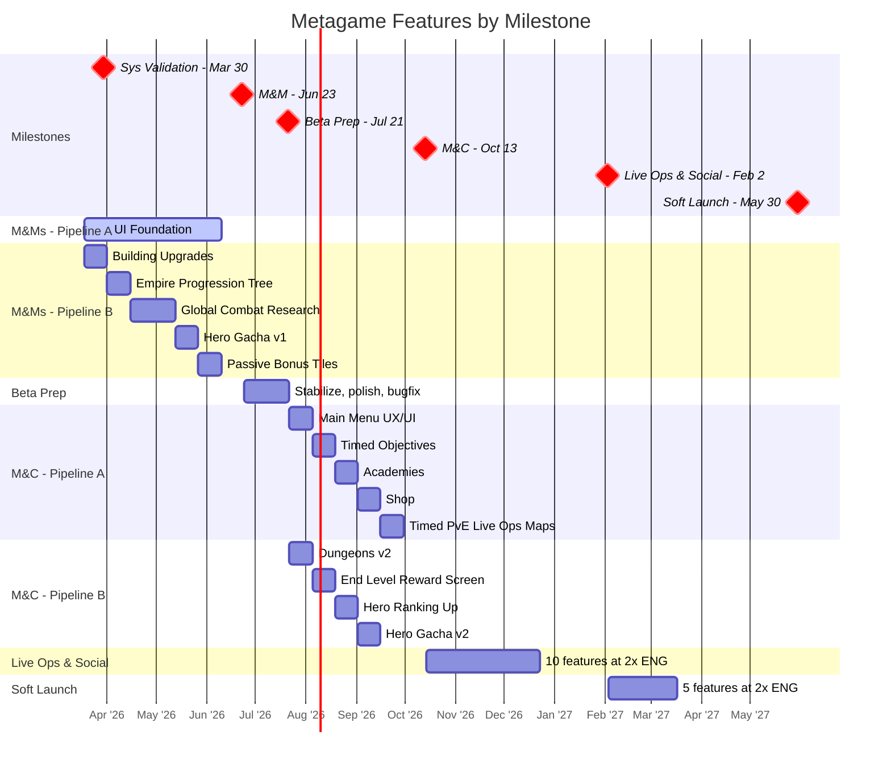

# Metagame Pod Plan

Last Updated: 2026-03-25
Pod Lead: [TBD]

> Feature-level planning per milestone. Sprint execution lives in ClickUp.
> For the overall milestone timeline, see `generated/roadmap.md`.
> For the full validation hierarchy, see `planning/ValidationRoadmap.md`.

---

## Roadmap View



---

## Sprint Plans

> Skill-maintained by `/sprint-plan`. Updated with user approval.
> Shows current + next sprint. Full details in `generated/sprint_plans/`.

### Sprint 26: Yodel Yaks (3/31 - 4/14) — CURRENT

**Goals**:
- Start **UI Foundation** (Pipeline A, Sprint 1 of 6) — foundation for Hero Info, Leveling, Gear, Badging, Tutorials/Narrative
- Complete **Building Upgrades** (Pipeline B, 1-sprint feature)
- Support metagame systems depth for M&Ms validation

**Key Assignments**:

| Person | Focus | Notes |
|--------|-------|-------|
| Dan Dupuis | UI Foundation (Pipeline A) | Also Empire eng lead — Governors may need oversight |
| Guilherme Quizzini | Building Upgrades (Pipeline B) | 1-sprint feature, should complete this sprint |
| Leonard Perez | UI Foundation design + Building Upgrades support | |
| Christopher Fidalgo | S25 carry-over + metagame design | 10 tasks in S25, many still "to do" — heavy carry-over |
| Kevin Ligon | UI Foundation UX wireframes | Foundation UX for metagame screens |
| Miguel Duran | UI Foundation UI art | S25 carry-over (CHI-36195). Shared resource with Empire |
| Hugo Hideo | Building Upgrades QA (end of sprint) | S25 verification in parallel |

**Risks & Awareness**:
- Christopher Fidalgo: 10 S25 tasks, many still "to do" — heavy carry-over likely
- Miguel Duran: shared UI artist between Metagame and Empire (Governors UI)
- Building Upgrades spec — does one exist? Design source needed
- UI Foundation scope for Sprint 1: which sub-features come first needs definition
- UI Foundation has no SHQ mapping — should it link to a validation question?

### Sprint 27: Zany Zebras (4/14 - 4/28) — NEXT

**Goals**:
- Continue **UI Foundation** (Pipeline A, Sprint 2 of 6)
- Start **Empire Progression Tree** (Pipeline B, 1-sprint feature)

**Risks & Awareness**:
- Chris Fidalgo carry-over may still be unresolved
- Dan Dupuis split attention: UI Foundation + Empire Governors oversight

---

## Milestone: Multiplayer & Meta (M&Ms)

**Ends**: Jun 23, 2026 (~7 sprints available)
**Capacity**: 2x ENG (parallel pipelines)

### Features

Two engineering pipelines run in parallel:

```
Pipeline A (dedicated):                      Pipeline B (sequential):
─────────────────────────────────────        ─────────────────────────────────────
S1 ┃ UI Foundation                           S1 ┃ Building Upgrades (1 sprint)
S2 ┃ UI Foundation                           S2 ┃ Empire Progression Tree (1 sprint)
S3 ┃ UI Foundation                           S3 ┃ Global Combat Research Tree
S4 ┃ UI Foundation          (6 sprints)      S4 ┃ Global Combat Research Tree (2 sprints)
S5 ┃ UI Foundation                           S5 ┃ Hero Gacha v1 (1 sprint)
S6 ┃ UI Foundation                           S6 ┃ Passive Bonus Tiles (1 sprint)
S7 ┃ (buffer)                                S7 ┃ (buffer)
```

| #   | Feature                     | Sprints | Pipeline | Notes                                                                         |
| --- | --------------------------- | ------- | -------- | ----------------------------------------------------------------------------- |
| 1   | UI Foundation               | 6       | A        | Foundation work, Hero Info, Hero Leveling, Gear, Badging, Tutorials/Narrative |
| 2   | Building Upgrades           | 1       | B        |                                                                               |
| 3   | Empire Progression Tree     | 1       | B        |                                                                               |
| 4   | Global Combat Research Tree | 2       | B        |                                                                               |
| 5   | Hero Gacha v1               | 1       | B        |                                                                               |
| 6   | Passive Bonus Tiles         | 1       | B        |                                                                               |

---

## Milestone: Beta Launch Prep

**Ends**: Jul 21, 2026 (2 sprints available)

### Features

No planned feature work. Stabilize, polish, and bugfix.

---

## Milestone: Monetization & Conversion (M&C)

**Ends**: Oct 13, 2026 (6 sprints available)
**Capacity**: 2x ENG (parallel pipelines)

### Features

```
Pipeline A:                                  Pipeline B:
─────────────────────────────────────        ─────────────────────────────────────
S1 ┃ Main Menu UX/UI                        S1 ┃ Dungeons v2
S2 ┃ Timed Objectives                       S2 ┃ End Level Reward Screen
S3 ┃ Academies                              S3 ┃ Hero Ranking Up
S4 ┃ Shop                                   S4 ┃ Hero Gacha v2
S5 ┃ Timed PvE Live Ops Maps                S5 ┃ (buffer)
S6 ┃ (buffer)                               S6 ┃ (buffer)
```

| # | Feature | Sprints | Notes |
|---|---------|---------|-------|
| 1 | Main Menu UX/UI | 1 | |
| 2 | Dungeons v2 | 1 | |
| 3 | Timed Objectives | 1 | |
| 4 | End Level Reward Screen | 1 | |
| 5 | Academies | 1 | |
| 6 | Hero Ranking Up | 1 | |
| 7 | Shop | 1 | |
| 8 | Hero Gacha v2 | 1 | |
| 9 | Timed PvE Live Ops Maps | 1 | |

---

## Milestone: Live Ops & Social

**Ends**: Feb 2, 2027 (8 sprints available)
**Capacity**: [TBD — assumes 2x ENG continues]

### Features

| # | Feature | Sprints | Notes |
|---|---------|---------|-------|
| 1 | Mobile Extractors | 1 | |
| 2 | Mobile Command Center Access Point | 1 | |
| 3 | Tutorial Expansion | 1 | |
| 4 | Interstitials | 1 | |
| 5 | Daily Quests | 1 | |
| 6 | Achievements | 1 | |
| 7 | Hero Empowering | 1 | |
| 8 | Hero Ability Upgrading | 1 | |
| 9 | Ad Monetization | 1 | |
| 10 | Live Events | 1 | |

---

## Milestone: Soft Launch (UA Scale)

**Ends**: May 30, 2027 (~8 sprints available)
**Capacity**: [TBD — assumes 2x ENG continues]

### Features

| # | Feature | Sprints | Notes |
|---|---------|---------|-------|
| 1 | Inbox & Admin Comms | 1 | |
| 2 | Notifications | 1 | |
| 3 | UI Stability & Performance Pass | 1 | |
| 4 | Growthbook Integration | 1 | |
| 5 | Initial Login Flow Optimization | 1 | |
