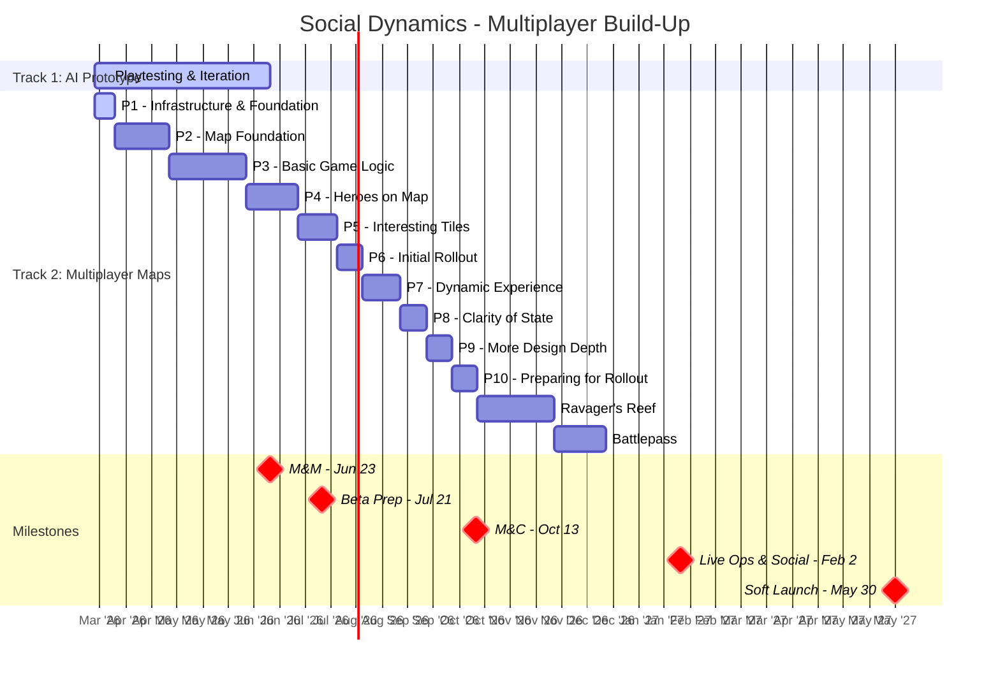

# Social Dynamics Pod Plan

Last Updated: 2026-03-19
Pod Lead: [TBD]

> **What this file tracks**: Feature priorities per milestone and validation alignment.
> **What lives elsewhere**: Feature details in `planning/features/*.md`. Staffing in `planning/capacity.md`. Sprint execution in ClickUp.
> For the full validation hierarchy, see `planning/ValidationRoadmap.md`.

---

## Strategy: Two Parallel Tracks

Social Dynamics runs two parallel tracks during M&Ms:

1. **Multiplayer AI Prototype** -- Playtesting and iterating on the AI-driven prototype throughout M&Ms. This is our active playtest vehicle until the real client is ready.
2. **Multiplayer Maps Build-Up** -- Engineering builds the real multiplayer map phase by phase (Phases 1-10, see below).

**Switchover Goal**: Get the in-client version functional enough to replace the AI prototype for playtesting during M&Ms.
**Player Release Goal**: Ship multiplayer to players during / at the end of M&C.
**All phases (1-10) target completion by end of M&C** (Oct 13, 2026). Later phases assume additional resources beyond the initial 2 engineers.

**Staffing**: 2 client engineers (Randy, Garrett) across M&Ms and M&C. Additional resources expected for later phases.

---

## Roadmap View



> Gantt durations are estimates. Phases 7-10 compress with additional resources. Actual timelines TBD as breakdowns are finalized.

---

## Feature Phases

### Phase 1 (CURRENT) -- Multiplayer Infrastructure & Foundation
**ETA**: 3/30/2026

| Engineer | Work |
|----------|------|
| Randy | Messaging Infrastructure, Game Instance Container Pattern, Testing & Validation |
| Garrett | Real multiplayer infrastructure (pending breakdown) |

### Phase 2 -- Map Foundation (~1 month)

- Engineering Work Breakdown
- Map Foundation Support

### Phase 3 -- Basic Game Logic (TBD)

| # | Feature |
|---|---------|
| 1 | Multiplayer Map Instance Creation / List / Join v1 |
| 2 | Multiplayer Map Authoring |
| 3 | Embark Flow (Dock Selection + 1-3 hero party & troop selection) |
| 4 | Tile Ownership & Tile States & Map Visualization |
| 9 (part 1) | Troop Training |
| 13 | Battles |

### Phase 4 -- Heroes on Map (TBD)

| # | Feature |
|---|---------|
| 5 | Hero Party Map Representation |
| 6 | Persistent Hero Health & Recovery |
| 7 | Hero Energy System (& pathing) |
| 9 (part 2) | Army Screen |

### Phase 5 -- Interesting Tiles (TBD)

| # | Feature |
|---|---------|
| 10 | Tile Info and Actions (view info, attack, defend, Fortify, Upgrade) |
| 11 | Tile Types (Foundations, Barracks, Shrines) |
| 8 | Cycle Generation System |

### Phase 6 -- "Initial Rollout" / Completed Game Loop (TBD)

| # | Feature |
|---|---------|
| 12 | Map Leaderboard |

---

### Phase 7 -- Dynamic Experience (TBD)

| # | Feature |
|---|---------|
| 14 | Fog of War -- Multiplayer Logic, supporting Hero Avatar sight range |
| 15 | Story Shards appear at random locations |
| 18 | When I enter multiplayer, I have 3 options to select from |
| 19 | Each Map in Multiplayer has a different modifier |
| 24 | Departure logic |

### Phase 8 -- Clarity of State (TBD)

| # | Feature |
|---|---------|
| 17 | I can see all of my active modifiers / passive boost tiles |
| 20 | I can see a "log" of things that have happened on the map by all players |
| 22 | I see a multiplayer Income Summary |
| 23 | End Level Reward Screen Updates |
| 25 | Metagame Leaderboard (comparing ALL players across the whole season) |

### Phase 9 -- More Design Depth (TBD)

| # | Feature |
|---|---------|
| 16 | Buildings can start at a higher upgrade level |
| 21 | "Seasonal" support where the map changes over time |
| 26 | Leaderboard Payouts |

### Phase 10 -- Preparing for Rollout (TBD)

| # | Feature |
|---|---------|
| 27 | Battle Server Authoritative |
| 28 | Multiplayer Onboarding |
| 1 | Multiplayer Map Instance System v2 |

---

## Standalone Features (Post-Phase 10)

| Feature | Estimate | Status |
|---------|----------|--------|
| Ravager's Reef | 3 sprints | NOT STARTED |
| Battlepass | 2 sprints | NOT STARTED |

---

## Milestone Breakdown

### M&Ms (Multiplayer & Meta)

**Ends**: Jun 23, 2026 | **Sprints**: ~7

Two parallel tracks:
- **AI Prototype**: Continuous playtesting and iteration throughout milestone
- **Multiplayer Maps**: Phase 1 through as far as possible (target: enough for playtest switchover)

```
Phase 1:  Infrastructure & Foundation (through 3/30)
Phase 2:  Map Foundation (~1 month)
Phase 3:  Basic Game Logic
Phase 4+: As time allows -- goal is playtest switchover from AI prototype
```

---

### Beta Launch Prep

**Ends**: Jul 21, 2026 | **Sprints**: 2

[TBD - likely stabilization and continued map build-up]

---

### M&C (Monetization & Conversion)

**Ends**: Oct 13, 2026 | **Sprints**: 6

All remaining phases (through P10) complete by end of milestone. Additional resources ramped up to hit this target. Multiplayer ships to players during / at end of M&C.

---

### Live Ops & Social

**Ends**: Feb 2, 2027 | **Sprints**: 8

Ravager's Reef (3 sprints) + Battlepass (2 sprints).

---

### Soft Launch (UA Scale)

**Ends**: May 30, 2027 | **Sprints**: ~8

[TBD]
