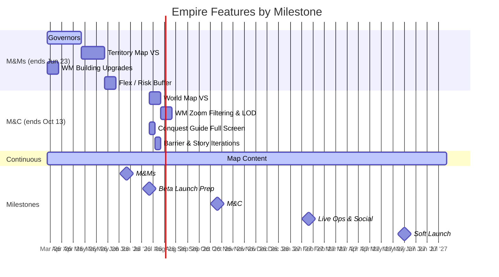

# Empire Pod Plan

Last Updated: 2026-03-18
Pod Lead: Diana Vasilescu

> Feature-level planning per milestone. Sprint execution lives in ClickUp.
> For the overall milestone timeline, see `roadmap.md`.

---

## Milestone: Multiplayer & Meta (M&Ms)

**Ends**: Jun 23, 2026 (~7 sprints available)
**Engineering budget**: 6 sprints committed, 1 sprint flex/risk buffer

### Features

#### Governors
| | |
|---|---|
| **Estimate** | 3 sprints (6 weeks) |
| **Status** | IN PROGRESS |
| **Dependencies** | None |
| **Assumptions** | [TBD - scope assumptions, design readiness, etc.] |
| **Risk** | [TBD] |
| **ClickUp** | [Epic link] |

**Scope**: [TBD - high-level summary of what Governors delivers]

---

#### Territory Map Vertical Slice
| | |
|---|---|
| **Estimate** | 2 sprints (4 weeks) |
| **Status** | NOT STARTED |
| **Dependencies** | Governors (builds on governor system?) [confirm] |
| **Assumptions** | [TBD] |
| **Risk** | [TBD] |
| **ClickUp** | [Epic link] |

**Scope**: [TBD - what does the Territory Map VS prove out?]

---

#### WM Support for Building Upgrades
| | |
|---|---|
| **Estimate** | 1 sprint (2 weeks) |
| **Status** | NOT STARTED |
| **Dependencies** | None |
| **Assumptions** | [TBD] |
| **Risk** | Low - small scope |
| **ClickUp** | [Epic link] |

**Scope**: [TBD - World Map support for building upgrade visuals/interactions]

---

#### Map Content (Design/Art Track)
| | |
|---|---|
| **Estimate** | Ongoing through Soft Launch (May 2027) |
| **Status** | IN PROGRESS |
| **Dependencies** | Territory Map VS and World Map VS inform content requirements |
| **Assumptions** | Dedicated design/art resources available continuously |
| **Risk** | Medium - quantity targets not yet defined. Pipeline capacity unproven at scale. |
| **ClickUp** | [Folder link] |

**Scope**: Territory Maps, World Maps, Onboarding maps, Narrative content. Runs in parallel with engineering features. Quantity targets TBD - placeholder until pipeline is validated.

**Content Types This Milestone**:
- Territory Maps: [TBD qty]
- World Maps: [TBD qty]
- Onboarding content: [TBD qty]
- Narrative: [TBD qty]

---

### M&Ms Sprint Allocation (Empire)

```
Sprint 1-3:  Governors + Map Content (parallel)
Sprint 4-5:  Territory Map VS + Map Content (parallel)
Sprint 6:    WM Building Upgrades + Map Content (parallel)
Sprint 7:    Flex / risk buffer / iteration
```

### M&Ms Validation Alignment

| Feature | Related SHQs | Notes |
|---------|-------------|-------|
| Governors | SHQ7 (short/mid/long-term goals) | Governors may provide a long-term goal vector |
| Territory Map VS | SHQ1 (map at scale), SHQ2 (empire strategy ↔ tile conquest) | VS should test SHQ2 assumptions |
| Map Content | SHQ1 (high visual bar, variety) | Content pipeline validates production capacity |

---
---

## Milestone: Beta Launch Prep

**Ends**: Jul 21, 2026 (2 sprints available)

> No Empire engineering features planned for this milestone. Map Content continues.

### Features

#### Map Content (Design/Art Track - continued)
| | |
|---|---|
| **Estimate** | Ongoing |
| **Status** | CONTINUES FROM M&Ms |
| **Risk** | Quantity targets still TBD |
| **ClickUp** | [Folder link] |

**Content Targets This Milestone**:
- Territory Maps: [TBD qty]
- World Maps: [TBD qty]

---
---

## Milestone: Monetization & Conversion (M&C)

**Ends**: Oct 13, 2026 (6 sprints available)

### Features

#### World Map Vertical Slice
| | |
|---|---|
| **Estimate** | ~1 sprint [confirm] |
| **Status** | NOT STARTED |
| **Dependencies** | Territory Map VS (M&Ms) - world map builds on territory map learnings |
| **Assumptions** | Territory Map VS completed and learnings applied |
| **Risk** | Medium - depends on M&Ms Territory Map VS landing cleanly |
| **ClickUp** | [Epic link] |

**Scope**: [TBD - what does the World Map VS prove?]

---

#### World Map Zoom Filtering and LOD
| | |
|---|---|
| **Estimate** | ~1 sprint [confirm] |
| **Status** | NOT STARTED |
| **Dependencies** | World Map VS (this milestone) |
| **Assumptions** | LOD strategy defined during World Map VS |
| **Risk** | Medium - performance-sensitive, may need iteration |
| **ClickUp** | [Epic link] |

**Scope**: [TBD - zoom levels, what shows/hides at each level, performance targets]

---

#### Conquest Guide Full Screen
| | |
|---|---|
| **Estimate** | ~0.5 sprint [confirm] |
| **Status** | NOT STARTED |
| **Dependencies** | None |
| **Assumptions** | Design complete before milestone starts |
| **Risk** | Low |
| **ClickUp** | [Epic link] |

**Scope**: [TBD]

---

#### Barrier & Story Shard Minor Iterations
| | |
|---|---|
| **Estimate** | ~0.5 sprint [confirm] |
| **Status** | NOT STARTED |
| **Dependencies** | None |
| **Assumptions** | Iteration scope defined from M&Ms playtest feedback |
| **Risk** | Low - minor iterations |
| **ClickUp** | [Epic link] |

**Scope**: [TBD - polish/iteration on existing barrier and story shard systems]

---

#### Map Content (Design/Art Track - continued)
| | |
|---|---|
| **Estimate** | Ongoing |
| **Status** | NOT STARTED |
| **Dependencies** | World Map VS informs world map content needs |
| **Risk** | Quantity targets still TBD |
| **ClickUp** | [Folder link] |

**Content Targets This Milestone**:
- Territory Maps: [TBD qty]
- World Maps: [TBD qty]

---

## Milestone: Live Ops & Social

**Ends**: Feb 2, 2027 (8 sprints available)

### Features

[TBD - awaiting feature definitions]

#### Map Content (Design/Art Track - continued)
| | |
|---|---|
| **Estimate** | Ongoing |
| **Content Targets** | [TBD qty] |

---

## Milestone: Soft Launch (UA Scale)

**Ends**: May 30, 2027 (~8 sprints available)

### Features

[TBD - awaiting feature definitions]

#### Map Content (Design/Art Track - continued)
| | |
|---|---|
| **Estimate** | Ongoing - final push |
| **Content Targets** | [TBD qty - must be defined before this milestone] |

---
---

## Empire Feature Timeline



---

## How This Connects to ClickUp

```
Brain (this file)                    ClickUp
─────────────────                    ───────
Feature: "Governors"        →→→      Epic: Governors
  Estimate: 3 sprints                  Sprint 1: [tasks]
  Status: IN PROGRESS                  Sprint 2: [tasks]
  Dependencies: None                   Sprint 3: [tasks]
  Assumptions: [...]                   Burndown, assignees, etc.
```

- **This file** tracks: what features, which milestone, estimates, dependencies, assumptions, risk
- **ClickUp** tracks: stories/tasks within each feature, sprint assignments, assignees, burndown
- **Status here** reflects ClickUp reality: update when features start, complete, or get blocked
- **Estimates here** are planning-level (sprints). ClickUp has task-level estimates (hours/points).
