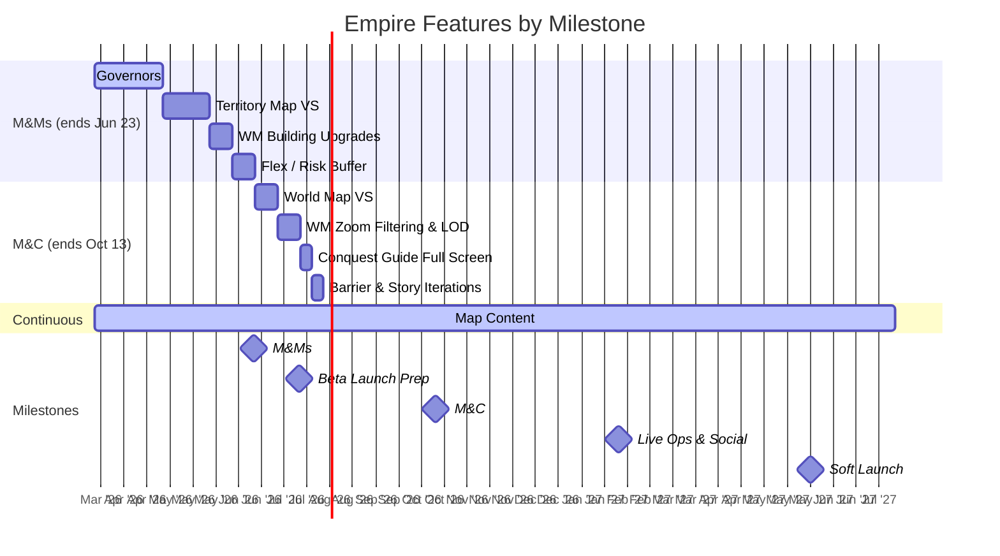

# Empire Pod Plan

Last Updated: 2026-03-19
Pod Lead: Diana Vasilescu

> **What this file tracks**: Feature priorities per milestone and validation alignment.
> **What lives elsewhere**: Feature details in `features/*.md`. Staffing in `capacity.md`. Sprint execution in ClickUp.

---

## Validation Focus

The Empire pod is primarily validating **WH-2: Empire Hypothesis** - that we can retain better than traditional mobile 4X by anchoring early progression in intuitive, visual exploration on the map layer.

### Key BHQs This Pod Owns

| BHQ | Question | Status |
|-----|----------|--------|
| BHQ-E1 | Can we make the civ-like grid intuitive, scalable, and will players be motivated to explore? | NOT YET TESTED |
| BHQ-E2 | Can we create sharp return motivations that feel organic and not punishing? | TESTING |
| BHQ-E3 | Can Empire progression remain compelling long-term ("one more turn" on mobile)? | NOT YET TESTED |
| BHQ-E4 | Can we increase instant gratification when the player takes actions? | NOT YET TESTED |

### Active SHQ Gaps

- **SHQ2** (empire strategy <-> tile conquest seamlessness) - IN PROGRESS
- **SHQ3** (map -> hero progression) - ANSWERED with a negative result. Design iteration needed.
- **BHQ-E4** has no SHQs defined yet. Needs attention.

---

## Milestone: Multiplayer & Meta (M&Ms)

**Ends**: Jun 23, 2026 (~7 sprints)

### Feature Priorities (ordered)

| # | Feature | Estimate | Status | Feature Doc |
|---|---------|----------|--------|-------------|
| 1 | Governors | 3 sprints | IN PROGRESS | [`features/governors.md`](../features/governors.md) |
| 2 | Territory Map Vertical Slice | 2 sprints | NOT STARTED | `features/territory_map_vs.md` [TBD] |
| 3 | WM Support for Building Upgrades | 1 sprint | NOT STARTED | `features/wm_building_upgrades.md` [TBD] |
| - | Map Content (Design/Art Track) | Ongoing | IN PROGRESS | `features/map_content.md` [TBD] |

**Flex**: ~1 sprint buffer for risk/iteration.

### Validation Alignment

| Feature | Related SHQs | What It Proves |
|---------|-------------|----------------|
| Governors | SHQ7 (short/mid/long-term goals) | Governors provide a long-term goal vector in Empire |
| Territory Map VS | SHQ1 (map at scale), SHQ2 (strategy <-> conquest) | VS should test whether the two map layers feel connected |
| Map Content | SHQ1 (high visual bar, variety) | Content pipeline validates production capacity |

### Sprint Allocation

```
Sprint 1-3:  Governors
Sprint 4-5:  Territory Map VS
Sprint 6:    WM Building Upgrades
Sprint 7:    Flex / risk buffer / iteration
```

Map Content runs in parallel on design/art (see `capacity.md`).

---

## Milestone: Beta Launch Prep

**Ends**: Jul 21, 2026 (2 sprints)

### Feature Priorities

| # | Feature | Estimate | Status | Feature Doc |
|---|---------|----------|--------|-------------|
| - | Map Content (Design/Art Track) | Ongoing | CONTINUES | `features/map_content.md` [TBD] |

No Empire engineering features planned. Engineering capacity may flex to other pods (see `capacity.md`).

---

## Milestone: Monetization & Conversion (M&C)

**Ends**: Oct 13, 2026 (6 sprints)

### Feature Priorities (ordered)

| # | Feature | Estimate | Status | Feature Doc |
|---|---------|----------|--------|-------------|
| 1 | World Map Vertical Slice | ~1 sprint | NOT STARTED | `features/world_map_vs.md` [TBD] |
| 2 | World Map Zoom Filtering & LOD | ~1 sprint | NOT STARTED | `features/wm_zoom_lod.md` [TBD] |
| 3 | Conquest Guide Full Screen | ~0.5 sprint | NOT STARTED | `features/conquest_guide.md` [TBD] |
| 4 | Barrier & Story Shard Iterations | ~0.5 sprint | NOT STARTED | `features/barrier_story_iterations.md` [TBD] |
| - | Map Content (Design/Art Track) | Ongoing | NOT STARTED | `features/map_content.md` [TBD] |

### Validation Alignment

[TBD - map features to SHQs for this milestone]

---

## Milestone: Live Ops & Social

**Ends**: Feb 2, 2027 (8 sprints)

### Feature Priorities

[TBD - awaiting feature definitions]

Map Content continues.

---

## Milestone: Soft Launch (UA Scale)

**Ends**: May 30, 2027 (~8 sprints)

### Feature Priorities

[TBD - awaiting feature definitions]

Map Content: final push. Content targets must be defined before this milestone.

---

## Empire Feature Timeline


