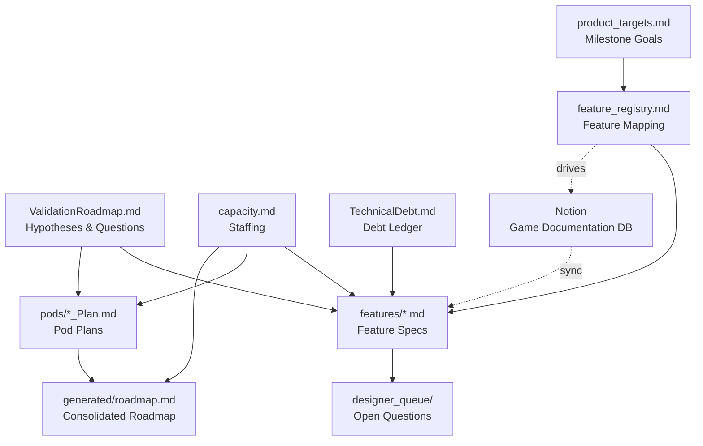

# Lotus Documentation Brain — Project Charter

> This document defines the architecture, rules, and principles for the Lotus documentation brain.
> It is the first file any LLM or new team member should read.

---

## Purpose

This documentation brain is the **single source of truth for Lotus project planning**. It contains structured markdown files that humans author and LLMs read to provide context-aware assistance — risk analysis, spec authoring, gap detection, roadmap generation, and more.

The brain does NOT replace ClickUp (task tracking) or Notion (design documentation). It sits between them:

```
Notion (Design Docs)              Documentation Brain              ClickUp
Game Documentation DB    -sync->  planning/ files        -inform-> Sprint-level tasks
                                  generated/ views                  Execution tracking
                                  reference/ raw data
```

- **Strategic planning** happens here (milestones, features, validation, capacity)
- **Sprint-level execution** happens in ClickUp
- **Design detail** lives in Notion and gets synced here as feature specs via `/spec-sync`

---

## Lotus Project Overview

**Game**: Lotus — mobile army battler with empire-building metagame
**Game Director**: James Fielding
**Executive Producer**: Holly Mellor

### Pods

| Pod | Focus | Pod Lead | Producer | Eng Lead |
|-----|-------|----------|----------|----------|
| Empire | Maps & Map Content | Diana Vasilescu | Brann Livesay | Dan Dupuis |
| Metagame | Meta-loop, progression & economy | Leonard Perez | Tim Williams | Dan Dupuis |
| Battle | Battles & Units | Lincoln Li | Thorben Novais | Jota Oliveira |
| Social Dynamics | Multiplayer & Social features | Paul Flores | Tim Williams | Derek Gallant |
| Dozer | Technical Efforts & Infrastructure | - | - | Derek Gallant |
| Art | Cross-pod visual production | Kevin Griffith (Art Director) | Brann Livesay | - |

### Milestones

| # | Milestone | End Date | Sprints | Phase |
|---|-----------|----------|---------|-------|
| 1 | Multiplayer & Meta (M&Ms) | Jun 23, 2026 | ~7 | Iteration & Refinement |
| 2 | Beta Launch Prep | Jul 21, 2026 | 2 | Polish |
| 3 | Monetization & Conversion (M&C) | Oct 13, 2026 | 6 | Iteration & Refinement |
| 4 | Live Ops & Social | Feb 2, 2027 | 8 | Iteration & Refinement |
| 5 | Soft Launch (UA Scale) | May 30, 2027 | ~8 | Scale |

**Cadence**: 2-week sprints
**Prior milestones (complete)**: Core Experience (Jul 2025), Core Loop (Oct 2025), Systems Validation (Mar 2026)

---

## File Structure

```
lotusDocumentationBrain/
  project-charter.md              This file — architecture and rules
  README.md                       Repo overview and getting started
  QUICK_START.md                  Step-by-step walkthrough
  EXAMPLES.md                    Usage examples
  INGESTION_GUIDE.md             How to bring data into the brain

  planning/                       Human-authored sources of truth
    product_targets.md            Milestone goals, must-have features, success criteria
    capacity.md                   Team staffing by discipline across milestones
    ValidationRoadmap.md          Winning Hypotheses -> BHQs -> SHQs
    feature_registry.md           Feature-to-source mapping (drives /spec-sync)
    dependency_map.md             Cross-pod and cross-feature dependencies
    GlobalRules.md                Project-wide constraints and standards
    TechnicalDebt.md              Tech debt ledger (owned by Engineering Leads)
    sprint_rules.md               Task scaffolding rules for ClickUp (drives /sprint-plan)
    pods/                         Per-pod plans (priorities, validation focus)
      Empire_Plan.md
      Metagame_Plan.md
      Battle_Plan.md
      SocialDynamics_Plan.md
      Dozer_Plan.md
      Art_Plan.md
    features/                     Feature specs (one per feature)
      governors.md                Current template / reference spec
      [feature].md
    designer_queue/               Q&A pipeline for designers
      designerQueue.md            Open questions tracking
      raw_input/                  Unprocessed designer responses
      clean_input/                Validated responses
      output/                     Applied changes log

  generated/                      Skill-generated views (disposable, regenerated)
    roadmap.md                    Consolidated roadmap (regenerated by /roadmap-update)
    roadmap_options.md            Draft roadmap scenarios (overwritten by /roadmap-options)
    sprint_plans/                 Sprint plan markdown files (generated by /sprint-plan)
    reports/                      Saved evaluation reports (risk-eval, etc.)

  reference/                      Ingested source data, evaluations, CSVs, exports

  .claude/
    commands/                     Skills (slash commands)
      [skill-name].md
```

---

## Architecture Principles

### 1. One Source of Truth Per Concept

Every piece of information has ONE authoritative home. Other files reference it, never duplicate it.

| Information | Authoritative File | Referenced By |
|-------------|-------------------|---------------|
| Milestone goals & must-have features | `planning/product_targets.md` | Feature name |
| Team staffing, roles, pod leadership | `planning/capacity.md` | Person/role name |
| Validation hypotheses & questions | `planning/ValidationRoadmap.md` | Question ID (e.g., SHQ7) |
| Feature scope, cost, approach | `planning/features/*.md` | Feature name + link |
| Pod priorities & validation focus | `planning/pods/*_Plan.md` | Pod name |
| Feature-to-source mapping | `planning/feature_registry.md` | Feature name |
| Cross-project constraints | `planning/GlobalRules.md` | Rule name |
| Technical debt items | `planning/TechnicalDebt.md` | Item ID (e.g., TD-001) |
| Pod leadership assignments | `planning/capacity.md` (Pod Leadership Summary) | Person name |
| Task scaffolding & sprint rules | `planning/sprint_rules.md` | Rule name |

**Test**: If you're about to write the same fact in a second file, stop. Add a reference to the authoritative file instead.

### 2. Planning Is Authoritative, Generated Is Disposable

- `planning/` files are **human-authored sources of truth**. Skills may update them, but only with user approval.
- `generated/` files are **skill-generated views** that can be blown away and regenerated at any time. No human should manually edit them.
- `reference/` files are **raw ingested data** and saved evaluations — source material, not authoritative plans.

### 3. The Triangle: Targets vs Plans vs Resources

Three files form the core tension that drives planning:

```
product_targets.md     "What must each milestone achieve?"
       |
       | compared against
       v
roadmap.md             "What are we actually building?"
(from pod plans)
       |
       | checked against
       v
capacity.md            "Do we have the people?"
```

Most analysis skills (risk evaluation, roadmap options, validation review) compare some combination of these three.

### 4. Reference, Don't Duplicate

- Validation questions are referenced by ID (`SHQ7`), not copied in full
- Features are referenced by name and link, not re-described
- Pod leadership is pulled from `capacity.md`, not hardcoded in other files
- If a skill needs to display information from another file, it reads and summarizes — it doesn't create a copy

### 5. Skills Are Safe to Run Repeatedly

- Skills should be **idempotent** or **additive** — running them twice shouldn't break anything
- Skills should never auto-overwrite human-authored content without explicit user approval
- Skills should never delete files or data without confirmation

---

## File Relationships



### Reading Order for LLMs

When an LLM needs to understand the Lotus project, it should read files in this order:

1. `project-charter.md` — Architecture and rules (this file)
2. `planning/product_targets.md` — What we're trying to achieve
3. `planning/capacity.md` — Who's available and where
4. `planning/ValidationRoadmap.md` — What we're trying to prove
5. `planning/feature_registry.md` — What features exist and where their docs are
6. `planning/pods/*_Plan.md` — What each pod is building
7. `planning/features/*.md` — Detail on specific features (read on demand)
8. `planning/TechnicalDebt.md` — Known debt affecting planned work

---

## Validation Model

Lotus uses a hierarchical validation model to ensure we're building the right thing:

```
Winning Hypotheses (4)
  "We believe [core bet about the product]"
    |
    v
Big Hypothesis Questions (BHQs)
  "Can we prove [major aspect of the hypothesis]?"
    |
    v
Sub-Hypothesis Questions (SHQs)
  "Does [specific thing] work as expected?"
  (Testable in a milestone, tied to features)
```

### Lotus Winning Hypotheses

| ID | Hypothesis | Confidence | Trend |
|----|-----------|-----------|-------|
| WH-1 | **Battle** — Compelling army battling centered on dramatic hero moments | Medium | + |
| WH-2 | **Empire** — Retention via intuitive, visual map exploration | Low-Medium | + |
| WH-3 | **Monetization** — Sustained spend via hero collection with social context | Low | = |
| WH-4 | **Production** — Scalable content creation, rapid iteration, stable deployment | Low | = |

### Key Rules

- **Hypotheses** are stable — they rarely change
- **BHQs** are broad — they span multiple pods and milestones
- **SHQs** are specific — they can be answered by building and testing specific features
- Features reference SHQs by ID in their "Why This Feature" section
- BHQs and SHQs are **NOT necessarily pod-specific** — many are cross-pod "cohesive product" questions that require contributions from multiple teams
- `planning/ValidationRoadmap.md` is THE single source of truth for all validation content
- Other files reference SHQs by ID; they don't duplicate validation details
- Next available SHQ number: **29**

---

## Feature Spec Template

All feature specs follow a consistent structure. The current template/reference spec is `planning/features/governors.md`.

Key sections (in order):
1. **Why This Feature** — Validation goals (SHQs), parent hypothesis, success criteria
2. **Scope** — What it does, core mechanics, in/out of scope
3. **Estimate & Approach** — Disciplines, sprint estimates, implementation flow, pre-conditions
4. **Dependencies** — What this depends on and what depends on it
5. **Risks** — Impact, probability, mitigation
6. **Open Questions** — Unresolved design decisions
7. **References** — Links to Notion docs, external sources

**Validation goals come first** — every feature should be traceable to a hypothesis or question the team is trying to answer.

---

## Feature Registry

`planning/feature_registry.md` is the authoritative mapping of features to their Notion source documents and local spec files. It is the bridge between external design docs and local specs.

- `/spec-sync` reads the registry to know which features need specs and where to pull content from
- `/roadmap-update` adds new features to the registry when they're added to pod plans
- `/risk-evaluation` checks the registry for gaps (unregistered features, missing specs)

When adding a new feature to the brain:
1. Add it to the pod plan (`planning/pods/*_Plan.md`)
2. Add it to the feature registry (`planning/feature_registry.md`)
3. Create the spec (`planning/features/*.md`) — via `/doc-author`, `/spec-sync`, or manually

---

## Designer Queue System

The designer queue is a structured Q&A pipeline that connects design gaps to designer responses:

```
/spec-sync finds gaps/conflicts  ->  designer_queue/designerQueue.md  (open Qs)
/designer-quiz collects answers  ->  designer_queue/raw_input/        (unprocessed)
/queue-review validates answers  ->  designer_queue/clean_input/      (validated)
                                 ->  designer_queue/output/           (applied changes log)
                                 ->  planning/features/*.md           (specs updated)
```

Designer ownership is determined from `planning/capacity.md` (Pod Leadership Summary + Design section).

---

## Technical Debt

`planning/TechnicalDebt.md` is a ledger of known technical debt items, owned by Engineering Leads and managed via the `/tech-debt` skill.

- Items are never deleted — retired items stay for history
- IDs are sequential and never reused (TD-001, TD-002, etc.)
- `/tech-debt` has two modes: **Report** (debt vs features analysis) and **Editor** (add/update/retire items)
- `/risk-evaluation` checks active debt items against planned features for compounding risk

---

## Skill Architecture

Skills are slash commands (`.claude/commands/*.md`) that automate common workflows.

### Skill Design Principles

1. **Read-Assess-Act-Summarize**: Read project state, assess against criteria, take action (with approval), summarize what changed.
2. **Graceful Degradation**: If an external source or file isn't available, do useful work with what's available. Flag what's missing, don't halt.
3. **Flag, Don't Fix**: When a skill spots a problem outside its scope, flag it and suggest which skill to run — don't try to fix everything.
4. **Questions Grouped by Owner**: When generating action items, group by the responsible person (from `capacity.md`).

### Core Skills

| Skill | Purpose | Reads | Writes |
|-------|---------|-------|--------|
| `/roadmap-update` | Update pod plans, regenerate roadmap | product_targets, pod plans, capacity, feature_registry, features/, dependency_map, ValidationRoadmap, TechnicalDebt | pods/, feature_registry, generated/roadmap.md |
| `/risk-evaluation` | Compare targets vs plans vs resources | product_targets, roadmap, capacity, pod plans, ValidationRoadmap, feature_registry, TechnicalDebt, features/ | generated/reports/ |
| `/roadmap-options` | Generate alternative roadmap scenarios | pod plans, capacity, targets, dependencies | generated/roadmap_options.md |
| `/validation-review` | Evaluate validation progress | ValidationRoadmap, features/, pod plans, product_targets | Report (no file changes) |
| `/spec-sync` | Sync feature registry + Notion to local specs | feature_registry, features/, Notion (via MCP) | features/, designer_queue |
| `/doc-author` | Interactive spec authoring | features/, all planning files | features/ |
| `/designer-quiz` | Collect designer answers to open questions | designer_queue, capacity | raw_input/ |
| `/queue-review` | Validate and apply designer answers | raw_input/, features/ | clean_input/, output/, features/, designer_queue |
| `/feature-review-prep` | Single-feature design review briefing | features/, pod plans, product_targets, ValidationRoadmap | generated/design_briefs/ |
| `/tech-debt` | Manage technical debt ledger | TechnicalDebt, features/, capacity | TechnicalDebt |
| `/new-skill` | Guide creation of new skills | Existing skills, charter | .claude/commands/ |
| `/generatePulseCheckReport` | Monthly executive Pulse Check report | product_targets, capacity, pod plans, ValidationRoadmap | Report |
| `/generate_qvr_report` | Quarterly Validation Review report | product_targets, capacity, ValidationRoadmap, pod plans | Report |
| `/sprint-plan` | Sprint planning (Preview/Kickoff modes) | product_targets, pod plans, capacity, sprint_rules, roadmap, Google Calendar, ClickUp | generated/sprint_plans/, ClickUp tasks (Kickoff) |
| `/sprint-risks` | Interactive sprint risk triage | ClickUp sprint tasks, product_targets, pod plans, Slack | Report (copy/paste) |
| `/roadmap-sheet` | Generate Google Sheets roadmap script | product_targets, pod plans, capacity, roadmap | generated/roadmap_apps_script.js |

### Creating New Skills

Before creating a skill, check:
- [ ] Does an existing skill already cover this? (Extend, don't duplicate)
- [ ] Does it create a new source of truth? (**Red flag** — can this data live in an existing file?)
- [ ] Does it write to `planning/` files? (Must ask for user confirmation)
- [ ] Is it safe to run twice? (Must be idempotent or additive)
- [ ] Will it create files nobody maintains? (Prefer `generated/` for outputs)
- [ ] Does it reference `feature_registry.md` when creating or checking features?
- [ ] Does it degrade gracefully when files are missing?

---

## External Integrations

### Notion MCP

Connected via MCP (Model Context Protocol). Used by `/spec-sync` to pull design doc content.

- **Game Documentation DB ID**: `1c93f0b3b6ab80588d39d13dde6d9cab`
- **Data Source**: `collection://1c93f0b3-b6ab-804e-9462-000b25d3d67d`
- Feature Notion page IDs are stored in `planning/feature_registry.md`

### ClickUp

Sprint-level execution tracking. Not directly integrated — feature status is manually reflected in pod plans at high level.

---

## Rules for LLMs

When operating in this brain:

1. **Read before writing** — Always read the current state of files before proposing changes
2. **Respect authority** — The authoritative file for a concept is the only place to update it
3. **Ask before overwriting** — Never auto-replace human-authored content in `planning/`
4. **Use IDs for references** — Reference SHQs, BHQs, tech debt items, and features by their identifiers, not by copying full text
5. **Follow the template** — Feature specs must match the established template structure (see `planning/features/governors.md`)
6. **Surface conflicts** — If two files disagree, flag it rather than silently picking one
7. **Stay in scope** — Each skill has a focused job; flag issues outside that scope for the appropriate skill
8. **Degrade gracefully** — If an external source (Notion, etc.) or file isn't available, work with what's available
9. **Pull leadership from capacity.md** — Pod leadership, design ownership, and staffing always come from `planning/capacity.md`, not hardcoded elsewhere
10. **Update the registry** — When adding features to pod plans, also add them to `planning/feature_registry.md`

---

## Change Log

| Date | Change | Author |
|------|--------|--------|
| 2026-03-24 | Initial Lotus project charter created from brain-template | Tim / Claude |
