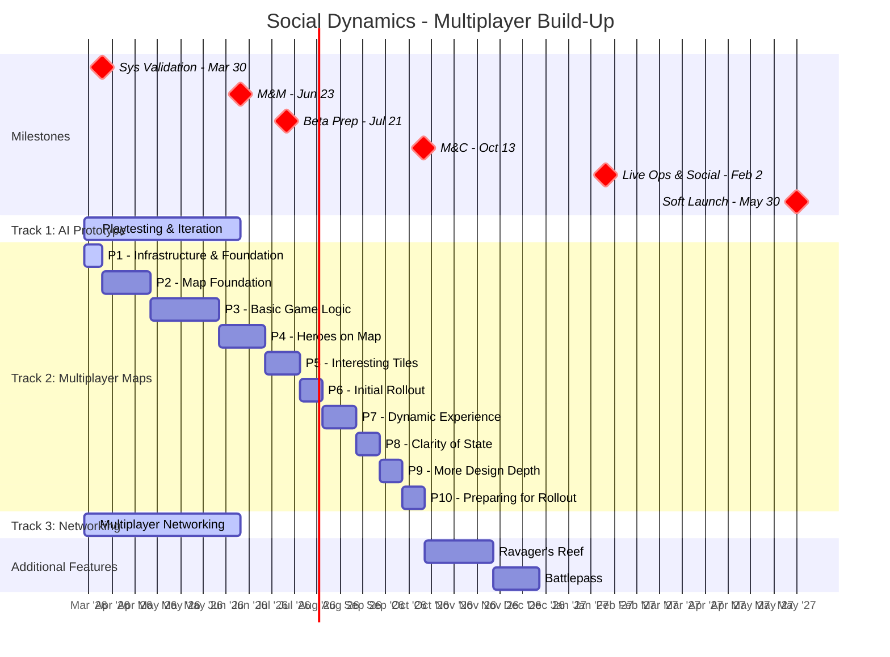

# Making LLMs Actually Useful for Production Work

*Tim Williams | March 2026*

---

## The Problem: LLMs Forget, Drift, and Make Things Up

If you've used ChatGPT, Claude, or any LLM for real work, you've probably hit these walls:

### Context Bloat
The longer a conversation goes, the worse it gets. Early instructions get pushed out. The LLM starts contradicting itself. You find yourself re-explaining things you already covered.

### No Persistent Memory You Can See or Control
Most LLMs store "memories" behind the scenes -- but you can't see them, edit them, or organize them. So the LLM might "remember" something wrong, or forget something critical, and you have no way to fix it.

### Drift = Lost Trust
When the LLM gets something wrong because it lost context or hallucinated a detail, you lose trust. And once you lose trust, you stop relying on it for anything that matters -- which defeats the purpose.

```
Session 1: "Our milestone ends June 23"
Session 5: "Your milestone ends in July, right?"
Session 9: *confidently uses wrong dates in a plan*
```

**The core issue**: LLMs are stateless by default. Every conversation starts from zero unless you manually paste in context. And pasting in context doesn't scale.

---

## Exploring a solution: OpenClaw

Tools like [OpenClaw](https://openclaw.ai) give you something most LLM interfaces don't: **a file system the LLM can read and write to, with memory you fully control.**

This means:
- You decide what the LLM knows
- You can see, edit, and organize its knowledge
- It persists across sessions -- no re-explaining
- Wrong information can be corrected at the source

### The Multi-Layered Brain

I've been building an OpenClaw cluster, and I've built a layered memory system where different types of context load at different times:

```
L1 - BRAIN: Always Loaded
├── SOUL - Personality, Voice, Values
├── AGENTS - Role, Rules, Lane
├── HEARTBEAT - Standing recurring checks
├── TOOLS - Agent-specific commands and workarounds
└── MEMORY - What's active now

L2 - MEMORY: Indexed & Searched Semantically
├── DAILY NOTES: Session summary, decisions, completed work, corrections
├── CONTACTS: People & Relationships
├── PROJECTS: Narrative history per project
└── DECISIONS: Cross-cutting choices & trade-offs

L3 - VAULT: Deep Reference, On Demand
├── SOPs, Frameworks, Playbooks, Research
├── Burns no context unless needed
└── Searched when doing deep analysis
```

**Why this matters**: The LLM always knows the basics (L1), can pull in details when needed (L2), and can dig into raw data for complex questions (L3). No context bloat. No drift. 

### Example: Project Memory in Action

Say I'm building a "Mission Command Center" to manage my cluster of agents - I'll have a file in L2:`memory/projects/mission-command-center.md`:

```markdown
# Project: Mission Command Center
## Current State (March 2026)
- Phase 1 infrastructure deployed
- Phase 2 backend and data populated
- Phase 3 UI built and deployed
- Target: Iterate on Task UI, then continue expanding MCC functionality with Task UI
## Key Decisions
- 2026-03-15: Going with a web-based task/workflow engine 
- 2026-03-19: Moving daily briefings to leverage task status
```

When I start a fresh conversation and ask "what's next for us", the LLM loads this context and gives me a grounded answer -- not a guess. If a decision changes, I update the file, and every future conversation reflects it. And the LLM knows about this file and helps you keep it updated.

---

## What I Built: An LLM-friendly Documentation Brain for Lotus

I took this approach and applied it to our production planning. The result is a structured set of markdown files that give the LLM (and us) a complete, organized view of our project.

### The Structure

```
lotusDocumentationBrain/
├── planning/
│   ├── product_targets.md        # What each milestone MUST achieve
│   ├── ValidationRoadmap.md      # Are we building the right thing?
│   ├── capacity.md               # Where are our people?
│   ├── pods/
│   │   ├── Empire_Plan.md        # Pod priorities + validation alignment
│   │   ├── Metagame_Plan.md
│   │   ├── SocialDynamics_Plan.md
│   │   └── ...
│   └── features/
│       ├── governors.md          # Full feature spec: cost, approach, goals
│       └── ...
├── generated/
│   ├── roadmap.md                # Consolidated view (auto-generated)
│   └── roadmap_options.md        # "What if" scenarios (disposable)
└── .claude/
    └── skills/                   # Reusable workflows
        ├── roadmap-update.md
        ├── risk-evaluation.md
        ├── roadmap-options.md
        └── validation-review.md
```

### What It Can Do

Here are real examples from this week:

**"Update the Social Dynamics plan with these phases"**
> I described the phased multiplayer build-up. The LLM read the existing plan, restructured it with 10 phases across 3 parallel tracks, generated a Gantt chart, and updated milestone breakdowns -- all consistent with our dates, capacity, and priorities.

**"Are we on track for M&Ms?"** (`/risk-evaluation`)
> The LLM reads product targets (must-haves), the roadmap (what's planned), and capacity (who's available). It compares all three and flags gaps -- like a must-have feature with no pod assigned, or a pod that's overcommitted.

**"What if we move an engineer from Battle to Empire?"**
> It reads capacity, both pod plans, and feature estimates. It tells you what Empire gains (accelerates Territory Map VS by ~1 sprint) and what Battle loses (their single engineer, so everything stops).

**"Generate 3 roadmap options for M&C"** (`/roadmap-options`)
> It creates multiple scenarios with different trade-offs, each with its own Gantt chart and risk analysis, side by side for comparison. Just tell it what options you want to see.

### Visual Roadmaps, Auto-Generated

Every pod plan has a Mermaid Gantt chart that renders right in VS Code. When plans change, the charts update with the plan -- no separate slide deck to maintain.



### Skills = Repeatable Workflows

Instead of explaining what I want every time, I've built "skills" -- structured prompts the LLM follows. Run `/roadmap-update` and it knows to:

1. Read the pod plan + product targets + capacity
2. Ask what changed
3. Validate against constraints
4. Update the plan
5. Regenerate the consolidated roadmap
6. Flag risks

Same quality every time. No re-explaining.

---

## Why This Matters Beyond My Pods

### The Problem at Scale
Every producer manages plans, tracks capacity, aligns features to milestones, and reports status. We all do this in slightly different ways across Notion, ClickUp, Slides, and Slack messages. When leadership asks "are we on track?", assembling the answer is manual, slow, and error-prone.

### What This Enables

| Today | With a Documentation Brain |
|-------|---------------------------|
| Manually assemble status from 3 tools | Ask the LLM, it reads the structured files |
| Roadmap changes require updating slides | Update the plan, Gantt regenerates |
| "What if" scenarios take hours | `/roadmap-options` generates 3 in minutes |
| Risk assessment is gut feel + spreadsheet | `/risk-evaluation` compares targets vs plans vs capacity |
| New team members read 50 Notion pages | They read the pod plan + 2 feature docs |
| Validation alignment is a separate artifact | It's built into every pod plan and feature doc |

### The Investment

This isn't heavy infrastructure. It's markdown files in a git repo. The setup for a new pod is:
- 1 pod plan file (~30 min to populate)
- Feature docs as needed (~15 min each)
- Capacity entries (~5 min)

After that, maintenance is a few minutes per sprint -- mostly status updates and the occasional priority shift.

### What I'm NOT Saying

- This doesn't replace Notion or ClickUp -- sprint execution still lives there
- This doesn't require everyone to use Claude Code -- the markdown files are useful on their own
- This isn't a rigid process -- it's a structured way to organize what we already track in the format LLMs work best with

---

## Want to Try It?

If you're interested in setting something like this up for your pod(s), happy to walk through it. The core is simple:

1. **Write down what your milestone must achieve** (product targets)
2. **List your features in priority order** with validation goals (pod plan)
3. **Spec your top features** with estimates and approach (feature docs)
4. **Record where your people are** (capacity)

Once that's in markdown, the LLM can do the rest -- generate roadmaps, compare scenarios, flag risks, and keep everything consistent.

Reach out if you want to see it live or set one up.

-- Tim
