# Visualization Examples

A reference of Mermaid chart types useful for roadmap, planning, and validation documents. All render in VS Code with the Mermaid extension.

---

## Table of Contents

1. [Gantt Chart](#gantt-chart) -- Timelines, roadmaps, feature scheduling
2. [Quadrant Chart](#quadrant-chart) -- 2-axis comparison, confidence mapping
3. [Flowchart](#flowchart) -- Processes, decision trees, user flows
4. [Mindmap](#mindmap) -- Hierarchies, brainstorming, feature decomposition
5. [Timeline](#timeline) -- Milestones, historical events, release history
6. [Pie Chart](#pie-chart) -- Proportions, allocation breakdowns
7. [Block Diagram](#block-diagram) -- System architecture, pod relationships
8. [Kanban](#kanban) -- Status boards, feature status at a glance
9. [Sankey](#sankey) -- Resource flow, staffing allocation
10. [XY Chart](#xy-chart) -- Data plots, trend lines, metric tracking
11. [State Diagram](#state-diagram) -- Feature states, lifecycle, validation flow
12. [Sequence Diagram](#sequence-diagram) -- Interactions, API flows, handoffs between pods

---

## Gantt Chart

Best for: roadmaps, feature timelines, parallel workstreams, milestone tracking.

**Currently used in**: all pod plans, consolidated roadmap.

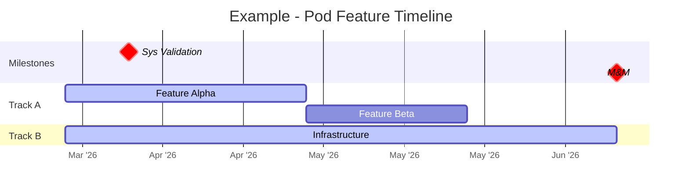

### Gantt Tips
- `active` = blue (in progress), `done` = gray, `crit` = red (blocked/at risk)
- `after taskId` chains tasks sequentially
- `milestone` with `0d` duration creates diamond markers
- Duration can be days (`30d`) or absolute dates (`2026-06-23`)
- Keep to ~30 bars max for readability

---

## Quadrant Chart

Best for: comparing items on two dimensions, prioritization matrices, confidence vs evidence.

**Currently used in**: ValidationRoadmap.md (hypothesis confidence).

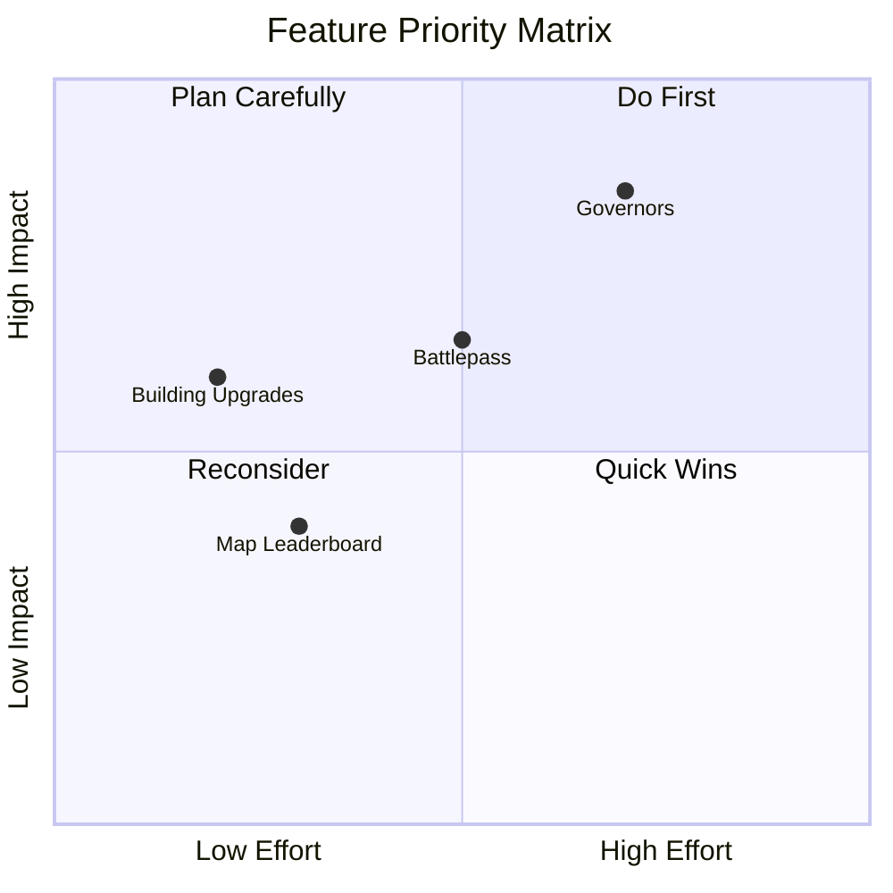

### Quadrant Variations
- **Priority Matrix**: Effort vs Impact
- **Risk Matrix**: Likelihood vs Severity
- **Validation Status**: Evidence vs Confidence
- **Feature Readiness**: Design Completeness vs Eng Readiness

---

## Flowchart

Best for: processes, decision trees, dependency flows, user journeys.

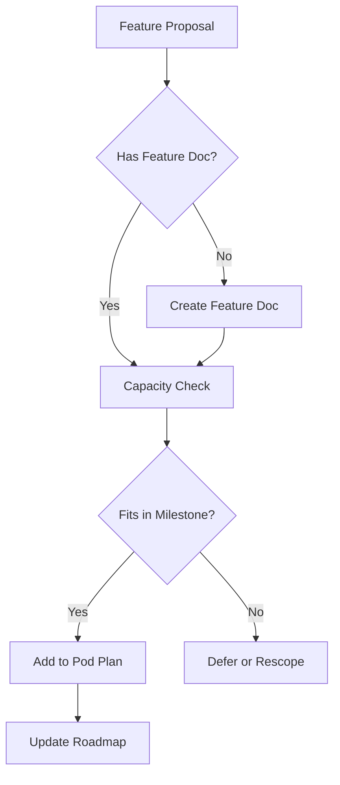

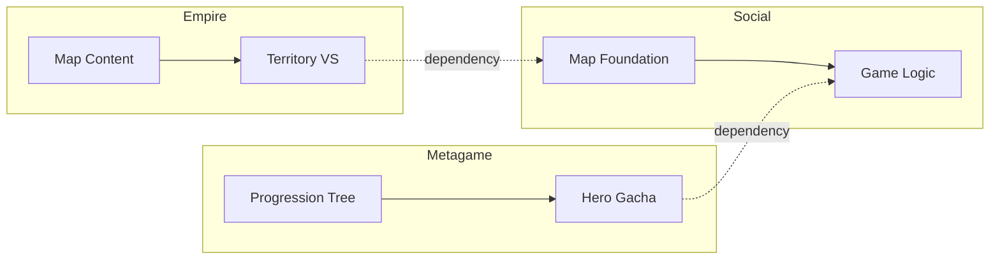

### Flowchart Tips
- `TD` = top-down, `LR` = left-right
- `-->` solid arrow, `-.->` dotted arrow (dependencies)
- `subgraph` groups related nodes
- `{Decision}` = diamond, `[Task]` = rectangle, `([Stadium])` = rounded, `((Circle))`

---

## Mindmap

Best for: hierarchical breakdowns, brainstorming, feature decomposition, pod structure.

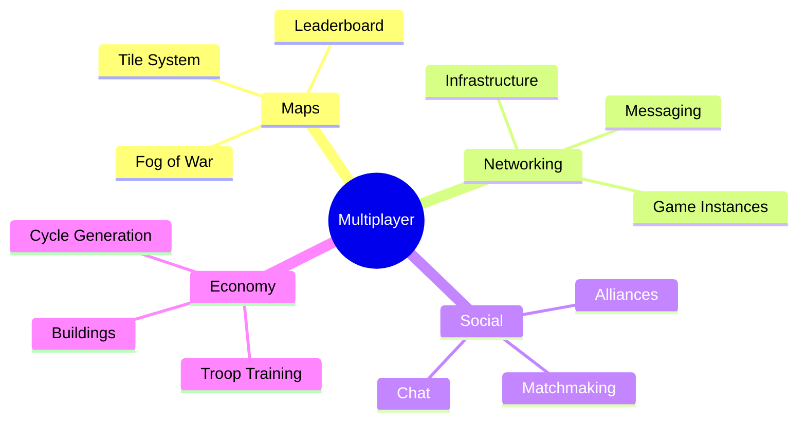

---

## Timeline

Best for: milestone history, release dates, key events in sequence.

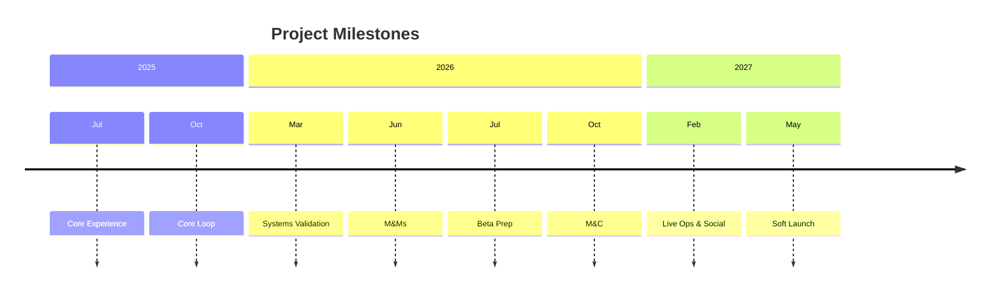

---

## Pie Chart

Best for: proportional breakdowns, capacity allocation, time distribution.

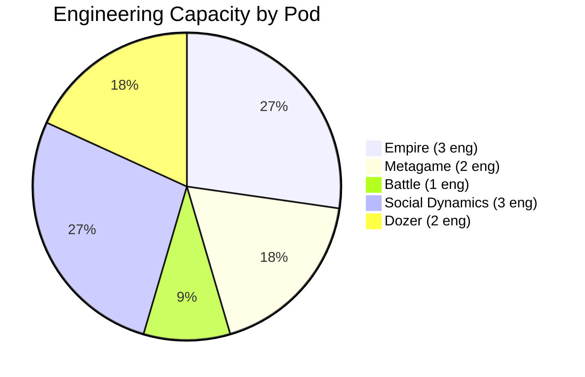

---

## Block Diagram

Best for: system architecture, pod relationships, high-level structure.

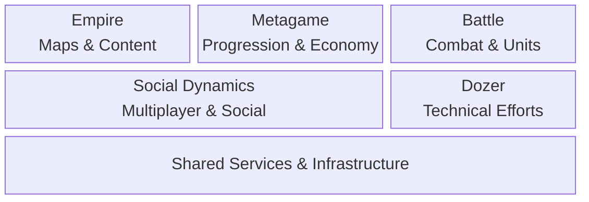

---

## Kanban

Best for: feature status at a glance, sprint boards, phase tracking.

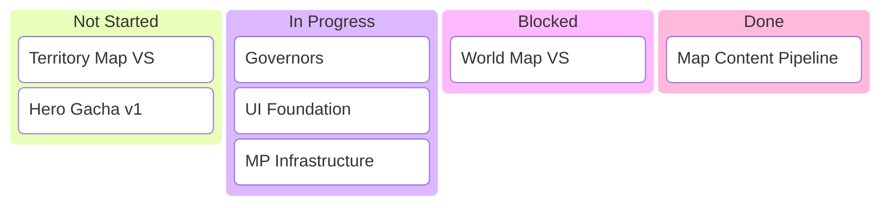

---

## Sankey

Best for: resource flow, showing how capacity/effort distributes across areas.

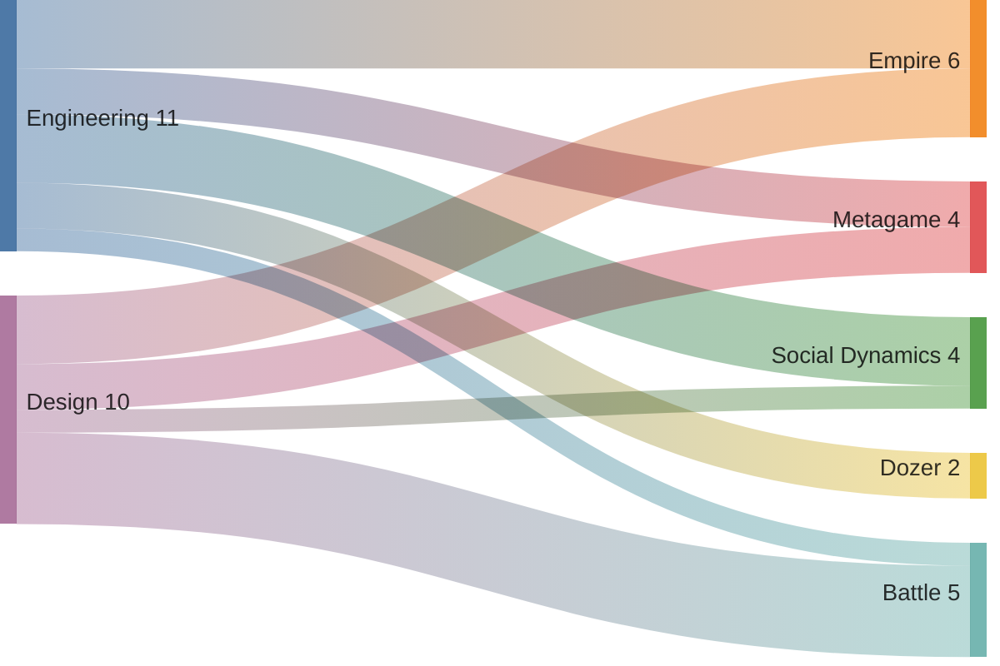

---

## XY Chart

Best for: data plots, metric tracking over time, trend visualization.

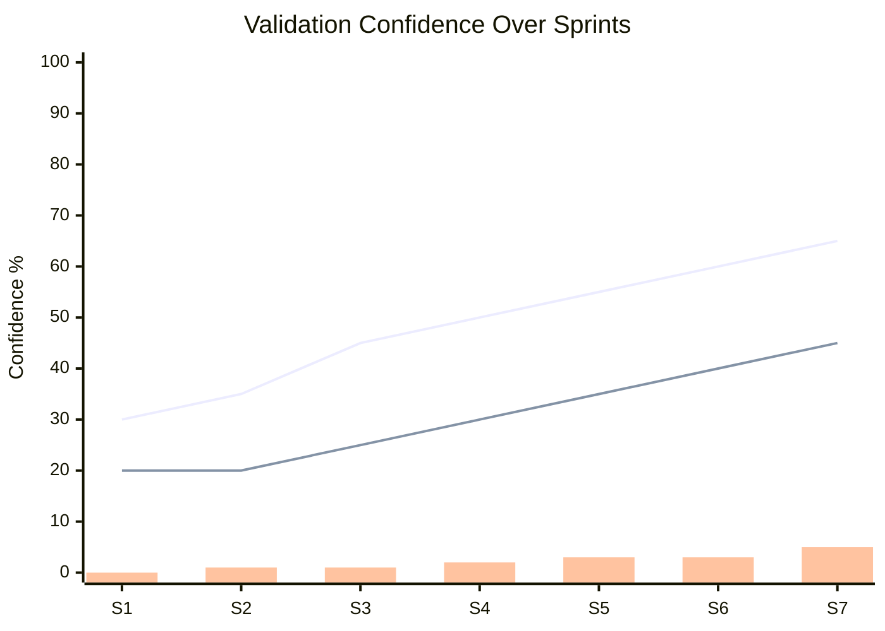

---

## State Diagram

Best for: feature lifecycle, validation states, status transitions.

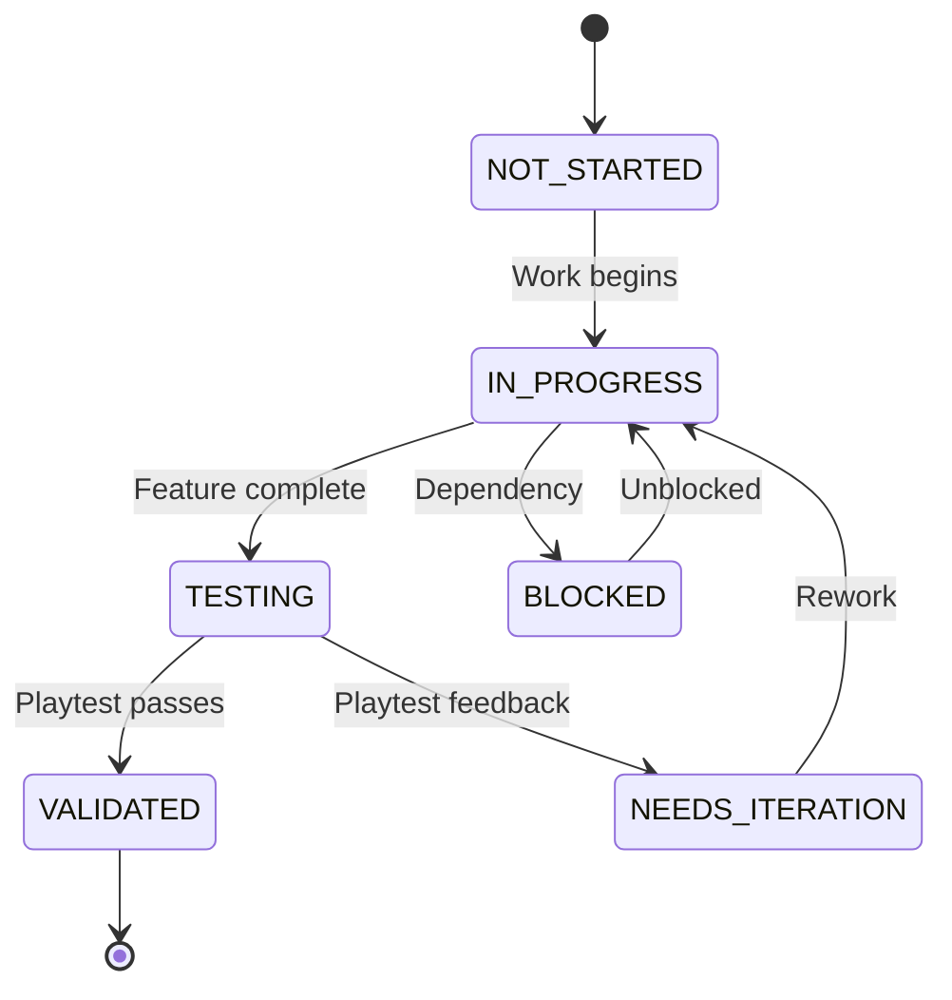

---

## Sequence Diagram

Best for: interactions between pods, handoff processes, API flows.

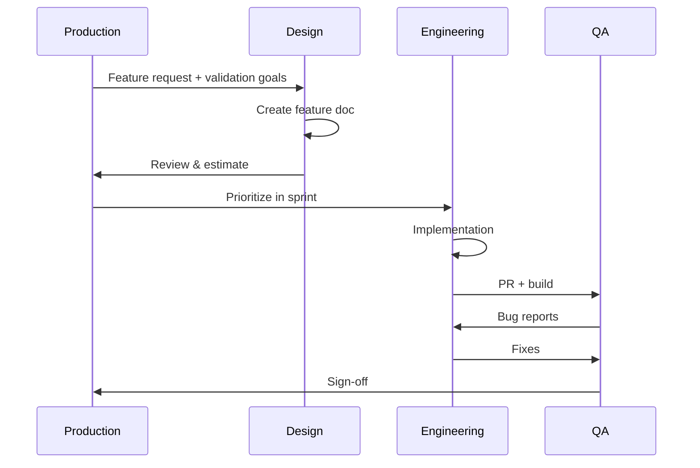

---

## Quick Reference

| Chart Type | Best For | Complexity |
|------------|----------|------------|
| Gantt | Timelines, scheduling, parallel tracks | Medium |
| Quadrant | 2-axis comparison, prioritization | Low |
| Flowchart | Processes, decisions, dependencies | Low-Medium |
| Mindmap | Hierarchies, decomposition | Low |
| Timeline | Sequential events, milestones | Low |
| Pie | Proportions, allocation | Low |
| Block | Architecture, structure | Low |
| Kanban | Status boards | Low |
| Sankey | Resource flow, distribution | Medium |
| XY Chart | Data over time, metrics | Medium |
| State Diagram | Lifecycle, transitions | Medium |
| Sequence | Interactions, handoffs | Medium |
