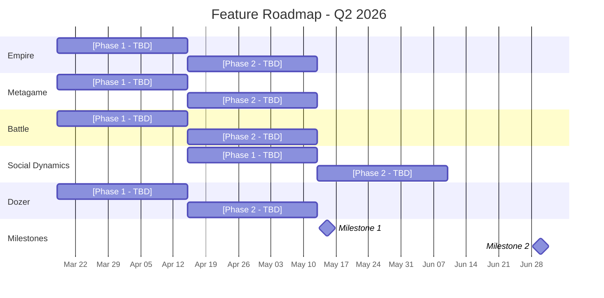
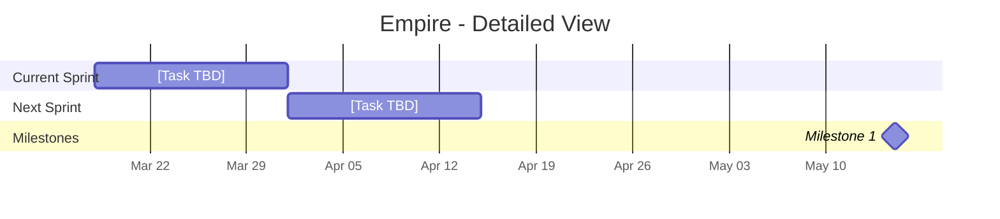
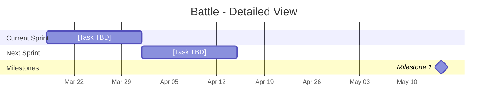
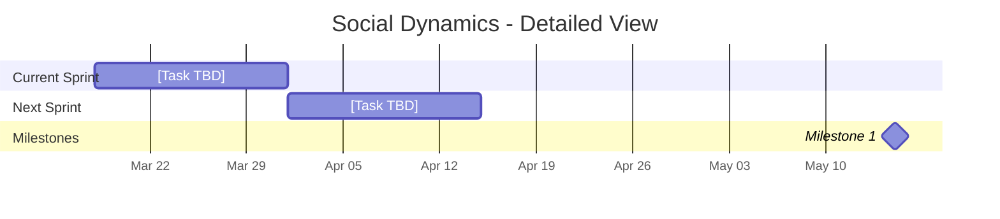

# Feature Roadmap

Last Updated: 2026-03-18

> This is the **Feature Roadmap** - what we're building and when.
> For product validation (Winning Hypotheses, BHQs, SHQs), see `ValidationRoadmap.md`.

---

## High-Level Roadmap

---

## Detailed Pod Roadmaps

### Empire

---

### Metagame

---

### Battle

---

### Social Dynamics

---

### Dozer

---

## Legend

| Visual | Meaning |
|--------|---------|
| Gray bar | `done` - Completed work |
| Blue bar | `active` - Currently in progress |
| Red bar | `crit` - Blocked or at risk |
| Default bar | Planned / committed (not yet started) |
| Diamond | `milestone` - Key delivery date |

---

## How to Read This Roadmap

- **High-Level chart**: Major phases per pod + milestones. Executive overview.
- **Detailed Pod charts**: Individual tasks per sprint. Team-level planning.
- **Dependencies**: `after [id]` = must wait for referenced task. Cross-pod arrows from `dependency_map.md`.
- **Critical (red)**: Blocked or at risk of delaying downstream work.
- **Milestones align with `ValidationRoadmap.md`**: Milestone 1 here = Milestone 1 SHQ evaluation there.

---

## Update History

| Date | Changed By | Summary |
|------|-----------|---------|
| 2026-03-18 | Initial | Created roadmap structure with all 5 pods |
