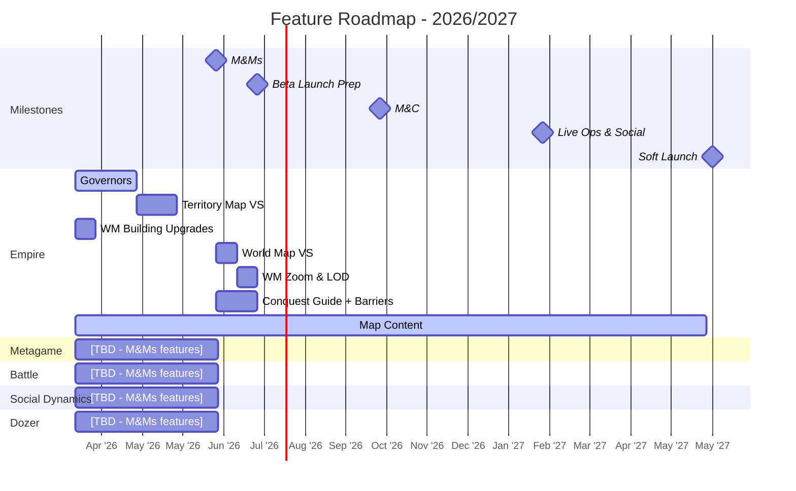

# Feature Roadmap

Last Updated: 2026-03-18

> This is the **Feature Roadmap** - what we're building and when.
> For product validation (Winning Hypotheses, BHQs, SHQs), see `ValidationRoadmap.md`.
> For feature details per pod, see `pods/*_Plan.md`.
> Sprint-level execution lives in **ClickUp** - this document tracks features/boulders across milestones.

---

## Milestones

| # | Milestone | End Date | Sprints | Dev Phase | Goal |
|---|-----------|----------|---------|-----------|------|
| 1 | **Multiplayer & Meta (M&Ms)** | Jun 23, 2026 | ~7 | Iteration & Refinement | Introduce multiplayer foundations and metagame depth |
| 2 | **Beta Launch Prep** | Jul 21, 2026 | 2 | Polish | Production-quality first impression, vertical slices complete |
| 3 | **Monetization & Conversion (M&C)** | Oct 13, 2026 | 6 | Iteration & Refinement | Validate monetization model, conversion funnels |
| 4 | **Live Ops & Social** | Feb 2, 2027 | 8 | Iteration & Refinement | Evergreen engagement, social features, alliance systems |
| 5 | **Soft Launch (UA Scale)** | May 30, 2027 | ~8 | Scale | UA-driven external validation at medium scale |

**Cadence**: 2-week sprints
**Prior Milestones (complete)**: Core Experience (Jul 2025), Core Loop (Oct 2025), Systems Validation (Mar 2026)

### Milestone-Validation Alignment

| Feature Milestone | Validation Milestone | Key SHQs to Validate |
|-------------------|---------------------|----------------------|
| M&Ms | Multiplayer (Aug 2026) | Multiplayer engagement, social context |
| Beta Launch Prep | - | Production readiness |
| M&C | Early Experience (May 2026) + later | Conversion, spend depth |
| Live Ops & Social | Live Ops & Social (Nov 2026) | Evergreen engagement, alliance impact |
| Soft Launch | Fortis Soft Launch (Mar 2027) | D0-D30 retention, LTV |

---

## High-Level Roadmap

---

## Per-Pod Feature Plans

Detailed feature breakdowns live in each pod's plan file:

| Pod | Plan File | Lead |
|-----|-----------|------|
| Empire | [`pods/Empire_Plan.md`](pods/Empire_Plan.md) | Diana Vasilescu |
| Metagame | [`pods/Metagame_Plan.md`](pods/Metagame_Plan.md) | [TBD] |
| Battle | [`pods/Battle_Plan.md`](pods/Battle_Plan.md) | [TBD] |
| Social Dynamics | [`pods/SocialDynamics_Plan.md`](pods/SocialDynamics_Plan.md) | [TBD] |
| Dozer | [`pods/Dozer_Plan.md`](pods/Dozer_Plan.md) | [TBD] |

---

## How to Read This Roadmap

- **Milestones table**: The source of truth for dates, sprint counts, and goals
- **Gantt chart**: Visual overview of features across milestones per pod. Features, not tasks.
- **Pod Plan files**: Details on each feature (scope, estimates, dependencies, assumptions, risk)
- **ClickUp**: Sprint-level execution. Each feature here links to a ClickUp Epic/Folder for task breakdown.
- **Validation alignment**: Maps feature milestones to validation milestones in `ValidationRoadmap.md`

### Legend

| Visual | Meaning |
|--------|---------|
| Gray bar | `done` - Completed |
| Blue bar | `active` - In progress |
| Red bar | `crit` - Blocked or at risk |
| Default bar | Planned (not yet started) |
| Diamond | `milestone` - Milestone end date |

---

## Update History

| Date | Changed By | Summary |
|------|-----------|---------|
| 2026-03-18 | Tim / Claude | Milestone definitions, Empire M&Ms + Beta Launch Prep features |
